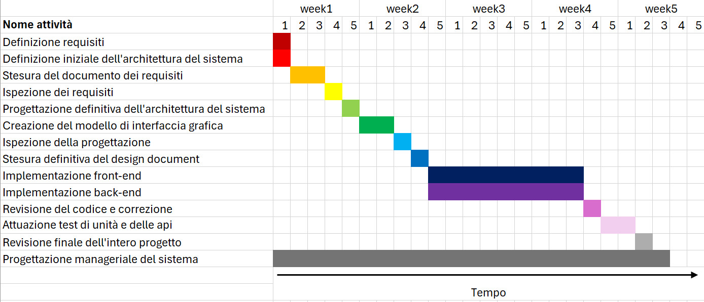

# Project Estimation - CURRENT
Date: 01-05-24

Version: 1.3

# Estimation approach
Consider the EZElectronics  project in CURRENT version (as given by the teachers), assume that you are going to develop the project INDEPENDENT of the deadlines of the course, and from scratch
# Estimate by size
### 
|                                                                                                         | Estimate      |
| ------------------------------------------------------------------------------------------------------- | ------------- |
| NC =  Estimated number of classes to be developed                                                       | 15            |
| A = Estimated average size per class, in LOC                                                            | 200           |
| S = Estimated size of project, in LOC (= NC * A)                                                        | 3000          |
| E = Estimated effort, in person hours (here use productivity 10 LOC per person hour)                    | 300ph         |
| C = Estimated cost, in euro (here use 1 person hour cost = 30 euro)                                     | 9000 euro     |
| Estimated calendar time, in calendar weeks (Assume team of 4 people, 8 hours per day, 5 days per week ) | about 2 weeks |

# Estimate by product decomposition
### 
| component name       | Estimated effort (person hours) |
| -------------------- | ------------------------------- |
| requirement document | 70ph                            |
| GUI prototype        | 50ph                            |
| design document      | 30ph                            |
| code                 | 300ph                           |
| unit tests           | 30ph                            |
| api tests            | 30ph                            |
| management documents | 40ph                            |

<!--Totale 550ph, 30 euro all'ora: 16.500 euro per l'intera progettazione e creazione del sito web -->

# Estimate by activity decomposition
### 
| Activity name                                          | Estimated effort (person hours) |
| ------------------------------------------------------ | ------------------------------- |
| Definizione dei requisiti                              | 15ph                            |
| Definizione iniziale dell'architettura del sistema     | 15ph                            |
| Stesura del documento dei requisiti                    | 70ph                            |
| Ispezione dei requisiti                                | 5ph                             |
| Progettazione definitiva dell'architettura del sistema | 10ph                            |
| Creazione del modello di interfaccia grafica           | 50ph                            |
| Ispezione della progettazione                          | 10ph                            |
| Stesura definitiva del design document                 | 30ph                            |
| Implementazione front-end                              | 120ph                           |
| Implementazione back-end                               | 180ph                           |
| Revisione del codice e correzione                      | 30ph                            |
| Attuazione test di unità e delle api                   | 60ph                            |
| Revisione finale dell'intero progetto                  | 30ph                            |
| Progettazione manageriale del sistema                  | 40ph                            |

<!--Totale 665ph, 30 euro all'ora: 19.950 per l'intera progettazione e creazione del sito web -->
### Gantt Chart

# Summary

Le differenze derivano principalmente dal metodo di stima utilizzato. 

Infatti la stima per code size è una stima che tiene conto solo scrittura del codice, e perciò sarà meno accurata.

Al contrario la stima per decomposizione di prodotti e di attività sono progressivamente più specifiche, e includono la considerazione di più fattori che vanno ad incidere sul tempo complessivo necessario per progettare e realizzare l'intero progetto. 

|                                    | Estimated effort | Estimated duration |
| ---------------------------------- | ---------------- | ------------------ |
| estimate by size                   | 300ph            | about 2 weeks      |
| estimate by product decomposition  | 530ph            | about 3.5 weeks    |
| estimate by activity decomposition | 665ph            | about 4.5 weeks    |

