# Graphical User Interface Prototype - CURRENT

Authors: Giuseppe Barone, Christian Galipò, Lorenzo Cuccu, Giulio Lettieri

Date: 24-04-2024

Version: 1.20

Come riportato all'interno del documento "[RequirementsDocumentV1](./RequirementsDocumentV1.md)", il software si compone di due profili: 
- Un profilo Customer 
- Un profilo Manager

## Pagine Utente
In questa sezione si analizzano le pagine utente; ovvero le pagine che hanno in comune sia il manager che customer. Tali pagine sono: 
1. Login 
2. Registrazione
3. Visualizza Profilo
### Login [UC1](./RequirementsDocumentV1.md#use-case-1-uc1) 
Il login dell'utente si effettua inserendo l'username e la password.
Nel caso in cui l'utente non si fosse ancora registrato, può farlo attraverso il textButton "Registrati", il quale avvia il caso d'uso "Registrazione" [UC3](./RequirementsDocumentV1.md#use-case-3-uc3).
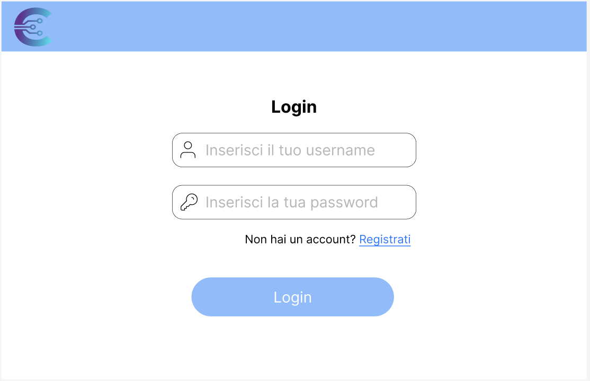
### Registrazione [UC3](./RequirementsDocumentV1.md#use-case-3-uc3)
La schermata registrazione permette all'utente di inserire dati quali: 
- Username
- Nome
- Cognome 
- Password 
- Ruolo

Si è pensati di utilizzare dei radio button mutualmente esclusivi per far scegliere all'utente se registrarsi o come manager oppure come customer.
  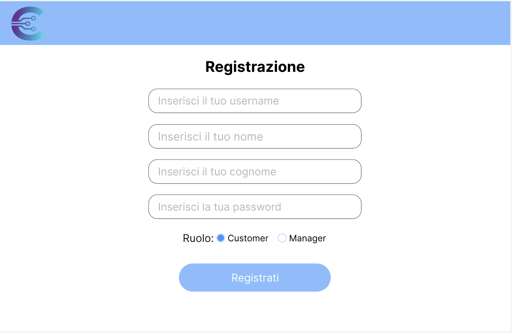
### Visualizza Informazioni Utente [UC4](./RequirementsDocumentV1.md#use-case-4-uc4)
In questa sezione l'utente ha la possibilità di visualizzare le proprie informazioni personali.
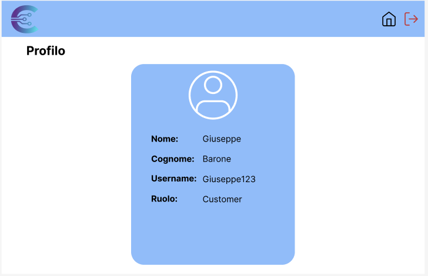

## Pagine Customer 
In questa sezione si analizzano tutte le pagine relative al customer.
### Visualizza Prodotti Customer [UC5](./RequirementsDocumentV1.md#use-case-5-uc5)
In tale pagina è possibile, visualizzare tutti i prodotti oppure filtrarli per:
- Modello
- Codice 
- Categoria

Inoltre, il customer attraverso il menù posto in alto può: 
- Visualizzare il proprio carrello [UC10](./RequirementsDocumentV1.md#use-case-10-uc10)
- Visualizzare le proprie informazioni Utente [UC4](./RequirementsDocumentV1.md#use-case-4-uc4)
- Effettuare il logout [UC2](./RequirementsDocumentV1.md#use-case-2-uc2)

Inizialmente il software restituisce un messaggio di avvertimenti di selezione di un filtro per visualizzare i prodotti.

.png)

Ecco il caso in cui l'utente seleziona dei filtri:

Visualizza Tutti i prodotti: 

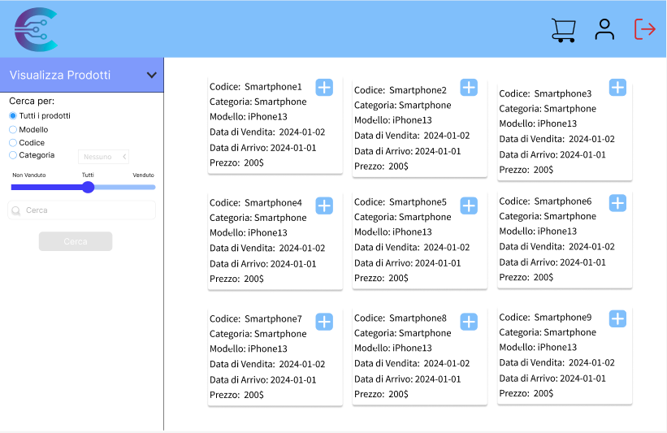

Visualizza Tutti i prodotti per Categoria:

Visualizza tutti i prodotti per Codice:

Visualizza tutti i prodotti per Modello:

### Visualizza Carrello [UC10](./RequirementsDocumentV1.md#use-case-10-uc10)
In questa schermata è possibile visualizzare il proprio carrello; visualizzare il totale, ed eliminare un determinato prodotto attraverso il tasto
"Rimuovi" [UC13](./RequirementsDocumentV1.md#use-case-13-uc13).

È possibile, inoltre, visualizzare lo storico degli ordini precedenti attraverso il tasto "Visualizza Cronologia" [UC12](./RequirementsDocumentV1.md#use-case-12-uc12), svuotare il carrello attraverso il tasto "svuota carrello" [UC11](./RequirementsDocumentV1.md#use-case-11-uc11) oppure
procedere al checkout [UC14](./RequirementsDocumentV1.md#use-case-14-uc14)

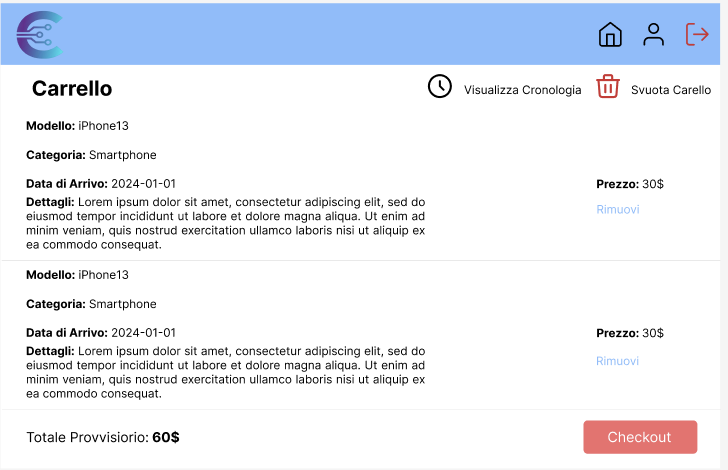

### Visualizza Cronologia ordini [UC12](./RequirementsDocumentV1.md#use-case-12-uc12)
In questa schermata il customer può visualizzare la propria cronologia degli ordini:

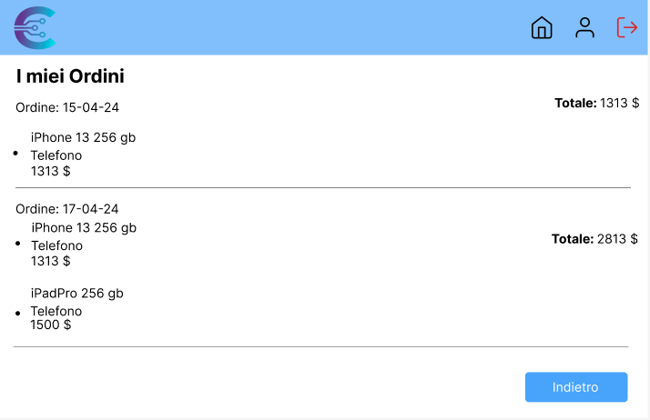

## Pagine Manager
In questa sezione si analizzano tutte le pagine relative al Manager. 

### Visualizza Prodotti [UC5](./RequirementsDocumentV1.md#use-case-5-uc5)
In questa pagina, è possibile visualizzare i prodotti presenti all'interno del sistema.

Inizialmente il software restituisce un messaggio di avvertimento di selezione di un filtro per visualizzare i prodotti.
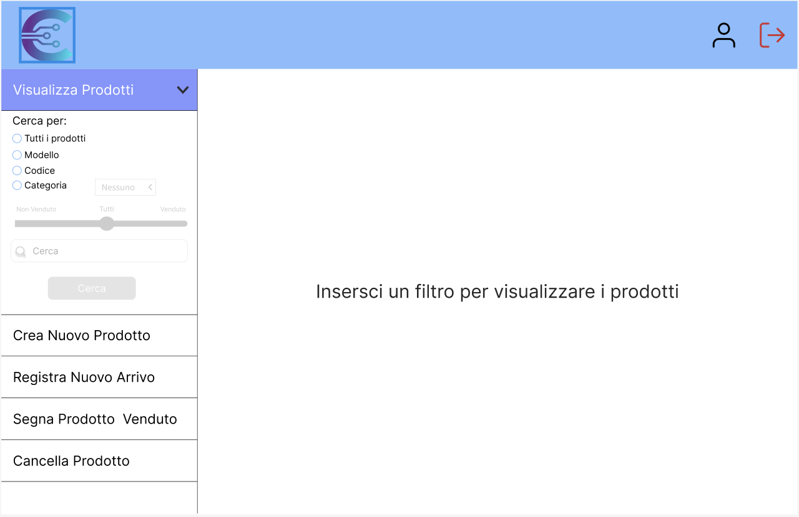
Il sistema prevede un meccanismo di filtraggio dinamico, nel quale è possibile attraverso dei radio button filtrare i prodotti. Secondo quale filtro si selezioni, si attiva o no la barra di ricerca o un slider per selezionare un filtraggio più accurato.
- Se l'utente seleziona la voce "Tutti i prodotti" allora il sistema provvederà a fornire tutti i prodotti del sistema. L'utente può inoltre aggiungere un ulteriore filtro, selezionando i prodotti venduti o non venduti attraverso uno slider.

- Se l'utente seleziona la voce "modello" allora il sistema mostrerà inizialmente un messaggio di richiesta di inserimento del modello all'interno della barra di ricerca. Una volta inserito correttamente il dato il sistema mostrerà i prodotti relativi al modello selezionato

- Se l'utente seleziona la voce "codice" allora il sistema mostrerà inizialmente un messaggio di richiesta di inserimento del codice all'interno della barra di ricerca. Una volta inserito correttamente il dato il sistema mostrerà il prodotto relativo al codice selezionato

- Se l'utente seleziona la voce "categoria" allora il sistema mette a disposizione un drop menu button, con il quale si avrà la possibilità di selezionare la categoria desiderata.

### Crea nuovo prodotto [UC6](./RequirementsDocumentV1.md#use-case-6-uc6)
In questa schermata l'utente è in grado di inserire un nuovo prodotto fornendo in input: 
1. Codice del prodotto
2. Prezzo di vendita
3. Modello del prodotto
4. Dettagli 
5. Categoria

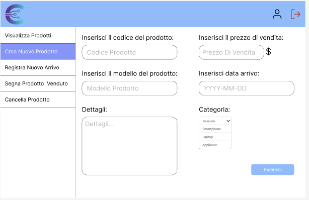
### Registra nuovo arrivo [UC7](./RequirementsDocumentV1.md#use-case-7-uc7)
In questa sezione l'utente è in grado di registrare un nuovo arrivo. 

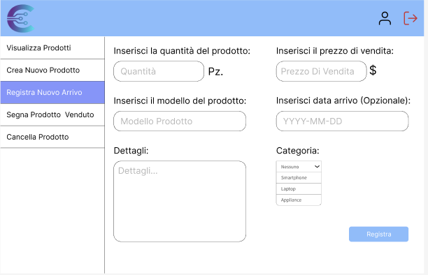
### Segna prodotto come venduto [UC8](./RequirementsDocumentV1.md#use-case-8-uc8)
In questa schermata l'utente inserisce
In questa sezione analizzeremo la sezione delle pagine del customer

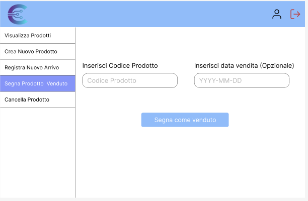
### Cancella Prodotto [UC9](./RequirementsDocumentV1.md#use-case-9-uc9)
In questa schermata l'utente inserisce il codice del prodotto da eliminare

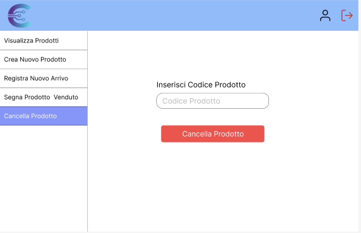