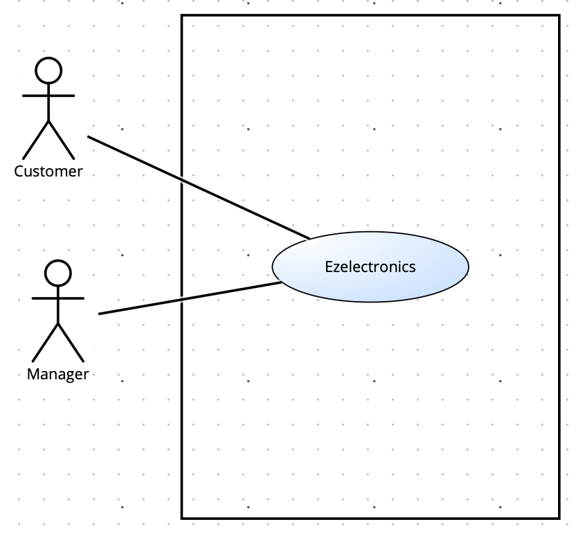

# Requirements Document - current EZElectronics

Date:

Version: V1 - description of EZElectronics in CURRENT form (as received by teachers)

| Version number | Change                                       |
| :------------: | :------------------------------------------- |
|      1.0       | Inizio requisiti                             |
|      1.1       | Aggiunti stakeholders                        |
|      1.2       | Aggiunto context Diagram                     |
|      1.3       | Aggiunti Stories and personas                |
|      2.0       | Inizio requisiti funzionali e non funzionali |
|      2.1       | Aggiunti   requisiti funzionali              |
|      2.2       | Aggiunti    requisiti non funzionali         |
|      3.0       | Inizio Use case                              |
|      3.1       | Aggiunto use case diagram                    |
|      3.2       | Aggiunti use case                            |
|      4.0       | Aggiunto glossario                           |
|      4.1       | Aggiunto class diagram                       |
|      5.0       | Aggiunto Deployment diagram                  |

# Contents

- [Requirements Document - current EZElectronics](#requirements-document---current-ezelectronics)
- [Contents](#contents)
- [Informal description](#informal-description)
- [Stakeholders](#stakeholders)
- [Context Diagram and interfaces](#context-diagram-and-interfaces)
  - [Context Diagram](#context-diagram)
  - [Interfaces](#interfaces)
- [Stories and personas](#stories-and-personas)
- [Functional and non functional requirements](#functional-and-non-functional-requirements)
  - [Functional Requirements](#functional-requirements)
  - [Non Functional Requirements](#non-functional-requirements)
- [Use case diagram and use cases](#use-case-diagram-and-use-cases)
  - [Summary](#summary)
  - [Use case diagram](#use-case-diagram)
    - [Use case 1, UC1](#use-case-1-uc1)
        - [Scenario 1.1](#scenario-11)
        - [Scenario 1.2](#scenario-12)
    - [Use case 2, UC2](#use-case-2-uc2)
        - [Scenario 2.1](#scenario-21)
    - [Use case 3, UC3](#use-case-3-uc3)
        - [Scenario 3.1](#scenario-31)
        - [Scenario 3.2](#scenario-32)
    - [Use case 4, UC4](#use-case-4-uc4)
        - [Scenario 4.1](#scenario-41)
    - [Use case 5, UC5](#use-case-5-uc5)
        - [Scenario 5.1](#scenario-51)
        - [Scenario 5.2](#scenario-52)
        - [Scenario 5.3](#scenario-53)
        - [Scenario 5.4](#scenario-54)
        - [Scenario 5.5](#scenario-55)
        - [Scenario 5.6](#scenario-56)
    - [Use case 6, UC6](#use-case-6-uc6)
        - [Scenario 6.1](#scenario-61)
        - [Scenario 6.2](#scenario-62)
        - [Scenario 6.3](#scenario-63)
    - [Use case 7, UC7](#use-case-7-uc7)
        - [Scenario 7.1](#scenario-71)
        - [Scenario 7.2](#scenario-72)
    - [Use case 8, UC8](#use-case-8-uc8)
        - [Scenario 8.1](#scenario-81)
        - [Scenario 8.2](#scenario-82)
        - [Scenario 8.3](#scenario-83)
        - [Scenario 8.4](#scenario-84)
    - [Use case 9, UC9](#use-case-9-uc9)
        - [Scenario 9.1](#scenario-91)
        - [Scenario 9.2](#scenario-92)
    - [Use case 10, UC10](#use-case-10-uc10)
        - [Scenario 10.1](#scenario-101)
    - [Use case 11, UC11](#use-case-11-uc11)
        - [Scenario 11.1](#scenario-111)
    - [Use case 12, UC12](#use-case-12-uc12)
        - [Scenario 12.1](#scenario-121)
        - [Scenario 12.2](#scenario-122)
    - [Use case 13, UC13](#use-case-13-uc13)
        - [Scenario 13.1](#scenario-131)
    - [Use case 14, UC14](#use-case-14-uc14)
        - [Scenario 14.1](#scenario-141)
    - [Use case 15, UC15](#use-case-15-uc15)
        - [Scenario 15.1](#scenario-151)
        - [Scenario 15.2](#scenario-152)
- [Glossary](#glossary)
  - [Class Diagram](#class-diagram)
- [Deployment Diagram](#deployment-diagram)

# Informal description

EZElectronics (read EaSy Electronics) is a software application designed to help managers of electronics stores to manage their products and offer them to customers through a dedicated website. Managers can assess the available products, record new ones, and confirm purchases. Customers can see available products, add them to a cart and see the history of their past purchases.

# Stakeholders
| Stakeholder name | Description                                                                                                                                                                   |
| :--------------: | :---------------------------------------------------------------------------------------------------------------------------------------------------------------------------- |
|     Manager      | Utilizzatore del software che gestisce le vendite del proprio store online. Tale figura può aggiungere e modificare i prodotti, visualizzarli oppure aggiungere nuovi arrivi. |
|     Customer     | Utilizzatore del software, il quale può visualizzare i prodotti, acquistarne di nuovi e vedere la storia dei propri acquisti.                                                 |

# Context Diagram and interfaces

## Context Diagram

## Interfaces

|  Actor   | Logical Interface                                                           | Physical Interface |
| :------: | :-------------------------------------------------------------------------- | :----------------- |
| Customer | GUI (Dedicata a visualizzare i prodotti da acquistare e gestire gli ordini) | PC/Smartphone      |
| Manager  | GUI (Dedicata alla gestiore ed alla visualizzazione dei prodotti)           | PC/Smartphone      |
# Stories and personas
- Gestore di un piccolo negozio di elettronica, che vorrebbe espandere il proprio business anche online.  
-  Un cliente che vorrebbe trovare e confrontare vari prezzi di un determinato prodotto elettronico venduto da più rivenditori.
- Un cliente che preferisce l'acquisto online.
- Gestore di una grande catena che vorrebbe gestire facilmente i prodotti del proprio store.
- Un cliente che vorrebbe tenere traccia degli ordini effettuati in precedenza.
- Un gestore che vorrebbe visualizzare i propri prodotti venduti in modo facile e veloce.
# Functional and non functional requirements

## Functional Requirements

\<In the form DO SOMETHING, or VERB NOUN, describe high level capabilities of the system>

\<they match to high level use cases>
<!-- Nel caso in cui vi è l'utente non autenticato, possiamo dividere il casi d'uso testing tra tutti gli altri casi d'uso -->
| ID           | Description                                          |
| :----------- | :--------------------------------------------------- |
| FR1          | Gestione Account                                     |
| &nbsp; FR1.1 | Login                                                |
| &nbsp; FR1.2 | Logout                                               |
| &nbsp; FR1.3 | Registrazione                                        |
| &nbsp; FR1.4 | Visualizza informazioni utente                       |
| FR2          | Gestione Prodotti                                    |
| &nbsp; FR2.1 | Crea nuovo prodotto                                  |
| &nbsp; FR2.2 | Cancella prodotto specifico                          |
| &nbsp; FR2.3 | Registra nuovo arrivo                                |
| &nbsp; FR2.4 | Segna prodotto venduto                               |
| &nbsp; FR2.5 | Visualizza prodotti (per codice, categoria, modello) |
| FR3          | Gestione Ordini                                      |
| &nbsp; FR3.1 | Aggiungi prodotto al carrello                        |
| &nbsp; FR3.2 | Visualizza Carrello                                  |
| &nbsp; FR3.3 | Visualizza Cronologia Ordini                         |
| &nbsp; FR3.4 | Rimuovi prodotto Dal Carrello                        |
| &nbsp; FR3.5 | Svuota Carrello                                      |
| &nbsp; FR3.6 | Checkout carrello                                    |

## Non Functional Requirements

| ID    | Type (efficiency, reliability, ..) | Description                                                                                                                                                                                       |  Refers to  |
| :---- | :--------------------------------- | :------------------------------------------------------------------------------------------------------------------------------------------------------------------------------------------------ | :---------: |
| NFR1  | Usability                          | Gli utenti non devono avere bisogno di training per utilizzare il software                                                                                                                        | FR1,FR2,FR3 |
| NFR2  | Efficiency                         | Il sistema deve garantire un tempo di caricamento inferiore ai 2 secondi                                                                                                                          | FR1,FR2,FR3 |
| NFR3  | Reliability                        | Il sistema deve garantire una permanenza locale dei dati anche durante la perdita di connessione con il database                                                                                  | FR1,FR2,FR3 |
| NFR4  | Reliability                        | Il sito web deve permettere l'acquisto di solo prodotti disponibili                                                                                                                               |     FR2     |
| NFR5  | Reliability                        | Il sito web deve garantire un uptime del 99.9999%                                                                                                                                                 | FR1,FR2,FR3 |
| NFR6  | Portability                        | Il sito web deve garantire il corretto funzionamento con i vari browers del customer                                                                                                              | FR1,FR2,FR3 |
| NFR7  | Portability                        | Il sistema deve essere progettato in modo tale da mantenere un utilizzo efficiente della memoria, evitando di causare rallentamenti significativi al sistema operativo o all'hardware sottostante | FR1,FR2,FR3 |
| NFR8  | Portability                        | Il sito web deve garantire la corretta visualizzazione all'interno di ogni dispositivo dell'utente con una dimensione schermo maggiore di 4.5 pollici                                             | FR1,FR2,FR3 |
| NFR9  | Security                           | Il sistema garantisce un processo di crittografia dei dati sensibili                                                                                                                              |     FR1     |
| NFR10 | Security                           | Il sistema deve garantire l'accesso alle funzionalità implementate solo agli utenti autenticati                                                                                                   | FR1,FR2,FR3 |
| NFR11 | Maintainability                    | Il sistema è scritto attraverso l'utilizzo di "framework" che garantiscono aggiornamenti per i prossimi 5 anni                                                                                    | FR1,FR2,FR3 |
| NFR12 | Reliability                        | Il sistema garantisce una corretta validazione dei dati inserti dall'utente                                                                                                                       | FR1,FR2,FR3 |
# Use case diagram and use cases
## Summary
Si sono identificati 3 macrocasi d'uso, quali:
- Gestione Account
- Gestione Prodotti
- Gestione Ordini
 

## Use case diagram
<!--TODO cambiare id con codice-->

### Use case 1, UC1

Caso d'uso: Login

| Actors Involved  | Utente                                 |
| :--------------: | :------------------------------------- |
|   Precondition   | L'utente non è autenticato nel sistema |
|  Postcondition   | L'utente è autenticato nel sistema     |
| Nominal Scenario | Login avvenuto con successo            |
|     Variants     | Nessuna.                               |
|    Exceptions    | Credenziali errate                     |

##### Scenario 1.1

Login avvenuto con successo

| Scenario 1.1  |                                                                           |
| :-----------: | :------------------------------------------------------------------------ |
| Precondition  | L'utente non è autenticato nel sistema e visualizza la pagina login       |
| Postcondition | L'utente è autenticato nel sistema                                        |
|     Step#     | Descrizione                                                               |
|       1       | L'utente inserisce le proprie credenziali   e  seleziona la voce "Accedi" |
|       2       | Il sistema verifica le credenziali                                        |
|       3       | L'utente viene autenticato e reindirizzato alla pagina principale         |
|       4       | Il caso d'uso Termina                                                     |

##### Scenario 1.2

L'utente inserisce credenziali errate

| Scenario 1.2  |                                                                            |
| :-----------: | :------------------------------------------------------------------------- |
| Precondition  | L'utente non è autenticato nel sistema e visualizza la pagina login        |
| Postcondition | L'utente non è autenticato nel sistema                                     |
|     Step#     | Descrizione                                                                |
|       1       | L'utente inserisce le proprie credenziali   e  seleziona la voce "Accedi"  |
|       2       | Il sistema verifica le credenziali e mostra a video un messaggio di errore |
|       3       | Il caso d'uso Termina                                                      |

### Use case 2, UC2

Caso d'uso: Logout

| Actors Involved  | Utente                                    |
| :--------------: | :---------------------------------------- |
|   Precondition   | L'utente è autenticato nel sistema.       |
|  Postcondition   | L'utente non è autenticato nel sistema.   |
| Nominal Scenario | L'utente effettua il logout correttamente |
|     Variants     | Nessuna                                   |
|    Exceptions    | Nessuna                                   |

##### Scenario 2.1

L'utente effettua il logout correttamente

| Scenario 2.1  |                                                          |
| :-----------: | :------------------------------------------------------- |
| Precondition  | L'utente è autenticato nel sistema.                      |
| Postcondition | L'utente non è autenticato nel sistema.                  |
|     Step#     | Descrizione                                              |
|       1       | L'utente seleziona la voce "Logout".                     |
|       2       | Il sistema mostra a video un pop-up di conferma.         |
|       3       | L'utente seleziona la voce "OK"                          |
|       4       | Il sistema reindirizza l'utente alla schermata di Login. |
|       5       | Il caso d'uso Termina                                    |

### Use case 3, UC3

Caso d'uso: Registrazione

| Actors Involved  | Utente                                                   |
| :--------------: | :------------------------------------------------------- |
|   Precondition   | L'utente non è registrato nel sistema                    |
|  Postcondition   | L'utente è registrato nel sistema                        |
| Nominal Scenario | Registrazione avvenuta con successo                      |
|     Variants     | Nessuna                                                  |
|    Exceptions    | L'utente inserisce  un username già presente nel sistema |

##### Scenario 3.1

Registrazione avvenuta con successo.

| Scenario 3.1  |                                                                                     |
| :-----------: | :---------------------------------------------------------------------------------- |
| Precondition  | L'utente non è registrato nel sistema e visualizza la pagina di registrazione.      |
| Postcondition | L'utente è registrato nel sistema.                                                  |
|     Step#     | Descrizione                                                                         |
|       1       | L'utente inserisce i propri dati di registrazione e  seleziona la voce "Registrati" |
|       2       | Il sistema verifica i dati inseriti                                                 |
|       3       | l'utente viene registrato e reindirizzato all pagina principale.                    |
|       4       | Il caso d'uso Termina                                                               |

##### Scenario 3.2

L'utente inserisce  un username già presente nel sistema

| Scenario 3.2  |                                                                                    |
| :-----------: | :--------------------------------------------------------------------------------- |
| Precondition  | L'utente non è registrato nel sistema e visualizza la schermata registrazione.     |
| Postcondition | L'utente non è registrato nel sistema.                                             |
|     Step#     | Descrizione                                                                        |
|       1       | L'utente inserisce i propri dati di registrazione e seleziona la voce "Registrati" |
|       2       | Il sistema verifica che i dati inseriti e visualizza un messaggio di errore        |
|       3       | L'utente seleziona la voce "OK"                                                    |
|       4       | Il sistema reindirizza l'utente alla schermata di registrazione.                   |
|       5       | Il caso d'uso Termina                                                              |

### Use case 4, UC4

Caso d'uso: Visualizza informazioni utente. 

| Actors Involved  | Utente                                                  |
| :--------------: | :------------------------------------------------------ |
|   Precondition   | Il sistema ha mostrato a video la schermata Principale. |
|  Post condition  | L'utente ha visualizzato le proprie informazioni.       |
| Nominal Scenario | L'utente visualizza le proprie informazioni             |
|     Variants     | Nessuna                                                 |
|    Exceptions    | Nessuna                                                 |

##### Scenario 4.1

L'utente visualizza le proprie informazioni. 

| Scenario 4.1  |                                                         |
| :-----------: | :------------------------------------------------------ |
| Precondition  | Il sistema ha mostrato a video la schermata Principale. |
| Postcondition | L'utente ha visualizzato le proprie informazioni.       |
|     Step#     | Descrizione                                             |
|       1       | L'utente seleziona la voce "profilo"                    |
|       2       | Il sistema mostra a video le informazioni dell'utente   |
|       3       | Il caso d'uso termina                                   |

### Use case 5, UC5

Caso d'uso: Visualizza Prodotti

| Actors Involved  | Utente                                                                |
| :--------------: | :-------------------------------------------------------------------- |
|   Precondition   | L'utente ha visualizzato la schermata Principale                      |
|  Post condition  | Il sistema ha mostrato i prodotti                                     |
| Nominal Scenario | L'utente visualizza correttamente tutti prodotti                      |
|     Variants     | L'utente visualizza i prodotti per codice, modello o categoria        |
|    Exceptions    | Se non sono presenti prodotti l'utente visualizza una schermata vuota |

##### Scenario 5.1

L'utente visualizza tutti i prodotti con successo

|  Scenario 5.1  |                                                          |
| :------------: | :------------------------------------------------------- |
|  Precondition  | L'utente visualizza la schermata iniziale                |
| Post condition | Il sistema mostra correttamente tutti i prodotti         |
|     Step#      | Description                                              |
|       1        | L'utente seleziona la voce 'visualizza prodotti'         |
|       2        | Il sistema mostra a schermo i filtri di ricerca prodotti |
|       3        | L'utente seleziona la voce filtro 'tutti i prodotti'     |
|       4        | Il sistema mostra a schermo tutti i prodotti presenti    |
|       5        | Il caso d'uso termina                                    |

##### Scenario 5.2

L'utente visualizza il prodotto con un codice specifico con successo

|  Scenario 5.2  |                                                                             |
| :------------: | :-------------------------------------------------------------------------- |
|  Precondition  | L'utente visualizza la schermata iniziale                                   |
| Post condition | Il sistema mostra correttamente il prodotto con codice inserito             |
|     Step#      | Description                                                                 |
|       1        | L'utente seleziona la voce 'visualizza prodotti'                            |
|       2        | Il sistema mostra a schermo i filtri di ricerca prodotti                    |
|       3        | L'utente seleziona la voce filtro 'codice' e inserisce il codice desiderato |
|       4        | Il sistema mostra a schermo il prodotto con codice inserito                 |
|       5        | Il caso d'uso termina                                                       |

##### Scenario 5.3

L'utente visualizza il prodotto con un modello specifico con successo

|  Scenario 5.3  |                                                                               |
| :------------: | :---------------------------------------------------------------------------- |
|  Precondition  | L'utente visualizza la schermata iniziale                                     |
| Post condition | Il sistema mostra correttamente i prodotti con modello inserito               |
|     Step#      | Description                                                                   |
|       1        | L'utente seleziona la voce 'visualizza prodotti'                              |
|       2        | Il sistema mostra a schermo i filtri di ricerca prodotti                      |
|       3        | L'utente seleziona la voce filtro 'modello' e inserisce il modello desiderato |
|       4        | Il sistema mostra a schermo i prodotti con modello inserito                   |
|       5        | Il caso d'uso termina                                                         |

##### Scenario 5.4

L'utente visualizza il prodotto con una categoria specifica con successo

|  Scenario 5.4  |                                                                                      |
| :------------: | :----------------------------------------------------------------------------------- |
|  Precondition  | L'utente visualizza la schermata iniziale                                            |
| Post condition | Il sistema mostra correttamente i prodotti con categoria scelta                      |
|     Step#      | Description                                                                          |
|       1        | L'utente seleziona la voce 'visualizza prodotti'                                     |
|       2        | Il sistema mostra a schermo i filtri di ricerca prodotti                             |
|       3        | L'utente seleziona la voce filtro 'categoria' e sceglie tra le categorie disponibili |
|       4        | Il sistema mostra a schermo i prodotti con categoria inserita                        |
|       5        | Il caso d'uso termina                                                                |

##### Scenario 5.5

L'utente visualizza con successo i prodotti venduti

|  Scenario 5.5  |                                                                                              |
| :------------: | :------------------------------------------------------------------------------------------- |
|  Precondition  | Si è verificato e concluso uno dei seguenti scenari: 5.1, 5.3, 5.4                           |
| Post condition | Il sistema mostra solo i prodotti venduti                                                    |
|     Step#      | Description                                                                                  |
|       1        | L'utente seleziona la voce filtro 'venduti'                                                  |
|       2        | Il sistema filtra i prodotti attualmente visualizzati e mostra a schermo solo quelli venduti |
|       3        | Il caso d'uso termina                                                                        |

##### Scenario 5.6

L'utente visualizza con successo i prodotti non venduti

|  Scenario 5.5  |                                                                                                  |
| :------------: | :----------------------------------------------------------------------------------------------- |
|  Precondition  | Si è verificato e concluso uno dei seguenti scenari: 5.1, 5.3, 5.4                               |
| Post condition | Il sistema mostra solo i prodotti non venduti                                                    |
|     Step#      | Description                                                                                      |
|       1        | L'utente seleziona la voce filtro 'non venduti'                                                  |
|       2        | Il sistema filtra i prodotti attualmente visualizzati e mostra a schermo solo quelli non venduti |
|       3        | Il caso d'uso termina                                                                            |

### Use case 6, UC6

Caso d'uso: Crea nuovo prodotto

| Actors Involved  | Manager                                                           |
| :--------------: | :---------------------------------------------------------------- |
|   Precondition   | Il manager visualizza la schermata iniziale                       |
|  Post condition  | Il sistema ha aggiunto un nuovo prodotto                          |
| Nominal Scenario | Il manager ha aggiunto correttamente un nuovo prodotto            |
|     Variants     | Nessuno                                                           |
|    Exceptions    | Visualizza messaggio di errore se i dati in input non sono validi |

##### Scenario 6.1

Il manager aggiunge un prodotto con successo

|  Scenario 6.1  |                                                                           |
| :------------: | :------------------------------------------------------------------------ |
|  Precondition  | Il manager visualizza la schermata iniziale                               |
| Post condition | Il sistema aggiunge correttamente un prodotto                             |
|     Step#      | Description                                                               |
|       1        | Il manager seleziona la voce 'Crea nuovo prodotto'                        |
|       2        | Il sistema mostra la schermata per aggiungere un prodotto                 |
|       3        | Il manager inserisce e i dati del prodotto e seleziona la voce 'Registra' |
|       4        | Il sistema analizza i dati in input e aggiunge correttamente il prodotto  |
|       5        | Il caso d'uso termina                                                     |

##### Scenario 6.2

Il manager inserisce un prodotto con un codice già presente nel database

|  Scenario 6.2  |                                                                          |
| :------------: | :----------------------------------------------------------------------- |
|  Precondition  | Il manager visualizza la schermata iniziale                              |
| Post condition | Il sistema non aggiunge correttamente un prodotto                        |
|     Step#      | Description                                                              |
|       1        | Il manager seleziona la voce 'Crea nuovo prodotto'                       |
|       2        | Il sistema mostra la schermata per aggiungere un prodotto                |
|       3        | Il manager inserisce i dati del prodotto e seleziona la voce 'Inserisci' |
|       4        | Il sistema analizza i dati in input e ritorna il messaggio di errore     |
|       5        | Il caso d'uso termina                                                    |

##### Scenario 6.3

Il manager inserisce un prodotto con una data di arrivo successiva al giorno corrente

|  Scenario 6.3  |                                                                          |
| :------------: | :----------------------------------------------------------------------- |
|  Precondition  | Il manager visualizza la schermata iniziale                              |
| Post condition | Il sistema non aggiunge correttamente un prodotto                        |
|     Step#      | Description                                                              |
|       1        | Il manager seleziona la voce 'Crea nuovo prodotto'                       |
|       2        | Il sistema mostra la schermata per aggiungere un prodotto                |
|       3        | Il manager inserisce i dati del prodotto e seleziona la voce 'Inserisci' |
|       4        | Il sistema analizza i dati in input e ritorna il messaggio di errore     |
|       5        | Il caso d'uso termina                                                    |

### Use case 7, UC7

Caso d'uso: Registra nuovo arrivo

| Actors Involved  | Manager                                                           |
| :--------------: | :---------------------------------------------------------------- |
|   Precondition   | Il manager visualizza la schermata iniziale                       |
|  Post condition  | Il sistema registra un set di nuovi arrivi                        |
| Nominal Scenario | Il manager ha aggiunto correttamente un set di nuovi arrivi       |
|     Variants     | Nessuno                                                           |
|    Exceptions    | Visualizza messaggio di errore se i dati in input non sono validi |

##### Scenario 7.1

Il manager registra un set di prodotti dello stesso modello con successo

|  Scenario 7.1  |                                                                                                |
| :------------: | :--------------------------------------------------------------------------------------------- |
|  Precondition  | Il manager visualizza la schermata iniziale                                                    |
| Post condition | Il sistema registra correttamente un set di prodotti dello stesso modello                      |
|     Step#      | Description                                                                                    |
|       1        | Il manager seleziona la voce 'Registra nuovo arrivo'                                           |
|       2        | Il sistema mostra la schermata per registrare più prodotti dello stesso modello                |
|       3        | Il manager inserisce i dati del prodotto e seleziona la voce 'Inserisci'                       |
|       4        | Il sistema analizza i dati in input e registra correttamente il set di nuovi prodotti arrivati |
|       5        | Il caso d'uso termina                                                                          |

##### Scenario 7.2

Il manager inserisce un set di prodotti con data di arrivo successiva alla data corrente

|  Scenario 7.2  |                                                                                                             |
| :------------: | :---------------------------------------------------------------------------------------------------------- |
|  Precondition  | Il manager visualizza la schermata iniziale                                                                 |
| Post condition | Il sistema non registra correttamente un set di prodotti dello stesso modello e ritorna messaggio di errore |
|     Step#      | Description                                                                                                 |
|       1        | Il manager seleziona la voce 'Registra nuovo arrivo'                                                        |
|       2        | Il sistema mostra la schermata per registrare più prodotti dello stesso modello                             |
|       3        | Il manager inserisce i dati del prodotto e seleziona la voce 'Inserisci'                                    |
|       4        | Il sistema analizza i dati in input e ritorna il messaggio di errore                                        |
|       5        | Il caso d'uso termina                                                                                       |

### Use case 8, UC8

Caso d'uso: Segna un prodotto 'venduto'

| Actors Involved  | Manager                                                           |
| :--------------: | :---------------------------------------------------------------- |
|   Precondition   | Il manager visualizza la schermata iniziale                       |
|  Post condition  | Il sistema segna un prodotto come 'venduto'                       |
| Nominal Scenario | Il manager ha segnato correttamente un prodotto come venduto      |
|     Variants     | Nessuno                                                           |
|    Exceptions    | Visualizza messaggio di errore se i dati in input non sono validi |

##### Scenario 8.1

Il manager segna con successo un prodotto come 'venduto'

|  Scenario 8.1  |                                                                                                          |
| :------------: | :------------------------------------------------------------------------------------------------------- |
|  Precondition  | Il manager visualizza la schermata iniziale                                                              |
| Post condition | Il sistema segna correttamente un prodotto come venduto                                                  |
|     Step#      | Description                                                                                              |
|       1        | Il manager seleziona la voce 'Segna prodotto venduto'                                                    |
|       2        | Il sistema mostra la schermata per cercare il prodotto da segnare come 'venduto'                         |
|       3        | Il manager inserisce il codice e opzionalmente la data di vendita del prodotto da segnare come 'venduto' |
|       4        | Il sistema analizza il codice in input e segna correttamente il prodotto come venduto                    |
|       5        | Il caso d'uso termina                                                                                    |

##### Scenario 8.2

Il manager inserisce il codice di un prodotto non presente nel database 

|  Scenario 8.2  |                                                                                                          |
| :------------: | :------------------------------------------------------------------------------------------------------- |
|  Precondition  | Il manager visualizza la schermata iniziale                                                              |
| Post condition | Il sistema non segna correttamente un prodotto come venduto e ritorna messaggio di errore                |
|     Step#      | Description                                                                                              |
|       1        | Il manager seleziona la voce 'Segna prodotto venduto'                                                    |
|       2        | Il sistema mostra la schermata per cercare il prodotto da segnare come 'venduto'                         |
|       3        | Il manager inserisce il codice e opzionalmente la data di vendita del prodotto da segnare come 'venduto' |
|       4        | Il sistema ritorna un messaggio di errore                                                                |
|       5        | Il caso d'uso termina                                                                                    |

##### Scenario 8.3

Il manager inserisce il codice di un prodotto gia venduto

|  Scenario 8.3  |                                                                                           |
| :------------: | :---------------------------------------------------------------------------------------- |
|  Precondition  | Il manager visualizza la schermata iniziale                                               |
| Post condition | Il sistema non segna correttamente un prodotto come venduto e ritorna messaggio di errore |
|     Step#      | Description                                                                               |
|       1        | Il manager seleziona la voce 'Segna prodotto venduto'                                     |
|       2        | Il sistema mostra la schermata per cercare il prodotto da segnare come 'venduto'          |
|       3        | Il manager inserisce il codice del prodotto da segnare come 'venduto'                     |
|       4        | Il sistema ritorna un messaggio di errore                                                 |
|       5        | Il caso d'uso termina                                                                     |

##### Scenario 8.4

Il manager inserisce una data di vendita di un prodotto non valida

|  Scenario 8.4  |                                                                                              |
| :------------: | :------------------------------------------------------------------------------------------- |
|  Precondition  | Il manager visualizza la schermata iniziale                                                  |
| Post condition | Il sistema non segna correttamente un prodotto come venduto e ritorna messaggio di errore    |
|     Step#      | Description                                                                                  |
|       1        | Il manager seleziona la voce 'Segna prodotto venduto'                                        |
|       2        | Il sistema mostra la schermata per segnare il prodotto come 'venduto'                        |
|       3        | Il manager inserisce il codice e e la data di vendita del prodotto da segnare come 'venduto' |
|       4        | Il sistema ritorna un messaggio di errore                                                    |
|       5        | Il caso d'uso termina                                                                        |

### Use case 9, UC9

Caso d'uso: Cancella un prodotto

| Actors Involved  | Manager                                                         |
| :--------------: | :-------------------------------------------------------------- |
|   Precondition   | Il manager visualizza la schermata iniziale                     |
|  Post condition  | Il sistema cancella un prodotto dal database                    |
| Nominal Scenario | Il manager ha cancellato correttamente un prodotto dal database |
|     Variants     | Nessuno                                                         |
|    Exceptions    | Visualizza messaggio di errore se il codice non è valido        |

##### Scenario 9.1

Il manager cancella con successo un prodotto

|  Scenario 9.1  |                                                                                          |
| :------------: | :--------------------------------------------------------------------------------------- |
|  Precondition  | Il manager visualizza la schermata iniziale                                              |
| Post condition | Il sistema cancella correttamente un prodotto dal database                               |
|     Step#      | Description                                                                              |
|       1        | Il manager seleziona la voce 'Cancella prodotto'                                         |
|       2        | Il sistema mostra la schermata per cancellare un prodotto                                |
|       3        | Il manager inserisce il codice del prodotto da cancellare                                |
|       4        | Il sistema analizza il codice in input e cancella correttamente il prodotto dal database |
|       5        | Il caso d'uso termina                                                                    |

##### Scenario 9.2

Il manager inserisce un codice di un prodotto non valido

|  Scenario 9.2  |                                                                         |
| :------------: | :---------------------------------------------------------------------- |
|  Precondition  | Il manager visualizza la schermata iniziale                             |
| Post condition | Il sistema non cancella correttamente un prodotto dal database          |
|     Step#      | Description                                                             |
|       1        | Il manager seleziona la voce 'Cancella prodotto'                        |
|       2        | Il sistema mostra la schermata per cancellare un prodotto               |
|       3        | Il manager inserisce il codice del prodotto da cancellare               |
|       4        | Il sistema analizza il codice in input e ritorna il messaggio di errore |
|       5        | Il caso d'uso termina                                                   |

### Use case 10, UC10

Caso d'uso: Visualizza carrello

| Actors Involved  | Customer                                                                     |
| :--------------: | :--------------------------------------------------------------------------- |
|   Precondition   | Il Customer sta visualizzando la schermata principale                        |
|  Post condition  | Il Customer visualizza il contenuto del carrello                             |
| Nominal Scenario | Il Customer accede alla schermata del carrello, e ne visualizza il contenuto |
|     Variants     | Nessuna                                                                      |
|    Exceptions    | Se non sono presenti prodotti il Customer visualizza una schermata vuota     |

##### Scenario 10.1

Il Customer accede alla schermata del carrello, e ne visualizza il contenuto

| Scenario 10.1  |                                                       |
| :------------: | :---------------------------------------------------- |
|  Precondition  | Il Customer ha visualizzato la schermata iniziale     |
| Post condition | Il Customer ha visualizzato il contenuto del carrello |
|     Step#      | Description                                           |
|       1        | Il Customer seleziona la voce "carrello"              |
|       2        | Il sistema mostra a schermo il carrello               |
|       3        | Il caso d'uso termina                                 |

### Use case 11, UC11

Caso d'uso: Svuota carrello

| Actors Involved  | Customer                                                                           |
| :--------------: | :--------------------------------------------------------------------------------- |
|   Precondition   | Il Customer ha visualizzato il carrello ed il carrello contiene almeno un prodotto |
|  Post condition  | Il carrello non contiene alcun prodotto                                            |
| Nominal Scenario | Il Customer rimuove correttamente un prodotto                                      |
|     Variants     | Nessuna                                                                            |
|    Exceptions    | Nessuna                                                                            |

##### Scenario 11.1

Il Customer svuota il carrello con successo

| Scenario 11.1  |                                                                                    |
| :------------: | :--------------------------------------------------------------------------------- |
|  Precondition  | Il Customer ha visualizzato il carrello ed il carrello contiene almeno un prodotto |
| Post condition | Il carrello non contiene alcun prodotto                                            |
|     Step#      | Description                                                                        |
|       1        | Il Customer seleziona la voce "svuota carrello"                                    |
|       2        | Il sistema svuota il carrello                                                      |
|       3        | Il caso d'uso termina                                                              |

### Use case 12, UC12

Caso d'uso: Visualizza cronologia ordini

| Actors Involved  | Customer                                                                       |
| :--------------: | :----------------------------------------------------------------------------- |
|   Precondition   | Il Customer ha visualizzato il carrello                                        |
|  Post condition  | Il Customer visualizza la cronologia ordini                                    |
| Nominal Scenario | Il Customer seleziona la voce "cronologia ordini"                              |
|     Variants     | Nessuna                                                                        |
|    Exceptions    | Se non sono presenti ordini passati il Customer visualizza una schermata vuota |

##### Scenario 12.1

Il Customer visualizza gli ordini passati

| Scenario 12.1  |                                                                           |
| :------------: | :------------------------------------------------------------------------ |
|  Precondition  | Il Customer ha visualizzato il carrello e ha effettuato ordini in passato |
| Post condition | Il Customer visualizza la cronologia ordini                               |
|     Step#      | Description                                                               |
|       1        | Il Customer seleziona la voce 'cronologia ordini'                         |
|       2        | Il sistema mostra la lista degli ordini passati                           |
|       3        | Il caso d'uso termina                                                     |
##### Scenario 12.2

Il Customer visualizza la cronologia ordini, ma non sono presenti ordini passati

| Scenario 12.2  |                                                                               |
| :------------: | :---------------------------------------------------------------------------- |
|  Precondition  | Il Customer ha visualizzato il carrello e non ha effettuato ordini in passato |
| Post condition | Il Customer visualizza la cronologia ordini vuota                             |
|     Step#      | Description                                                                   |
|       1        | Il Customer seleziona la voce 'cronologia ordini'                             |
|       2        | Il sistema mostra un messaggio che suggerisce di ordinare qualcosa            |
|       3        | Il caso d'uso termina                                                         |

### Use case 13, UC13

Caso d'uso: Rimuovi prodotto dal carrello

| Actors Involved  | Customer                                                                           |
| :--------------: | :--------------------------------------------------------------------------------- |
|   Precondition   | Il Customer ha visualizzato il carrello ed il carrello contiene almeno un prodotto |
|  Post condition  | Il Customer ha rimosso un prodotto dal carrello                                    |
| Nominal Scenario | Il Customer ha rimosso correttamente un prodotto dal carrello                      |
|     Variants     | Nessuna                                                                            |
|    Exceptions    | Il carrello è vuoto                                                                |

##### Scenario 13.1

Il Customer ha rimosso correttamente un prodotto dal carrello

| Scenario 13.1  |                                                                                          |
| :------------: | :--------------------------------------------------------------------------------------- |
|  Precondition  | Il Customer ha visualizzato il carrello ed il carrello contiene almeno un prodotto       |
| Post condition | Il Customer ha rimosso un prodotto dal carrello                                          |
|     Step#      | Description                                                                              |
|       1        | Il Customer seleziona la voce "rimuovi prodotto"                                         |
|       2        | Il sistema aggiorna il carrello, rimuovendo il prodotto, e mostra il carrello aggiornato |
|       3        | Il caso d'uso termina                                                                    |

### Use case 14, UC14

Caso d'uso: Checkout carrello

| Actors Involved  | Customer                                                    |
| :--------------: | :---------------------------------------------------------- |
|   Precondition   | Il Customer ha visualizzato il carrello                     |
|  Post condition  | Il carrello viene segnato come pagato                       |
| Nominal Scenario | Il Customer effettua correttamente il checkout del carrello |
|     Variants     | Nessuno                                                     |
|    Exceptions    | il carrello non contiene prodotti                           |

##### Scenario 14.1

Il Customer effettua correttamente il checkout del carrello

| Scenario 13.1  |                                          |
| :------------: | :--------------------------------------- |
|  Precondition  | Il Customer ha visualizzato il carrello  |
| Post condition | Il carrello viene segnato come pagato    |
|     Step#      | Description                              |
|       1        | Il Customer seleziona la voce "checkout" |
|       2        | Il sistema effettua il checkout          |
|       3        | Il caso d'uso termina                    |

### Use case 15, UC15

Caso d'uso: Aggiungi prodotto al carrello

| Actors Involved  | Customer                                                                |
| :--------------: | :---------------------------------------------------------------------- |
|   Precondition   | Si è verificato e concluso uno dei seguenti scenari: 5.1, 5.2, 5.3, 5.4 |
|  Post condition  | Il prodotto viene aggiunto al carrello                                  |
| Nominal Scenario | Il Customer aggiunge correttamente il prodotto al carrello              |
|     Variants     | Nessuno                                                                 |
|    Exceptions    | Il prodotto è gia stato venduto                                         |

##### Scenario 15.1

Il Customer aggiungie un prodotto al carrello correttamente

| Scenario 15.1  |                                                                         |
| :------------: | :---------------------------------------------------------------------- |
|  Precondition  | Si è verificato e concluso uno dei seguenti scenari: 5.1, 5.2, 5.3, 5.4 |
| Post condition | Il prodotto viene aggiunto al carrello                                  |
|     Step#      | Description                                                             |
|       1        | Il Customer seleziona la voce 'aggiungi prodotto al carrello'           |
|       2        | Il sistema aggiunge correttamente il prodotto al carrello               |
|       3        | Il caso d'uso termina                                                   |

##### Scenario 15.2

Il Customer aggiunge un prodotto già venduto

| Scenario 15.2  |                                                                         |
| :------------: | :---------------------------------------------------------------------- |
|  Precondition  | Si è verificato e concluso uno dei seguenti scenari: 5.1, 5.2, 5.3, 5.4 |
| Post condition | Il prodotto viene aggiunto al carrello                                  |
|     Step#      | Description                                                             |
|       1        | Il Customer seleziona la voce 'aggiungi prodotto al carrello'           |
|       2        | Il sistema mostra a schermo un messaggio di errore                      |
|       3        | Il caso d'uso termina                                                   |

# Glossary

* Sistema: indica il set di strumenti e dati messi a disposizione da ezelectronics

* Software: indica il set di strumenti messi a disposizione da ezelectronics

* Account: insieme di informazioni che riguardano un *utente*, registrate presso il *sistema*

* Utente: utilizzatore del software con un *account* attivo

* Customer: *utente* abilitato all'acquisto di *prodotti*

* Manager: *utente* abilitato alla gestione dei *prodotti*

* Autenticazione: procedura basata su *credenziali* che verifica l'identità di un *utente* e lo abilita all'utilizzo del *sistema*

* Login: procedura atta ad *autenticare* un *utente*

* Logout: procedura atta al de-*autenticare* un *utente* per permettere l'accesso ad un *utente* differente

* Registrazione: procedura atta alla creazione di un *utente* che richiede l'inserimento dei *Dati di registrazione*

* Browser: software atto alla visualizzazione e navigazione delle pagine web

<!-- TODO: da definire il concetto di availability? -->
* Uptime: definisce l'availability del *sistema*; spesso espressa in [percentuale o "numero di 9"](https://en.wikipedia.org/wiki/High_availability#Percentage_calculation).

* Credenziali: coppia di username e password che identificano un *utente*

* Dati di registrazione: forniti durante la registrazione, sono composti da:
  1. Un username - stringa composta da numeri, lettere e simboli
  1. Una password - stringa composta da numeri, lettere e simboli
  1. Un nome - stringa composta da lettere
  1. Un cognome - stringa composta da lettere
  1. Un ruolo - a scelta tra *Manager* e *Customer*

* Informazioni dell'utente: sottoinsieme dei dati forniti durante la registrazione, composto da:
  1. Un username - stringa composta da numeri, lettere e simboli
  1. Un nome - stringa composta da lettere
  1. Un cognome - stringa composta da lettere
  1. Un ruolo - a scelta tra *Manager* e *Customer*

* Arrivo: gruppo di *prodotti* dello stesso tipo con gli stessi *dati del prodotto*, fatta esclusione per il *codice*

* Prodotto: oggetto messo in vendita dal *sistema*; gestito dai *Manager*; può essere acquistato dai *Customer*.
  Caratterizzato dai *dati del prodotto*

* Categoria del prodotto: uno tra:
  1. Smartphone: telefono cellulare con capacità avanzate
  1. Laptop: computer portatile
  1. Appliance: oggetto elettronico che non rientra nelle precedenti categorie

* Codice del prodotto: stringa di caratteri alfanumerici che definisce unicamente un *prodotto* all'interno del *sistema*

* Modello del prodotto: stringa di caratteri alfabetici, numerici e simbolici che definiscono un gruppo di *prodotti* con le medesime caratteristiche

* Dati del prodotto: forniti da un *Manager* durante l'aggiunta del *prodotto* o di un *arrivo*, composti da:
  1. *Categoria*
  2. *Codice*
  3. *Modello*
  4. Prezzo di vendita
  5. Data di arrivo
  6. Dettagli

* Carrello: elenco di *prodotti*; gestito dai *Customer*

* Checkout: procedura che consiste nel pagamento di un *carrello*

* Ordine: *carrello* sul quale è stato effettuato il *checkout*

* Cronologia Ordini: lista di *ordini* effettuati da un *Customer*

*  Dati sensibili: insieme di dati privati dell'*utente*:
1. Password

* Crittografia: procedura atta a protegere i *dati sensibili* dell'*utente*.
 

## Class Diagram 

# Deployment Diagram

\<describe here deployment diagram >
Il sistema è ripartito nei seguenti nodi: 
1. Un nodo principale chiamato server, il quale gestisce le richieste http effettuate dal client
2. Un nodo application server il quale funge da interfaccia tra il server ed il database
3. Il DB Server, nel quale si memorizzano le informazioni del Sistema
4. Il client, che si ripartisce in Terminale Manager, e Custormer, sul quale è installato il browser per connetterni al sistema
 

