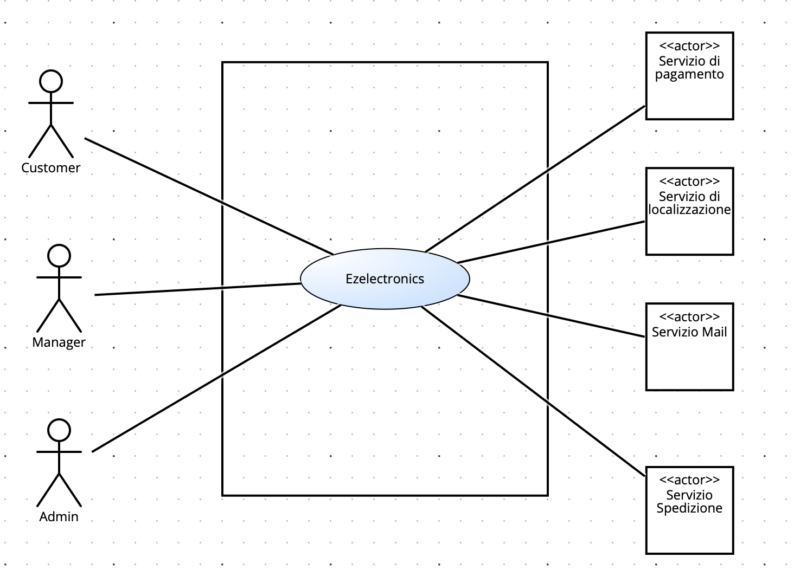
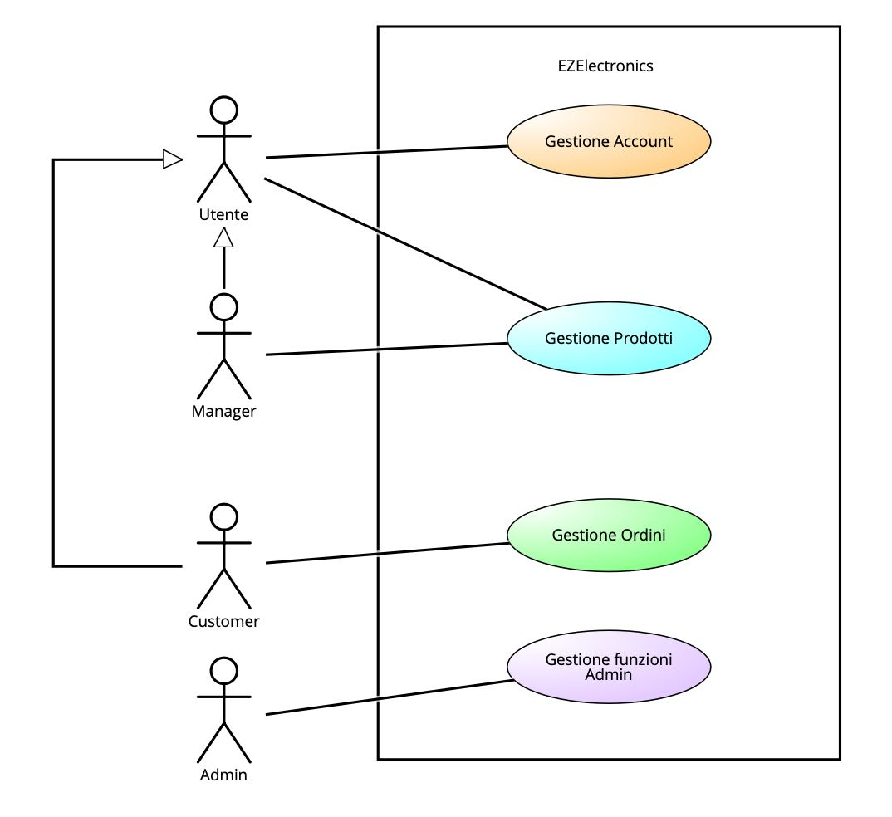
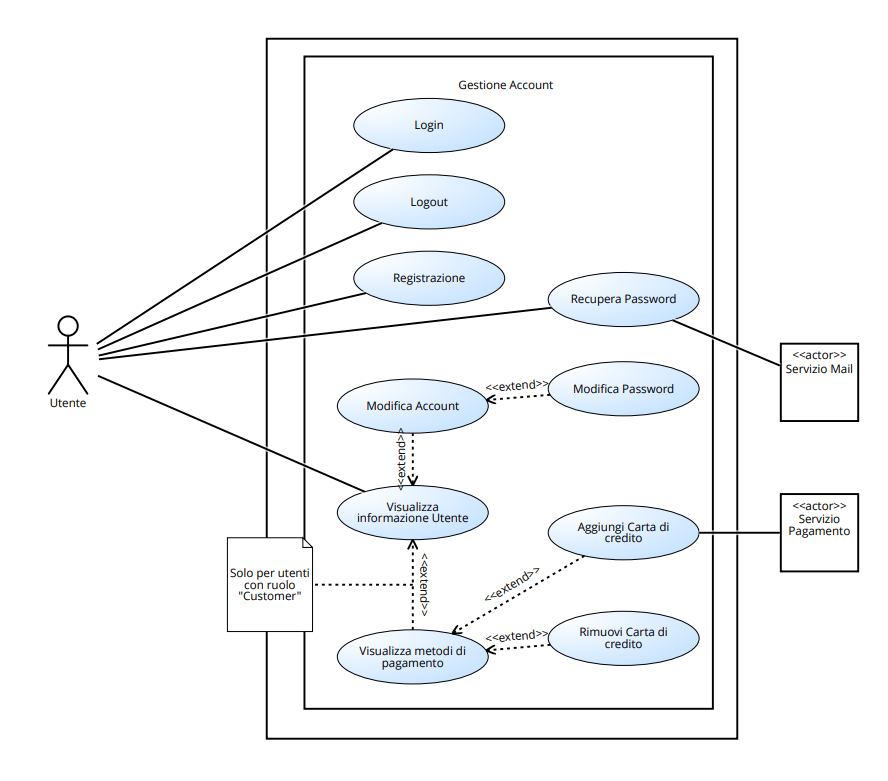
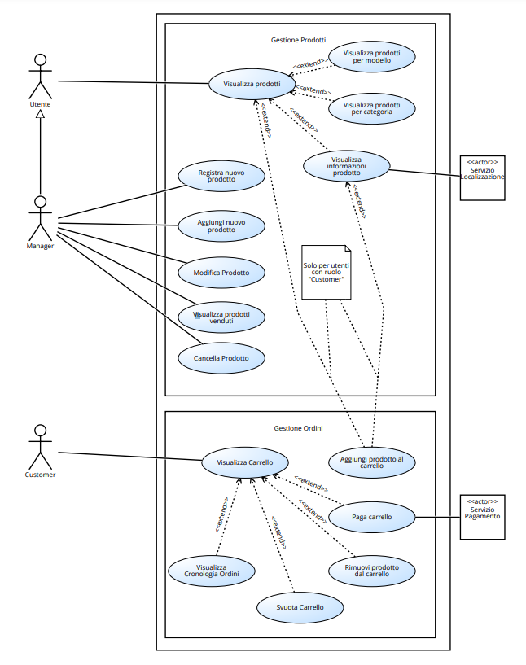
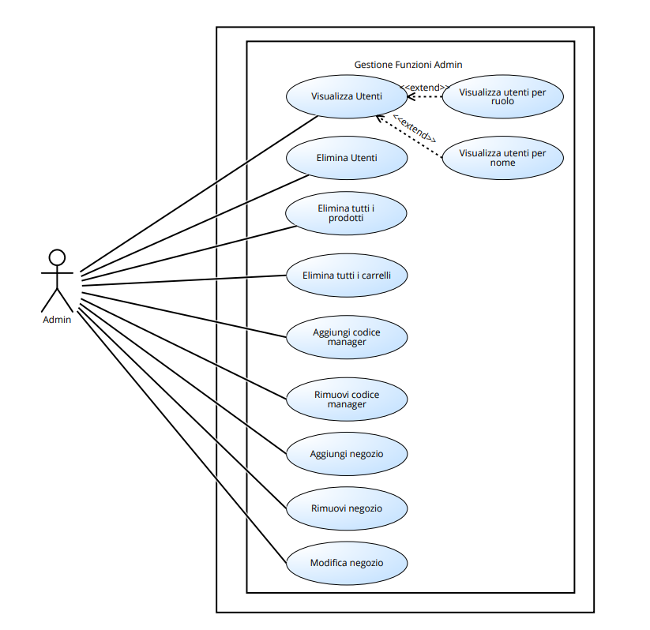
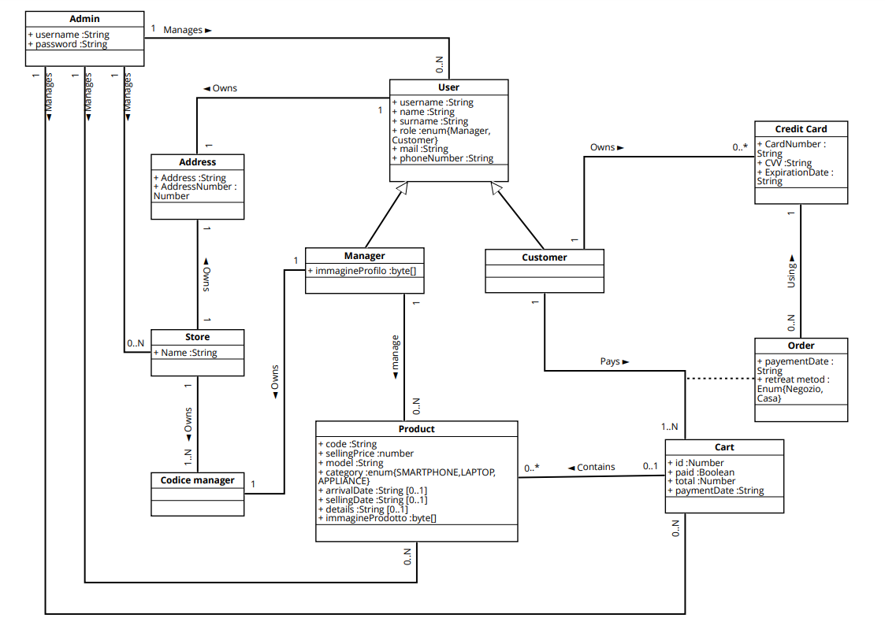
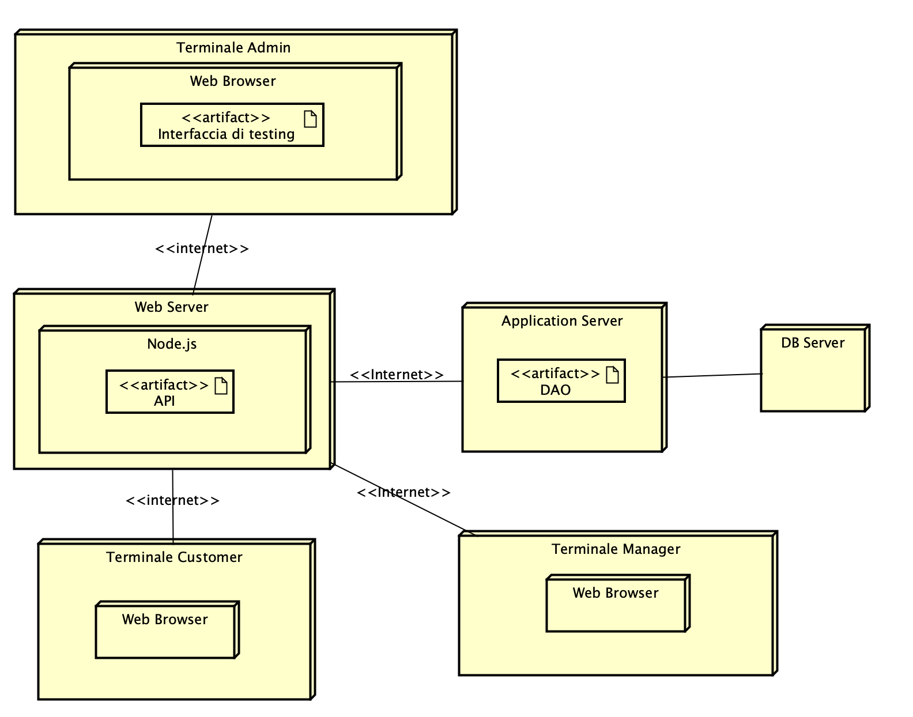

# Requirements Document - current EZElectronics

Date: 28-04-24

Version: Version: V1 - description of EZElectronics in FUTURE form (as proposed by the team)

| Version number | Change                                       |
| :------------: | :------------------------------------------- |
|      1.0       | Inizio requisiti                             |
|      1.1       | Aggiunti stakeholders                        |
|      1.2       | Aggiunto context Diagram                     |
|      1.3       | Aggiunti Stories and personas                |
|      2.0       | Inizio requisiti funzionali e non funzionali |
|      2.1       | Aggiunti   requisiti funzionali              |
|      2.2       | Aggiunti    requisiti non funzionali         |
|      3.0       | Inizio Use case                              |
|      3.1       | Aggiunto use case diagram                    |
|      3.2       | Aggiunti use case                            |
|      4.0       | Aggiunto glossario                           |
|      4.1       | Aggiunto class diagram                       |
|      5.0       | Aggiunto Deployment diagram                  |

# Contents

- [Requirements Document - current EZElectronics](#requirements-document---current-ezelectronics)
- [Contents](#contents)
- [Informal description](#informal-description)
- [Stakeholders](#stakeholders)
- [Context Diagram and interfaces](#context-diagram-and-interfaces)
  - [Context Diagram](#context-diagram)
  - [Interfaces](#interfaces)
- [Stories and personas](#stories-and-personas)
- [Functional and non functional requirements](#functional-and-non-functional-requirements)
  - [Functional Requirements](#functional-requirements)
  - [Non Functional Requirements](#non-functional-requirements)
- [Use case diagram and use cases](#use-case-diagram-and-use-cases)
  - [Summary](#summary)
  - [Use case diagram](#use-case-diagram)
    - [Use case 1, UC1](#use-case-1-uc1)
        - [Scenario 1.1](#scenario-11)
        - [Scenario 1.2](#scenario-12)
    - [Use case 2, UC2](#use-case-2-uc2)
        - [Scenario 2.1](#scenario-21)
    - [Use case 3, UC3](#use-case-3-uc3)
        - [Scenario 3.1](#scenario-31)
        - [Scenario 3.2](#scenario-32)
        - [Scenario 3.3](#scenario-33)
    - [Use case 4, UC4](#use-case-4-uc4)
        - [Scenario 4.1](#scenario-41)
    - [Use case 5, UC5](#use-case-5-uc5)
        - [Scenario 5.1](#scenario-51)
        - [Scenario 5.2](#scenario-52)
    - [Use case 6, UC6](#use-case-6-uc6)
        - [Scenario 6.1](#scenario-61)
        - [Scenario 6.2](#scenario-62)
    - [Use case 7, UC7](#use-case-7-uc7)
        - [Scenario 7.1](#scenario-71)
        - [Scenario 7.2](#scenario-72)
    - [Use case 8, UC8](#use-case-8-uc8)
        - [Scenario 8.1](#scenario-81)
    - [Use Case 9, UC9](#use-case-9-uc9)
        - [Scenario 9.1](#scenario-91)
        - [Scenario 9.2](#scenario-92)
        - [Scenario 9.3](#scenario-93)
    - [Use Case 10, UC10](#use-case-10-uc10)
        - [Scenario 10.1](#scenario-101)
    - [Use case 11, UC11](#use-case-11-uc11)
        - [Scenario 11.1](#scenario-111)
        - [Scenario 11.2](#scenario-112)
        - [Scenario 11.3](#scenario-113)
    - [Use case 12, UC12](#use-case-12-uc12)
        - [Scenario 12.1](#scenario-121)
    - [Use case 13, UC13](#use-case-13-uc13)
        - [Scenario 13.1](#scenario-131)
    - [Use case 14, UC14](#use-case-14-uc14)
        - [Scenario 14.1](#scenario-141)
        - [Scenario 14.2](#scenario-142)
    - [Use case 15, UC15](#use-case-15-uc15)
        - [Scenario 15.1](#scenario-151)
        - [Scenario 15.2](#scenario-152)
      - [Scenario 15.3](#scenario-153)
    - [Use case 16, UC16](#use-case-16-uc16)
        - [Scenario 16.1](#scenario-161)
        - [Scenario 16.2](#scenario-162)
        - [Scenario 16.3](#scenario-163)
    - [Use case 17, UC17](#use-case-17-uc17)
        - [Scenario 17.1](#scenario-171)
        - [Scenario 17.2](#scenario-172)
        - [Scenario 17.3](#scenario-173)
    - [Use case 18, UC18](#use-case-18-uc18)
        - [Scenario 18.1](#scenario-181)
    - [Use case 19, UC19](#use-case-19-uc19)
        - [Scenario 19.1](#scenario-191)
    - [Use case 20, UC20](#use-case-20-uc20)
        - [Scenario 20.1](#scenario-201)
        - [Scenario 20.2](#scenario-202)
    - [Use case 21, UC21](#use-case-21-uc21)
        - [Scenario 21.1](#scenario-211)
    - [Use case 22, UC22](#use-case-22-uc22)
        - [Scenario 22.1](#scenario-221)
        - [Scenario 22.2](#scenario-222)
    - [Use case 23, UC23](#use-case-23-uc23)
        - [Scenario 23.1](#scenario-231)
        - [Scenario 23.2](#scenario-232)
    - [Use case 24, UC24](#use-case-24-uc24)
        - [Scenario 24.1](#scenario-241)
        - [Scenario 24.2](#scenario-242)
        - [Scenario 24.3](#scenario-243)
    - [Use case 25, UC25](#use-case-25-uc25)
        - [Scenario 25.1](#scenario-251)
        - [Scenario 25.2](#scenario-252)
    - [Use case 26, UC26](#use-case-26-uc26)
        - [Scenario 26.1](#scenario-261)
    - [Use case 27, UC27](#use-case-27-uc27)
        - [Scenario 27.1](#scenario-271)
    - [Use case 28, UC28](#use-case-28-uc28)
        - [Scenario 28.1](#scenario-281)
        - [Scenario 28.2](#scenario-282)
    - [Use case 29, UC29](#use-case-29-uc29)
        - [Scenario 29.1](#scenario-291)
        - [Scenario 29.2](#scenario-292)
    - [Use case 30, UC30](#use-case-30-uc30)
        - [Scenario 30.1](#scenario-301)
    - [Use case 31, UC31](#use-case-31-uc31)
        - [Scenario 31.1](#scenario-311)
        - [Scenario 31.2](#scenario-312)
    - [Use case 32, UC32](#use-case-32-uc32)
        - [Scenario 32.1](#scenario-321)
        - [Scenario 32.2](#scenario-322)
- [Glossary](#glossary)
  - [Class Diagram](#class-diagram)
- [System Design](#system-design)
- [Deployment Diagram](#deployment-diagram)

# Informal description

EZElectronics (read EaSy Electronics) is a software application designed to help managers of electronics stores to manage their products and offer them to customers through a dedicated website. Managers can assess the available products, record new ones, and confirm purchases. Customers can see available products, add them to a cart and see the history of their past purchases.

# Stakeholders

|    Stakeholder name     | Description                                                                                                                                                                        |
| :---------------------: | :--------------------------------------------------------------------------------------------------------------------------------------------------------------------------------- |
|         Manager         | Utilizzatore del software che gestisce le vendite del proprio store online. Tale figura può aggiungere e modificare i prodotti, visualizzarli oppure aggiungere nuovi arrivi       |
|        Customer         | Utilizzatore del software, il quale può visualizzare i prodotti, acquistarne di nuovi e vedere la storia dei propri acquisti.                                                      |
|          Admin          | Gestore del software, il quale accede alle funzionalità di testing e di sviluppo, come eliminazione del database, eliminazione dei prodotti, utenti, carrelli.                     |
|   Servizio Pagamenti    | Servizio integrato nel sistema al fine di garantire all'utente il pagamento del carrello                                                                                           |
| Servizio Localizzazione | Servizio integrato nel sistema al fine di garantire all'utente la localizzazione dei negozi                                                                                        |
|      Servizio Mail      | Servizio integrato nel sistema al fine di inviare mail all'utente riguardo invio mail per il recupero della password, invio conferma ordini effettuati, ed invio di avvisi offerte |
|   Servizio Spedizione   | Servizio integrato nel sistema al fine di garantire all'utente la possibilità di ricevere i prodotti in un indirizzo diverso dall'indirizzo del negozio                            |

# Context Diagram and interfaces

## Context Diagram

## Interfaces

|          Actor          | Logical Interface                                                                   | Physical Interface                                                                                                                                                                                                                                                                                               |
| :---------------------: | :---------------------------------------------------------------------------------- | :--------------------------------------------------------------------------------------------------------------------------------------------------------------------------------------------------------------------------------------------------------------------------------------------------------------- |
|        Customer         | GUI (Dedicata a visualizzare i prodotti da acquistare e gestire gli ordini)         | PC/Smartphone                                                                                                                                                                                                                                                                                                    |
|         Manager         | GUI (Dedicata alla gestione ed alla visualizzazione dei prodotti)                   | PC/Smartphone                                                                                                                                                                                                                                                                                                    |
|          Admin          | GUI (GUI diversa dal Customer e Manager, dedicata prettamente al testing delle API) | PC                                                                                                                                                                                                                                                                                                               |
|   Servizio Pagamenti    | Internet                                                                            | https://stripe.com/it?utm_campaign=IT_it_Search_Brand_Stripe_EXA-1451370702&utm_medium=cpc&utm_source=google&ad_content=277477849608&utm_term=stripe&utm_matchtype=e&utm_adposition=&utm_device=c&gad_source=1&gclid=CjwKCAjwxLKxBhA7EiwAXO0R0JqjN_th5rcsyJBNkuRfP3huG7LS8Vfp-LmZu30FzFynKvRza4a9URoCogQQAvD_BwE |
| Servizio Localizzazione | Internet                                                                            | https://developers.google.com/maps/documentation?hl=it                                                                                                                                                                                                                                                           |
|      Servizio Mail      | Internet                                                                            | https://www.google.com/intl/it/gmail/about/                                                                                                                                                                                                                                                                      |
|   Servizio Spedizione   | Internet                                                                            | https://developer.dhl.com                                                                                                                                                                                                                                                                                        |
# Stories and personas
- Gestore di un piccolo negozio di elettronica, che vorrebbe espandere il proprio business anche online.
-  Un cliente che vorrebbe trovare e confrontare vari prezzi di un determinato prodotto elettronico venduto da più rivenditori.
- Un cliente di un piccolo paese che non ha a disposizione un negozio di elettronica nelle vicinanze.
- Un cliente che non ha la possibilità di recarsi fisicamente in un negozio di elettronica e preferisce l'acquisto online.
- Gestore di una grande catena che vorrebbe gestire facilmente i prodotti del proprio store.
- Un gestore che vorrebbe visualizzare i propri prodotti venduti in modo facile e veloce.
- Un cliente che vorrebbe tenere traccia degli ordini effettuati in precedenza.
# Functional and non functional requirements

## Functional Requirements
<!-- Nel caso in cui vi è l'utente non autenticato, possiamo dividere il casi d'uso testing tra tutti gli altri casi d'uso -->
| ID            | Description                              |
| :------------ | :--------------------------------------- |
| FR1           | Gestione Account                         |
| &nbsp; FR1.1  | Login                                    |
| &nbsp; FR1.2  | Logout                                   |
| &nbsp; FR1.3  | Registrazione                            |
| &nbsp; FR1.4  | Visualizza informazioni utente           |
| &nbsp; FR1.5  | Modifica Account                         |
| &nbsp; FR1.6  | Modifica Password                        |
| &nbsp; FR1.7  | Recupera Password                        |
| &nbsp; FR1.8  | Visualizza metodi di pagamento           |
| &nbsp; FR1.9  | Rimuovi carta di credito                 |
| &nbsp; FR1.10 | Aggiungi carta di credito                |
| FR2           | Gestione Prodotti                        |
| &nbsp; FR2.1  | Cancella prodotto                        |
| &nbsp; FR2.2  | Registra nuovo prodotto                  |
| &nbsp; FR2.3  | Aggiungi nuovo prodotto                  |
| &nbsp; FR2.4  | Visualizza prodotti (categoria, modello) |
| &nbsp; FR2.5  | Visualizza informazioni prodotto         |
| &nbsp; FR2.6  | Visualizza prodotti venduti              |
| &nbsp; FR2.7  | Modifica Prodotto                        |
| FR3           | Gestione Ordini                          |
| &nbsp; FR3.1  | Aggiungi prodotto al carrello            |
| &nbsp; FR3.2  | Visualizza Carrello                      |
| &nbsp; FR3.3  | Visualizza Cronologia Ordini             |
| &nbsp; FR3.4  | Rimuovi prodotto Dal Carrello            |
| &nbsp; FR3.5  | Svuota Carrello                          |
| FR4           | Gestione Pagamento                       |
| &nbsp; FR4.1  | Paga Carrello                            |
| FR5           | Gestione funzioni admin                  |
| &nbsp; FR5.1  | Visualizza Utenti                        |
| &nbsp; FR5.2  | Elimina utenti                           |
| &nbsp; FR5.3  | Elimina tutti i prodotti                 |
| &nbsp; FR5.4  | Elimina tutti i carrelli                 |
| &nbsp; FR5.5  | Aggiungi manager                         |
| &nbsp; FR5.6  | Rimuovi manager                          |
| &nbsp; FR5.7  | Modifica informazioni negozio            |
| &nbsp; FR5.8  | Aggiungi negozio                         |
| &nbsp; FR5.9  | Rimuovi negozio                          |

## Non Functional Requirements

| ID    | Type (efficiency, reliability, ..) | Description                                                                                                                                                                                       |  Refers to  |
| :---- | :--------------------------------- | :------------------------------------------------------------------------------------------------------------------------------------------------------------------------------------------------ | :---------: |
| NFR1  | Usability                          | Gli utenti non devono avere bisogno di training per utilizzare il software                                                                                                                        | FR1,FR2,FR3 |
| NFR2  | Efficiency                         | Il sistema deve garantire un tempo di caricamento inferiore ai 2 secondi                                                                                                                          | FR1,FR2,FR3 |
| NFR3  | Reliability                        | Il sistema deve garantire una permanenza locale dei dati anche durante la perdita di connessione con il database                                                                                  | FR1,FR2,FR3 |
| NFR4  | Reliability                        | Il sito web deve permettere l'acquisto di solo prodotti disponibili                                                                                                                               |     FR2     |
| NFR5  | Reliability                        | Il sito web deve garantire un uptime del 99.9999%                                                                                                                                                 | FR1,FR2,FR3 |
| NFR6  | Portability                        | Il sito web deve garantire il corretto funzionamento con i vari browers del customer                                                                                                              | FR1,FR2,FR3 |
| NFR7  | Portability                        | Il sistema deve essere progettato in modo tale da mantenere un utilizzo efficiente della memoria, evitando di causare rallentamenti significativi al sistema operativo o all'hardware sottostante | FR1,FR2,FR3 |
| NFR8  | Portability                        | Il sito web deve garantire la corretta visualizzazione all'interno di ogni dispositivo dell'utente con una dimensione schermo maggiore di 4.5 pollici                                             | FR1,FR2,FR3 |
| NFR9  | Security                           | Il pagamento deve essere effettuato solo da utenti collegati                                                                                                                                      |     FR3     |
| NFR10 | Security                           | Il sistema deve garantire l'accesso alle funzionalità implementate solo agli utenti autenticati                                                                                                   | FR1,FR2,FR3 |
| NFR11 | Maintainability                    | Il sistema è scritto attraverso l'utilizzo di "framework" che garantiscono aggiornamenti per i prossimi 5 anni                                                                                    | FR1,FR2,FR3 |
| NFR12 | Security                           | Il sistema garantisce la sicurezza sulla sensibilità dei dati, secondo il GDPR                                                                                                                    |     FR1     |
| NFR13 | Security                           | Il manager può inserire prodotti che sono conformi alla normativa europea vedi: "art. 25 del Regolamento comunitario 2019/1020"                                                                   |             |
| NFR14 | Reliability                        | Il sistema garantisce una corretta validazione dei dati inserti dall'utente                                                                                                                       | FR1,FR2,FR3 |
| NFR15 | Security                           | Il sistema garantisce un processo di crittografia dei dati sensibili                                                                                                                              |     FR1     |
| NFR16 | Security                           | Il sistema garantisce la registrazione di soli manager autorizzati attraverso codice manager                                                                                                      | FR1,FR2,FR3 |

# Use case diagram and use cases
## Summary
Si sono identificati 3 macro-casi d'uso, quali:
- Gestione Account
- Gestione Prodotti
- Gestione Ordini
- Gestione funzioni admin
- Gestione Pagamento

## Use case diagram
Per semplicità nel caricamento delle immagini nel documento si è deciso di dividere l'use case diagram:

### Use case 1, UC1

Caso d'uso: Login

| Actors Involved  | Utente                                 |
| :--------------: | :------------------------------------- |
|   Precondition   | L'utente non è autenticato nel sistema |
|  Postcondition   | L'utente è autenticato nel sistema     |
| Nominal Scenario | Login avvenuto con successo            |
|     Variants     | Nessuna.                               |
|    Exceptions    | Credenziali errate                     |

##### Scenario 1.1

Login avvenuto con successo

| Scenario 1.1  |                                                                           |
| :-----------: | :------------------------------------------------------------------------ |
| Precondition  | L'utente non è autenticato nel sistema e visualizza la pagina login       |
| Postcondition | L'utente è autenticato nel sistema                                        |
|     Step#     | Descrizione                                                               |
|       1       | L'utente inserisce le proprie credenziali   e  seleziona la voce "Accedi" |
|       2       | Il sistema verifica le credenziali                                        |
|       3       | L'utente viene autenticato e reindirizzato alla pagina principale         |
|       4       | Il caso d'uso Termina                                                     |

##### Scenario 1.2

L'utente inserisce credenziali errate

| Scenario 1.2  |                                                                            |
| :-----------: | :------------------------------------------------------------------------- |
| Precondition  | L'utente non è autenticato nel sistema e visualizza la pagina login        |
| Postcondition | L'utente non è autenticato nel sistema                                     |
|     Step#     | Descrizione                                                                |
|       1       | L'utente inserisce le proprie credenziali   e  seleziona la voce "Accedi"  |
|       2       | Il sistema verifica le credenziali e mostra a video un messaggio di errore |
|       3       | Il caso d'uso Termina                                                      |

### Use case 2, UC2

Caso d'uso: Logout

| Actors Involved  | Utente                                    |
| :--------------: | :---------------------------------------- |
|   Precondition   | L'utente è autenticato nel sistema.       |
|  Postcondition   | L'utente non è autenticato nel sistema.   |
| Nominal Scenario | L'utente effettua il logout correttamente |
|     Variants     | Nessuna                                   |
|    Exceptions    | Nessuna                                   |

##### Scenario 2.1

L'utente effettua il logout correttamente

| Scenario 2.1  |                                                          |
| :-----------: | :------------------------------------------------------- |
| Precondition  | L'utente è autenticato nel sistema.                      |
| Postcondition | L'utente non è autenticato nel sistema.                  |
|     Step#     | Descrizione                                              |
|       1       | L'utente seleziona la voce "Logout".                     |
|       2       | Il sistema mostra a video un pop-up di conferma.         |
|       3       | L'utente seleziona la voce "OK"                          |
|       4       | Il sistema reindirizza l'utente alla schermata di Login. |
|       5       | Il caso d'uso Termina                                    |

### Use case 3, UC3

Caso d'uso: Registrazione

| Actors Involved  | Utente                                                   |
| :--------------: | :------------------------------------------------------- |
|   Precondition   | L'utente non è registrato nel sistema                    |
|  Postcondition   | L'utente è registrato nel sistema                        |
| Nominal Scenario | Registrazione avvenuta con successo                      |
|     Variants     | Nessuna                                                  |
|    Exceptions    | L'utente inserisce  un username già presente nel sistema |

##### Scenario 3.1

Registrazione avvenuta con successo.

| Scenario 3.1  |                                                                                     |
| :-----------: | :---------------------------------------------------------------------------------- |
| Precondition  | L'utente non è registrato nel sistema e visualizza la pagina di registrazione.      |
| Postcondition | L'utente è registrato nel sistema.                                                  |
|     Step#     | Descrizione                                                                         |
|       1       | L'utente inserisce i propri dati di registrazione e  seleziona la voce "Registrati" |
|       2       | Il sistema verifica i dati inseriti                                                 |
|       3       | l'utente viene registrato e reindirizzato all pagina principale.                    |
|       4       | Il caso d'uso Termina                                                               |

##### Scenario 3.2

L'utente inserisce un username già presente nel sistema

| Scenario 3.2  |                                                                                    |
| :-----------: | :--------------------------------------------------------------------------------- |
| Precondition  | L'utente non è registrato nel sistema e visualizza la schermata registrazione.     |
| Postcondition | L'utente non è registrato nel sistema.                                             |
|     Step#     | Descrizione                                                                        |
|       1       | L'utente inserisce i propri dati di registrazione e seleziona la voce "Registrati" |
|       2       | Il sistema verifica che i dati inseriti e visualizza un messaggio di errore        |
|       3       | L'utente seleziona la voce "OK"                                                    |
|       4       | Il sistema reindirizza l'utente alla schermata di registrazione.                   |
|       5       | Il caso d'uso Termina                                                              |

##### Scenario 3.3

L'utente si vuole registrare con ruolo manager e inserisce un codice manager non presente nel sistema

| Scenario 3.3  |                                                                                    |
| :-----------: | :--------------------------------------------------------------------------------- |
| Precondition  | L'utente non è registrato nel sistema e visualizza la schermata registrazione.     |
| Postcondition | L'utente non è registrato nel sistema.                                             |
|     Step#     | Descrizione                                                                        |
|       1       | L'utente inserisce i propri dati di registrazione e seleziona la voce "Registrati" |
|       2       | Il sistema verifica che i dati inseriti e visualizza un messaggio di errore        |
|       3       | L'utente seleziona la voce "OK"                                                    |
|       4       | Il sistema reindirizza l'utente alla schermata di registrazione.                   |
|       5       | Il caso d'uso Termina                                                              |

### Use case 4, UC4

Caso d'uso: Visualizza informazioni utente.

| Actors Involved  | Utente                                                  |
| :--------------: | :------------------------------------------------------ |
|   Precondition   | Il sistema ha mostrato a video la schermata Principale. |
|  Post condition  | L'utente ha visualizzato le proprie informazioni.       |
| Nominal Scenario | L'utente visualizza le proprie informazioni             |
|     Variants     | Nessuna                                                 |
|    Exceptions    | Nessuna                                                 |

##### Scenario 4.1

L'utente visualizza le proprie informazioni.

| Scenario 4.1  |                                                         |
| :-----------: | :------------------------------------------------------ |
| Precondition  | Il sistema ha mostrato a video la schermata Principale. |
| Postcondition | L'utente ha visualizzato le proprie informazioni.       |
|     Step#     | Descrizione                                             |
|       1       | L'utente seleziona la voce "profilo"                    |
|       2       | Il sistema mostra a video le informazioni dell'utente   |
|       3       | Il caso d'uso termina                                   |

### Use case 5, UC5

Caso d'uso: Modifica account. 

| Actors Involved  | Utente                                                                |
| :--------------: | :-------------------------------------------------------------------- |
|   Precondition   | Il sistema ha mostrato a video la schermata di area personale utente. |
|  Post condition  | L'utente ha modificato il proprio account                             |
| Nominal Scenario | L'utente modifica il proprio account                                  |
|     Variants     | Nessuna                                                               |
|    Exceptions    | L'utente inserisce dati in input non validi                           |

##### Scenario 5.1

L'utente modifica il proprio account. 

| Scenario 5.1  |                                                                           |
| :-----------: | :------------------------------------------------------------------------ |
| Precondition  | Il sistema ha mostrato a video la schermata di area personale utente      |
| Postcondition | L'utente ha modificato il proprio account                                 |
|     Step#     | Descrizione                                                               |
|       1       | L'utente seleziona la voce 'Modifica informazioni account'                |
|       2       | Il sistema mostra la schermata per modificare i propri dati personali     |
|       3       | L’utente modifica i dati personali desiderati e seleziona la voce 'Salva' |
|       4       | Il sistema analizza i dati in input e li aggiorna                         |
|       5       | Il caso d'uso termina                                                     |

##### Scenario 5.2

L'utente non modifica i propri dati correttamente. 

| Scenario 5.2  |                                                                           |
| :-----------: | :------------------------------------------------------------------------ |
| Precondition  | Il sistema ha mostrato a video la schermata Principale.                   |
| Postcondition | L'utente non ha modificato il proprio account                             |
|     Step#     | Descrizione                                                               |
|       1       | L'utente seleziona la voce 'Modifica informazioni account'                |
|       2       | Il sistema mostra la schermata per modificare i propri dati personali     |
|       3       | L’utente modifica i dati personali desiderati e seleziona la voce 'Salva' |
|       4       | IL sistema analizza i dati e mostra a schermo un messaggio di errore      |
|       5       | Il caso d'uso termina                                                     |

### Use case 6, UC6

Caso d'uso: Visualizza metodi di pagamento. 

| Actors Involved  | Customer                                                       |
| :--------------: | :------------------------------------------------------------- |
|   Precondition   | Il sistema ha mostrato a video la schermata di area personale. |
|  Post condition  | Il Customer visualizza i metodi di pagamento                   |
| Nominal Scenario | Il Customer visualizza correttamente i metodi di pagamento     |
|     Variants     | Nessuna                                                        |
|    Exceptions    | Il customer non ha una carta di credito                        |

##### Scenario 6.1

Il customer visualizza i propri metodi di pagamento correttamente.

| Scenario 6.1  |                                                                 |
| :-----------: | :-------------------------------------------------------------- |
| Precondition  | Il sistema ha mostrato a video la schermata di area personale   |
| Postcondition | Il Customer ha visualizzato i propri metodi di pagamento        |
|     Step#     | Descrizione                                                     |
|       1       | Il manager seleziona la voce 'Metodi di pagamento'              |
|       2       | Il sistema mostra la schermata con i propri metodi di pagamento |
|       3       | Il caso d'uso termina                                           |

##### Scenario 6.2

Il customer non ha carte di credito inserite.

| Scenario 7.2  |                                                                           |
| :-----------: | :------------------------------------------------------------------------ |
| Precondition  | Il sistema ha mostrato a video la schermata di area personale             |
| Postcondition | Il Customer non ha visualizzato i propri metodi di pagamento              |
|     Step#     | Descrizione                                                               |
|       1       | Il manager seleziona la voce 'Metodi di pagamento'                        |
|       2       | Il sistema mostra una schermata vuota con un collegamento allo use case 8 |
|       3       | Il caso d'uso termina                                                     |

### Use case 7, UC7

Caso d'uso: Aggiungi carta di credito. 

| Actors Involved  | Customer                                                             |
| :--------------: | :------------------------------------------------------------------- |
|   Precondition   | Il sistema ha mostrato a video la schermata dei metodi di pagamento. |
|  Post condition  | Il Customer ha aggiunto una carta di credito                         |
| Nominal Scenario | Il Customer aggiunge correttamente la carta di credito               |
|     Variants     | Nessuna                                                              |
|    Exceptions    | Il Customer inserisce dati in input non validi                       |

##### Scenario 7.1

Il customer aggiunge una carta di credito correttamente. 

| Scenario 7.1  |                                                                         |
| :-----------: | :---------------------------------------------------------------------- |
| Precondition  | Il sistema ha mostrato a video la schermata dei metodi di pagamento     |
| Postcondition | Il Customer ha aggiunto una carta di credito al proprio account         |
|     Step#     | Descrizione                                                             |
|       1       | Il Customer seleziona la voce 'Aggiungi carta di credito'               |
|       2       | Il sistema mostra la schermata per aggiungere i dati della carta        |
|       3       | Il Customer inserisce i dati della carta e seleziona la voce 'Registra' |
|       4       | Il sistema analizza i dati input e aggiunge correttamente la carta      |
|       5       | Il caso d'uso termina                                                   |

##### Scenario 7.2

Il customer inserisce dati della carta errati 

| Scenario 7.2  |                                                                            |
| :-----------: | :------------------------------------------------------------------------- |
| Precondition  | Il sistema ha mostrato a video la schermata dei metodi di pagamento        |
| Postcondition | Il Customer non ha aggiunto una carta di credito al proprio account        |
|     Step#     | Descrizione                                                                |
|       1       | Il Customer seleziona la voce 'Aggiungi carta di credito'                  |
|       2       | Il sistema mostra la schermata per aggiungere i dati della carta           |
|       3       | Il Customer inserisce i dati della carta e seleziona la voce 'Registra'    |
|       4       | Il sistema analizza i dati input e mostra a schermo un messaggio di errore |
|       5       | Il caso d'uso termina                                                      |

### Use case 8, UC8

Caso d'uso: Rimuovi carta di credito. 

| Actors Involved  | Customer                                                             |
| :--------------: | :------------------------------------------------------------------- |
|   Precondition   | Il sistema ha mostrato a video la schermata dei metodi di pagamento. |
|  Post condition  | Il Customer ha rimosso una carta di credito                          |
| Nominal Scenario | Il Customer rimuove correttamente la carta di credito                |
|     Variants     | Nessuna                                                              |
|    Exceptions    | Nessuna                                                              |

##### Scenario 8.1

Il customer rimuove una carta di credito correttamente. 

| Scenario 8.1  |                                                                         |
| :-----------: | :---------------------------------------------------------------------- |
| Precondition  | Il sistema ha mostrato a video la schermata dei metodi di pagamento     |
| Postcondition | Il Customer ha rimosso una carta di credito al proprio account          |
|     Step#     | Descrizione                                                             |
|       1       | Il Customer seleziona la voce 'Rimuovi carta di credito'                |
|       2       | Il sistema mostra la schermata per rimuovere una carta di credito       |
|       3       | Il Customer seleziona la carta desiderata e seleziona la voce 'Rimuovi' |
|       4       | Il sistema analizza i dati e elimina la carta di credito                |
|       5       | Il caso d'uso termina                                                   |

### Use Case 9, UC9

Caso d'uso: Modifica password. 

| Actors Involved  | Utente                                                                |
| :--------------: | :-------------------------------------------------------------------- |
|   Precondition   | Il sistema ha mostrato a video la schermata di area personale utente. |
|  Post condition  | L'utente ha modificato la propria password                            |
| Nominal Scenario | L'utente modifica la propria password                                 |
|     Variants     | Nessuna                                                               |
|    Exceptions    | L'utente inserisce la password vecchia                                |
|      errata      |

##### Scenario 9.1

L'utente modifica la propria password correttamente

|  Scenario 9.1  |                                                                          |
| :------------: | :----------------------------------------------------------------------- |
|  Precondition  | Il sistema ha mostrato a video la schermata di area personale utente.    |
| Post condition | L'utente ha modificato la propria password                               |
|     Step#      | Descrizione                                                              |
|       1        | L'utente seleziona la voce 'Modifica informazioni account'               |
|       2        | Il sistema mostra la schermata per modificare i propri dati personali    |
|       3        | L'utente seleziona la voce 'Modifica Password'                           |
|       4        | Il sistema mostra la schermata per modificare la password                |
|       5        | L'utente inserisce i dati richiesti                                      |
|       6        | Il sistema verifica i dati in input e modifica correttamente la password |
|       7        | Il caso d'uso termina                                                    |

##### Scenario 9.2

L'utente inserisce la password vecchia errata

|  Scenario 9.2  |                                                                       |
| :------------: | :-------------------------------------------------------------------- |
|  Precondition  | Il sistema ha mostrato a video la schermata di area personale utente. |
| Post condition | L'utente non ha modificato la propria password                        |
|     Step#      | Descrizione                                                           |
|       1        | L'utente seleziona la voce 'Modifica informazioni account'            |
|       2        | Il sistema mostra la schermata per modificare i propri dati personali |
|       3        | L'utente seleziona la voce 'Modifica Password'                        |
|       4        | Il sistema mostra la schermata per modificare la password             |
|       5        | L'utente inserisce i dati richiesti                                   |
|       6        | Il sistema verifica i dati in input e mostra un messaggio di errore   |
|       7        | Il caso d'uso termina                                                 |

##### Scenario 9.3

L'utente inserisce una nuova password non idonea

|  Scenario 9.3  |                                                                       |
| :------------: | :-------------------------------------------------------------------- |
|  Precondition  | Il sistema ha mostrato a video la schermata di area personale utente. |
| Post condition | L'utente non ha modificato la propria password                        |
|     Step#      | Descrizione                                                           |
|       1        | L'utente seleziona la voce 'Modifica informazioni account'            |
|       2        | Il sistema mostra la schermata per modificare i propri dati personali |
|       3        | L'utente seleziona la voce 'Modifica Password'                        |
|       4        | Il sistema mostra la schermata per modificare la password             |
|       5        | L'utente inserisce i dati richiesti                                   |
|       6        | Il sistema verifica i dati in input e mostra un messaggio di errore   |
|       7        | Il caso d'uso termina                                                 |

<!--La password si considera idonea solamente se possiede almeno: 8 
caratteri, un numero, una lettera maiuscola, una minuscola ed un 
carattere speciale (- _ @ . ! ? + * < > [ ] { } /). -->

### Use Case 10, UC10

Caso d'uso: Recupera password. 

| Actors Involved  | Utente                                                |
| :--------------: | :---------------------------------------------------- |
|   Precondition   | Il sistema ha mostrato a video la schermata di login. |
|  Post condition  | L'utente ha ricevuto per email la sua password        |
| Nominal Scenario | L'utente riceve per email la sua password             |
|     Variants     | Nessuna                                               |
|    Exceptions    | Nessuna                                               |

##### Scenario 10.1

L'utente inserisce correttamente la nuova password

| Scenario 10.1  |                                                                                 |
| :------------: | :------------------------------------------------------------------------------ |
|  Precondition  | Il sistema ha mostrato a video la schermata di login                            |
| Post condition | Il sistema ha mostrato a video la schermata di login                            |
|     Step#      | Descrizione                                                                     |
|       1        | L'utente seleziona la voce 'Recupera Password'                                  |
|       2        | Il sistema chiede all'utente di inserire la sua email                           |
|       3        | L'utente inserisce la sua email nell'apposito campo e seleziona la voce 'Invia' |
|       4        | Il sistema invia la password associata all'email prelevata                      |
|       5        | Il caso d'uso termina                                                           |

### Use case 11, UC11

Caso d'uso: Visualizza Prodotti 

| Actors Involved  | Utente                                                                |
| :--------------: | :-------------------------------------------------------------------- |
|   Precondition   | L'utente ha visualizzato la schermata Principale                      |
|  Post condition  | Il sistema ha mostrato i prodotti disponibili                         |
| Nominal Scenario | L'utente visualizza correttamente tutti prodotti                      |
|     Variants     | L'utente visualizza i prodotti per modello o categoria                |
|    Exceptions    | Se non sono presenti prodotti l'utente visualizza una schermata vuota |

##### Scenario 11.1

L'utente visualizza tutti i prodotti disponibili con successo

| Scenario 11.1  |                                                              |
| :------------: | :----------------------------------------------------------- |
|  Precondition  | L'utente visualizza la schermata iniziale                    |
| Post condition | Il sistema mostra correttamente tutti i prodotti disponibili |
|     Step#      | Description                                                  |
|       1        | L'utente seleziona la voce 'visualizza prodotti'             |
|       2        | Il sistema mostra a schermo i filtri di ricerca prodotti     |
|       3        | L'utente seleziona la voce filtro 'tutti i prodotti'         |
|       4        | Il sistema mostra a schermo tutti i prodotti presenti        |
|       5        | Il caso d'uso termina                                        |

##### Scenario 11.2

L'utente visualizza un prodotto disponibile con un modello specifico con successo

| Scenario 11.2  |                                                                               |
| :------------: | :---------------------------------------------------------------------------- |
|  Precondition  | L'utente visualizza la schermata iniziale                                     |
| Post condition | Il sistema mostra correttamente i prodotti con modello inserito               |
|     Step#      | Description                                                                   |
|       1        | L'utente seleziona la voce 'visualizza prodotti'                              |
|       2        | Il sistema mostra a schermo i filtri di ricerca prodotti                      |
|       3        | L'utente seleziona la voce filtro 'modello' e inserisce il modello desiderato |
|       4        | Il sistema mostra a schermo i prodotti con modello inserito                   |
|       5        | Il caso d'uso termina                                                         |

##### Scenario 11.3

L'utente visualizza i prodotti disponibili con una categoria specifica con successo

| Scenario 11.3  |                                                                                      |
| :------------: | :----------------------------------------------------------------------------------- |
|  Precondition  | L'utente visualizza la schermata iniziale                                            |
| Post condition | Il sistema mostra correttamente i prodotti con categoria scelta                      |
|     Step#      | Description                                                                          |
|       1        | L'utente seleziona la voce 'visualizza prodotti'                                     |
|       2        | Il sistema mostra a schermo i filtri di ricerca prodotti                             |
|       3        | L'utente seleziona la voce filtro 'categoria' e sceglie tra le categorie disponibili |
|       4        | Il sistema mostra a schermo i prodotti con categoria inserita                        |
|       5        | Il caso d'uso termina                                                                |

### Use case 12, UC12

Caso d'uso: Visualizza informazioni prodotto 

| Actors Involved  | Utente                                                                       |
| :--------------: | :--------------------------------------------------------------------------- |
|   Precondition   | Si è verificato e concluso uno dei seguenti scenari: 11.1, 11.2, 11.3        |
|  Post condition  | Il sistema ha mostrato le informazioni di un modello di prodotto disponibile |
| Nominal Scenario | L'utente visualizza le informazioni del prodotto                             |
|     Variants     | Nessuno                                                                      |
|    Exceptions    | Nessuno                                                                      |

##### Scenario 12.1

L'utente visualizza le informazioni del prodotto con successo

| Scenario 12.1  |                                                                       |
| :------------: | :-------------------------------------------------------------------- |
|  Precondition  | Si è verificato e concluso uno dei seguenti scenari: 11.1, 11.2, 11.3 |
| Post condition | Il sistema mostra correttamente le informazioni del prodotto scelto   |
|     Step#      | Description                                                           |
|       1        | L'utente seleziona un prodotto visualizzato                           |
|       2        | Il sistema mostra a schermo le informazioni del prodotto scelto       |
|       3        | Il caso d'uso termina                                                 |

### Use case 13, UC13

Caso d'uso: Visualizza Prodotti venduti

| Actors Involved  | Manager                                                               |
| :--------------: | :-------------------------------------------------------------------- |
|   Precondition   | Il manager ha visualizzato la schermata iniziale                      |
|  Post condition  | Il sistema ha mostrato i prodotti venduti                             |
| Nominal Scenario | L'utente visualizza correttamente tutti prodotti venduti              |
|     Variants     | Nessuno                                                               |
|    Exceptions    | Se non sono presenti prodotti l'utente visualizza una schermata vuota |

##### Scenario 13.1

L'utente visualizza tutti i prodotti venduti con successo

| Scenario 13.1  |                                                                                  |
| :------------: | :------------------------------------------------------------------------------- |
|  Precondition  | Il manager ha visualizzato la schermata iniziale                                 |
| Post condition | Il sistema mostra correttamente tutti i prodotti venduti                         |
|     Step#      | Description                                                                      |
|       1        | Il manager seleziona la voce 'visualizza prodotti venduti'                       |
|       2        | Il sistema mostra a schermo i prodotti venduti con le rispettive date di vendita |
|       3        | Il caso d'uso termina                                                            |

### Use case 14, UC14

Caso d'uso: Registra nuovo prodotto

| Actors Involved  | Manager                                                  |
| :--------------: | :------------------------------------------------------- |
|   Precondition   | Il manager ha visualizzato la schermata iniziale         |
|  Post condition  | Viene aggiunto al sistema un nuovo prodotto              |
| Nominal Scenario | Il manager ha aggiunto correttamente un nuovo prodotto   |
|     Variants     | Nessuno                                                  |
|    Exceptions    | Il manager registra un prodotto già presente nel sistema |

##### Scenario 14.1

Il manager registra un prodotto con successo

| Scenario 14.1  |                                                                          |
| :------------: | :----------------------------------------------------------------------- |
|  Precondition  | Il manager ha visualizzato la schermata iniziale                         |
| Post condition | Il sistema registra correttamente un prodotto                            |
|     Step#      | Description                                                              |
|       1        | Il manager seleziona la voce 'Registra nuovo prodotto'                   |
|       2        | Il sistema mostra la schermata per aggiungere un prodotto                |
|       3        | Il manager inserisce i dati del prodotto e seleziona la voce "Registra"  |
|       4        | Il sistema analizza i dati in input e aggiunge correttamente il prodotto |
|       5        | Il caso d'uso termina                                                    |

##### Scenario 14.2

Il manager inserisce un modello di prodotto già presente nel sistema

| Scenario 14.2  |                                                                                                      |
| :------------: | :--------------------------------------------------------------------------------------------------- |
|  Precondition  | Il manager ha visualizzato la schermata iniziale                                                     |
| Post condition | Il sistema mostra messaggio di errore                                                                |
|     Step#      | Description                                                                                          |
|       1        | Il manager seleziona la voce 'Registra nuovo prodotto'                                               |
|       2        | Il sistema mostra la schermata per aggiungere un prodotto                                            |
|       3        | Il manager inserisce i dati del prodotto di un modello gia registrato e seleziona la voce "Registra" |
|       4        | Il sistema analizza i dati in input e mostra un messaggio di errore                                  |
|       5        | Il caso d'uso termina                                                                                |

### Use case 15, UC15

Caso d'uso: Aggiungi nuovo prodotto

| Actors Involved  | Manager                                                                                                  |
| :--------------: | :------------------------------------------------------------------------------------------------------- |
|   Precondition   | Il manager visualizza la schermata iniziale                                                              |
|  Post condition  | Il sistema aggiunge correttamente prodotti in vendita dello stesso modello                               |
| Nominal Scenario | Il manager ha aggiunto correttamente nuovi prodotti in vendita dello stesso modello                      |
|     Variants     | Nessuno                                                                                                  |
|    Exceptions    | Il manager inserisce un prodotto di un modello non registrato, o inserisce una data di arrivo non valida |

##### Scenario 15.1

Il manager aggiunge un prodotto in vendita con successo

| Scenario 15.1  |                                                                                                           |
| :------------: | :-------------------------------------------------------------------------------------------------------- |
|  Precondition  | Il manager visualizza la schermata iniziale                                                               |
| Post condition | Il sistema aggiunge correttamente prodotti in vendita dello stesso modello                                |
|     Step#      | Description                                                                                               |
|       1        | Il manager seleziona la voce 'Aggiungi nuovi prodotti'                                                    |
|       2        | Il sistema mostra la schermata per cercare il modello del prodotto desiderato                             |
|       3        | Il manager inserisce il modello desiderato                                                                |
|       4        | Il sistema analizza il dato in input e mostra la schermata per inserire i dati e la quantità del prodotto |
|       5        | Il manager inserisce inserisce i dati in input                                                            |
|       6        | Il sistema analizza i dati in input e aggiunge il prodotto in vendita con quantità specificata            |
|       7        | Il caso d'uso termina                                                                                     |

##### Scenario 15.2

Il manager inserisce un modello di prodotto non presente nel sistema

| Scenario 15.2  |                                                                                                                            |
| :------------: | :------------------------------------------------------------------------------------------------------------------------- |
|  Precondition  | Il manager visualizza la schermata iniziale                                                                                |
| Post condition | Il sistema mostra messaggio di errore                                                                                      |
|     Step#      | Description                                                                                                                |
|       1        | Il manager seleziona la voce 'Aggiungi nuovo prodotto'                                                                     |
|       2        | Il sistema mostra la schermata per cercare il modello del prodotto desiderato                                              |
|       3        | Il manager inserisce inserisce il modello desiderato                                                                       |
|       4        | Il sistema analizza il dato in input e mostra messaggio di errore con collegamento allo use case 'Registra nuovo prodotto' |
|       5        | Il caso d'uso termina                                                                                                      |

#### Scenario 15.3

Il manager inserisce una data di arrivo successiva alla data corrente

| Scenario 15.3  |                                                                                                           |
| :------------: | :-------------------------------------------------------------------------------------------------------- |
|  Precondition  | Il manager visualizza la schermata iniziale                                                               |
| Post condition | Il sistema mostra messaggio di errore                                                                     |
|     Step#      | Description                                                                                               |
|       1        | Il manager seleziona la voce 'Aggiungi nuovo prodotto'                                                    |
|       2        | Il sistema mostra la schermata per cercare il modello del prodotto desiderato                             |
|       3        | Il manager inserisce inserisce il modello desiderato                                                      |
|       4        | Il sistema analizza il dato in input e mostra la schermata per inserire i dati e la quantità del prodotto |
|       5        | Il manager inserisce inserisce i dati in input                                                            |
|       6        | Il sistema analizza i dati in input e mostra un messaggio di errore                                       |
|       7        | Il caso d'uso termina                                                                                     |

### Use case 16, UC16

Caso d'uso: Modifica prodotto

| Actors Involved  | Manager                                                    |
| :--------------: | :--------------------------------------------------------- |
|   Precondition   | Il manager visualizza la schermata iniziale                |
|  Post condition  | Il sistema modifica i dati di un prodotto                  |
| Nominal Scenario | Il manager modifica correttamente i dati di un prodotto    |
|     Variants     | Nessuno                                                    |
|    Exceptions    | Il manager inserisce un modello non registrato nel sistema |

##### Scenario 16.1

Il manager modifica un prodotto con successo

| Scenario 16.1  |                                                                                               |
| :------------: | :-------------------------------------------------------------------------------------------- |
|  Precondition  | Il manager visualizza la schermata iniziale                                                   |
| Post condition | Il sistema modifica correttamente un set di prodotti dello stesso modello                     |
|     Step#      | Description                                                                                   |
|       1        | Il manager seleziona la voce 'Modifica prodotto'                                              |
|       2        | Il sistema mostra la schermata per cercare il modello desiderato                              |
|       3        | Il manager inserisce il modello desiderato                                                    |
|       4        | Il sistema analizza il dato in input e mostra la schermata per modificare i dati del prodotto |
|       5        | Il manager modifica i dati desiderati                                                         |
|       6        | Il sistema analizza i dati in input e modifica correttamente i dati del prodotto desiderato   |
|       7        | Il caso d'uso termina                                                                         |

##### Scenario 16.2

Il manager inserisce un modello di prodotto non presente nel sistema

| Scenario 16.2  |                                                                                                                            |
| :------------: | :------------------------------------------------------------------------------------------------------------------------- |
|  Precondition  | Il manager visualizza la schermata iniziale                                                                                |
| Post condition | Il sistema mostra messaggio di errore                                                                                      |
|     Step#      | Description                                                                                                                |
|       1        | Il manager seleziona la voce 'Modifica prodotto'                                                                           |
|       2        | Il sistema mostra la schermata per cercare il modello del prodotto desiderato                                              |
|       3        | Il manager inserisce inserisce il modello desiderato                                                                       |
|       4        | Il sistema analizza il dato in input e mostra messaggio di errore con collegamento allo use case 'Registra nuovo prodotto' |
|       5        | Il caso d'uso termina                                                                                                      |

##### Scenario 16.3

Il manager modifica il modello di un prodotto con un modello gia presente nel database

| Scenario 16.3  |                                                                                               |
| :------------: | :-------------------------------------------------------------------------------------------- |
|  Precondition  | Il manager visualizza la schermata iniziale                                                   |
| Post condition | Il sistema mostra messaggio di errore                                                         |
|     Step#      | Description                                                                                   |
|       1        | Il manager seleziona la voce 'Modifica prodotto'                                              |
|       2        | Il sistema mostra la schermata per cercare il modello del prodotto desiderato                 |
|       3        | Il manager inserisce inserisce il modello desiderato                                          |
|       4        | Il sistema analizza il dato in input e mostra la schermata per modificare i dati del prodotto |
|       5        | Il manager modifica i dati desiderati                                                         |
|       6        | Il sistema verifica i dati in input e mostra un messaggio di errore                           |
|       7        | Il caso d'uso termina                                                                         |

### Use case 17, UC17

Caso d'uso: Cancella prodotto

| Actors Involved  | Manager                                                                      |
| :--------------: | :--------------------------------------------------------------------------- |
|   Precondition   | Il manager visualizza la schermata iniziale                                  |
|  Post condition  | Il sistema cancella dei prodotti in vendita per modello                      |
| Nominal Scenario | Il manager ha cancellato correttamente dei prodotto di un modello in vendita |
|     Variants     | Nessuno                                                                      |
|    Exceptions    | Visualizza messaggio di errore se i dati in input non sono validi            |

##### Scenario 17.1

Il manager cancella con successo dei prodotti di un modello in vendita

| Scenario 17.1  |                                                                                                            |
| :------------: | :--------------------------------------------------------------------------------------------------------- |
|  Precondition  | Il manager visualizza la schermata iniziale                                                                |
| Post condition | Il sistema cancella correttamente un prodotto dal database                                                 |
|     Step#      | Description                                                                                                |
|       1        | Il manager seleziona la voce 'Cancella prodotti'                                                           |
|       2        | Il sistema mostra la schermata per cercare il modello di cui cancellare i prodotti                         |
|       3        | Il manager inserisce il modello del prodotto da cancellare                                                 |
|       4        | Il sistema analizza i dati in input e mostra il modello con la quantità di prodotti da cancellare          |
|       5        | Il manager inserisce la quantità e seleziona la voce "Elimina"                                             |
|       6        | Il sistema analizza i dati in input e cancella correttamente la quantità di prodotti in vendita desiderata |
|       7        | Il caso d'uso termina                                                                                      |

##### Scenario 17.2

Il manager inserisce un modello di un prodotto non presente nel sistema

| Scenario 17.2  |                                                                                    |
| :------------: | :--------------------------------------------------------------------------------- |
|  Precondition  | Il manager visualizza la schermata iniziale                                        |
| Post condition | Il sistema mostra messaggio di errore                                              |
|     Step#      | Description                                                                        |
|       1        | Il manager seleziona la voce 'Cancella prodotti'                                   |
|       2        | Il sistema mostra la schermata per cercare il modello di cui cancellare i prodotti |
|       3        | Il manager inserisce il modello del prodotto da cancellare                         |
|       4        | Il sistema analizza i dati in input e ritorna messaggio di errore                  |
|       5        | Il caso d'uso termina                                                              |

##### Scenario 17.3

Il manager inserisce una quantità di un prodotto superiore a quella disponibile in vendita

| Scenario 17.3  |                                                                                                   |
| :------------: | :------------------------------------------------------------------------------------------------ |
|  Precondition  | Il manager visualizza la schermata iniziale                                                       |
| Post condition | Il sistema mostra messaggio di errore                                                             |
|     Step#      | Description                                                                                       |
|       1        | Il manager seleziona la voce 'Cancella prodotti'                                                  |
|       2        | Il sistema mostra la schermata per cercare il modello di cui cancellare i prodotti                |
|       3        | Il manager inserisce il modello del prodotto da cancellare                                        |
|       4        | Il sistema analizza i dati in input e mostra il modello con la quantità di prodotti da cancellare |
|       5        | Il manager inserisce la quantità e seleziona la voce "Elimina"                                    |
|       6        | Il sistema analizza i dati in input e mostra un messaggio di errore                               |
|       7        | Il caso d'uso termina                                                                             |

### Use case 18, UC18

Caso d'uso: Visualizza carrello

| Actors Involved  | Customer                                                                     |
| :--------------: | :--------------------------------------------------------------------------- |
|   Precondition   | Il Customer sta visualizzando la schermata principale                        |
|  Post condition  | Il Customer visualizza il contenuto del carrello                             |
| Nominal Scenario | Il Customer accede alla schermata del carrello, e ne visualizza il contenuto |
|     Variants     | Nessuna                                                                      |
|    Exceptions    | Se non sono presenti prodotti il Customer visualizza una schermata vuota     |

##### Scenario 18.1

Il Customer accede alla schermata del carrello, e ne visualizza il contenuto

| Scenario 18.1  |                                                       |
| :------------: | :---------------------------------------------------- |
|  Precondition  | Il Customer ha visualizzato la schermata iniziale     |
| Post condition | Il Customer ha visualizzato il contenuto del carrello |
|     Step#      | Description                                           |
|       1        | Il Customer seleziona la voce "carrello"              |
|       2        | Il sistema mostra a schermo il carrello               |
|       3        | Il caso d'uso termina                                 |

### Use case 19, UC19

Caso d'uso: Svuota carrello

| Actors Involved  | Customer                                                                           |
| :--------------: | :--------------------------------------------------------------------------------- |
|   Precondition   | Il Customer ha visualizzato il carrello ed il carrello contiene almeno un prodotto |
|  Post condition  | Il carrello non contiene alcun prodotto                                            |
| Nominal Scenario | Il Customer rimuove correttamente un prodotto                                      |
|     Variants     | Nessuna                                                                            |
|    Exceptions    | Nessuna                                                                            |

##### Scenario 19.1

Il Customer svuota il carrello con successo

| Scenario 19.1  |                                                                                    |
| :------------: | :--------------------------------------------------------------------------------- |
|  Precondition  | Il Customer ha visualizzato il carrello ed il carrello contiene almeno un prodotto |
| Post condition | Il carrello non contiene alcun prodotto                                            |
|     Step#      | Description                                                                        |
|       1        | Il Customer seleziona la voce "svuota carrello"                                    |
|       2        | Il sistema svuota il carrello                                                      |
|       3        | Il caso d'uso termina                                                              |

### Use case 20, UC20

Caso d'uso: Visualizza cronologia ordini

| Actors Involved  | Customer                                                                       |
| :--------------: | :----------------------------------------------------------------------------- |
|   Precondition   | Il Customer ha visualizzato la schermata iniziale                              |
|  Post condition  | Il Customer visualizza la cronologia ordini                                    |
| Nominal Scenario | Il Customer seleziona la voce "cronologia ordini"                              |
|     Variants     | Nessuna                                                                        |
|    Exceptions    | Se non sono presenti ordini passati il Customer visualizza una schermata vuota |

##### Scenario 20.1

Il Customer visualizza gli ordini passati

| Scenario 20.1  |                                                                                       |
| :------------: | :------------------------------------------------------------------------------------ |
|  Precondition  | Il Customer sta visualizzando la schermata iniziale e ha effettuato ordini in passato |
| Post condition | Il Customer visualizza la cronologia ordini                                           |
|     Step#      | Description                                                                           |
|       1        | Il Customer seleziona la voce 'cronologia ordini'                                     |
|       2        | Il sistema mostra la lista degli ordini passati                                       |
|       3        | Il caso d'uso termina                                                                 |

##### Scenario 20.2

Il Customer visualizza la cronologia ordini, ma non sono presenti ordini passati

| Scenario 20.2  |                                                                                           |
| :------------: | :---------------------------------------------------------------------------------------- |
|  Precondition  | Il Customer sta visualizzando la schermata iniziale e non ha effettuato ordini in passato |
| Post condition | Il Customer visualizza la cronologia ordini vuota                                         |
|     Step#      | Description                                                                               |
|       1        | Il Customer seleziona la voce 'cronologia ordini'                                         |
|       2        | Il sistema mostra un messaggio che suggerisce di ordinare qualcosa                        |
|       5        | Il caso d'uso termina                                                                     |

### Use case 21, UC21

Caso d'uso: Rimuovi prodotto dal carrello

| Actors Involved  | Customer                                                                           |
| :--------------: | :--------------------------------------------------------------------------------- |
|   Precondition   | Il Customer ha visualizzato il carrello ed il carrello contiene almeno un prodotto |
|  Post condition  | Il Customer ha rimosso un prodotto dal carrello                                    |
| Nominal Scenario | Il Customer ha rimosso correttamente un prodotto dal carrello                      |
|     Variants     | Nessuna                                                                            |
|    Exceptions    | Il carrello è vuoto                                                                |

##### Scenario 21.1

Il Customer ha rimosso correttamente un prodotto dal carrello

| Scenario 21.1  |                                                                                          |
| :------------: | :--------------------------------------------------------------------------------------- |
|  Precondition  | Il Customer ha visualizzato il carrello ed il carrello contiene almeno un prodotto       |
| Post condition | Il Customer ha rimosso un prodotto dal carrello                                          |
|     Step#      | Description                                                                              |
|       1        | Il Customer seleziona la voce "rimuovi prodotto"                                         |
|       2        | Il sistema aggiorna il carrello, rimuovendo il prodotto, e mostra il carrello aggiornato |
|       3        | Il caso d'uso termina                                                                    |

### Use case 22, UC22

Caso d'uso: Paga carrello

| Actors Involved  | Customer                                                     |
| :--------------: | :----------------------------------------------------------- |
|   Precondition   | Il Customer ha visualizzato il carrello                      |
|  Post condition  | Il Carrello viene pagato con successo                        |
| Nominal Scenario | Il Customer effettua correttamente il pagamento del carrello |
|     Variants     | Nessuno                                                      |
|    Exceptions    | Il customer non ha una carta di credito registrata           |

##### Scenario 22.1

Il Customer effettua correttamente il pagamento del carrello

| Scenario 22.1  |                                                                           |
| :------------: | :------------------------------------------------------------------------ |
|  Precondition  | Il Customer ha visualizzato il carrello                                   |
| Post condition | Il carrello viene segnato come pagato                                     |
|     Step#      | Description                                                               |
|       1        | Il Customer seleziona la voce "Checkout"                                  |
|       2        | Il sistema mostra la schermata per inserire dati di pagamento             |
|       3        | Il Customer inserisce di dati di pagamento e seleziona la voce 'Paga ora' |
|       4        | Il sistema mostra un messaggio di conferma del pagamento                  |
|       5        | Il caso d'uso termina                                                     |

##### Scenario 22.2

Il Customer non ha una carta di credito registrata

| Scenario 22.2  |                                                                                                                           |
| :------------: | :------------------------------------------------------------------------------------------------------------------------ |
|  Precondition  | Il Customer ha visualizzato il carrello                                                                                   |
| Post condition | Il Carrello non viene pagato                                                                                              |
|     Step#      | Description                                                                                                               |
|       1        | Il Customer seleziona la voce "Checkout"                                                                                  |
|       2        | Il sistema mostra la schermata per inserire dati di pagamento e un collegamento allo use case 'Aggiungi carta di credito' |
|       3        | Il caso d'uso termina                                                                                                     |

### Use case 23, UC23

Caso d'uso: Aggiungi prodotto al carrello

| Actors Involved  | Customer                                                                    |
| :--------------: | :-------------------------------------------------------------------------- |
|   Precondition   | Si è verificato e concluso uno dei seguenti scenari: 11.1, 11.2, 11.3, 12.1 |
|  Post condition  | Il prodotto viene aggiunto al carrello                                      |
| Nominal Scenario | Il Customer aggiunge correttamente il prodotto al carrello                  |
|     Variants     | Nessuna                                                                     |
|    Exceptions    | Il prodotto è gia stato venduto                                             |

##### Scenario 23.1

Il Customer aggiunge un prodotto al carrello correttamente

| Scenario 23.1  |                                                                             |
| :------------: | :-------------------------------------------------------------------------- |
|  Precondition  | Si è verificato e concluso uno dei seguenti scenari: 11.1, 11.2, 11.3, 12.1 |
| Post condition | Il prodotto viene aggiunto al carrello                                      |
|     Step#      | Description                                                                 |
|       1        | Il Customer seleziona la voce 'aggiungi prodotto al carrello'               |
|       2        | Il sistema aggiunge correttamente il prodotto al carrello                   |
|       3        | Il caso d'uso termina                                                       |

##### Scenario 23.2

Il Customer aggiunge un prodotto già venduto

| Scenario 23.2  |                                                                             |
| :------------: | :-------------------------------------------------------------------------- |
|  Precondition  | Si è verificato e concluso uno dei seguenti scenari: 11.1, 11.2, 11.3. 12.1 |
| Post condition | Il prodotto viene aggiunto al carrello                                      |
|     Step#      | Description                                                                 |
|       1        | Il Customer seleziona la voce 'aggiungi prodotto al carrello'               |
|       2        | Il sistema mostra a schermo un messaggio di errore                          |
|       3        | Il caso d'uso termina                                                       |

### Use case 24, UC24

Caso d'uso: Visualizza Utenti

| Actors Involved  | Admin                                                                          |
| :--------------: | :----------------------------------------------------------------------------- |
|   Precondition   | L'admin visualizza la schermata iniziale                                       |
|  Post condition  | Il sistema ha mostrato gli utenti                                              |
| Nominal Scenario | L'admin ha visualizzato correttamente tutti gli utenti all'interno del sistema |
|     Variants     | L'admin visualizza gli utenti per ruolo o username                             |
|    Exceptions    | Nessuna                                                                        |

##### Scenario 24.1

L'admin ha visualizzato correttamente gli utenti all'interno del sistema   

| Scenario 25.1  |                                                                      |
| :------------: | :------------------------------------------------------------------- |
|  Precondition  | L'admin visualizza la schermata iniziale                             |
| Post condition | Il sistema mostra la schermata contenente tutti gli utenti           |
|     Step#      | Description                                                          |
|       1        | L'admin seleziona la voce "Visualizza tutti gli utenti"              |
|       2        | Il sistema mostra a schermo la schermata visualizza tutti gli utenti |
|       3        | Il caso d'uso termina                                                |

##### Scenario 24.2

L'admin ha visualizzato correttamente gli utenti per ruolo all'interno del sistema   

| Scenario 24.2  |                                                                          |
| :------------: | :----------------------------------------------------------------------- |
|  Precondition  | L'admin visualizza la schermata iniziale                                 |
| Post condition | Il sistema mostra la schermata contenente gli utenti con ruolo specifico |
|     Step#      | Description                                                              |
|       1        | L'admin seleziona la voce "Visualizza tutti gli utenti"                  |
|       2        | Il sistema mostra a schermo la schermata visualizza tutti gli utenti     |
|       3        | L'admin seleziona la voce filtro 'ruolo'                                 |
|       4        | Il sistema mostra a schermo la schermata degli utenti desiderata         |
|       5        | Il caso d'uso termina                                                    |

##### Scenario 24.3

L'admin ha visualizzato correttamente un utente con username all'interno del sistema   

| Scenario 24.3  |                                                                            |
| :------------: | :------------------------------------------------------------------------- |
|  Precondition  | L'admin visualizza la schermata iniziale                                   |
| Post condition | Il sistema mostra la schermata contenente un utente con username specifico |
|     Step#      | Description                                                                |
|       1        | L'admin seleziona la voce "Visualizza tutti gli utenti"                    |
|       2        | Il sistema mostra a schermo la schermata visualizza tutti gli utenti       |
|       3        | L'admin inserisce la voce filtro 'utente'                                  |
|       4        | Il sistema mostra a schermo la schermata degli utenti desiderata           |
|       5        | Il caso d'uso termina                                                      |

### Use case 25, UC25

Caso d'uso: Elimina utenti

| Actors Involved  | Admin                                                       |
| :--------------: | :---------------------------------------------------------- |
|   Precondition   | L'admin visualizza la schermata contenente gli utenti       |
|  Post condition  | Il sistema cancella gli utenti dal database                 |
| Nominal Scenario | L'admin ha cancellato correttamente gli utenti dal database |
|     Variants     | L'admin cancella un utente specifico                        |
|    Exceptions    | Nessuno                                                     |

##### Scenario 25.1

L'admin ha cancellato correttamente tutti gli utenti dal database

| Scenario 25.1  |                                                                                             |
| :------------: | :------------------------------------------------------------------------------------------ |
|  Precondition  | L'admin visualizza la schermata contenente tutti gli utenti                                 |
| Post condition | Il sistema cancella tutti gli utenti dal database                                           |
|     Step#      | Description                                                                                 |
|       1        | L'admin seleziona la voce "Cancella tutti gli utenti"                                       |
|       2        | Il sistema cancella tutti gli utenti e  mostra a video la schermata degli utenti aggiornata |
|       3        | Il caso d'uso termina                                                                       |

##### Scenario 25.2

L'admin ha cancellato correttamente un utente dal database

| Scenario 25.2  |                                                                                     |
| :------------: | :---------------------------------------------------------------------------------- |
|  Precondition  | Si è verificato e concluso uno dei seguenti scenari: 24.1, 24.2, 24.3               |
| Post condition | Il sistema cancella un utente dal database                                          |
|     Step#      | Description                                                                         |
|       1        | L'admin seleziona la voce "Cancella utente"                                         |
|       2        | Il sistema cancella l'utente e  mostra a video la schermata degli utenti aggiornata |
|       3        | Il caso d'uso termina                                                               |

### Use case 26, UC26

Caso d'uso: Elimina tutti i prodotti

| Actors Involved  | Admin                                                             |
| :--------------: | :---------------------------------------------------------------- |
|   Precondition   | L'admin visualizza la schermata iniziale                          |
|  Post condition  | Il sistema cancella tutti i prodotti dal database                 |
| Nominal Scenario | L'admin ha cancellato correttamente tutti i prodotti dal database |
|     Variants     | Nessuno                                                           |
|    Exceptions    | Nessuno                                                           |

##### Scenario 26.1

L'admin ha cancellato correttamente tutti i prodotti all'interno del sistema

| Scenario 27.1  |                                                       |
| :------------: | :---------------------------------------------------- |
|  Precondition  | L'admin visualizza la schermata iniziale              |
| Post condition | Il sistema cancella tutti gli prodotti dal database i |
|     Step#      | Description                                           |
|       1        | L'admin seleziona la voce "Cancella tutti i prodotti" |
|       2        | Il sistema cancella tutti i prodotti correttamente    |
|       3        | Il caso d'uso termina                                 |

### Use case 27, UC27

Caso d'uso: Elimina tutti i carrelli

| Actors Involved  | Admin                                                             |
| :--------------: | :---------------------------------------------------------------- |
|   Precondition   | L'admin visualizza la schermata iniziale                          |
|  Post condition  | Il sistema cancella tutti i carrelli dal database                 |
| Nominal Scenario | L'admin ha cancellato correttamente tutti i carrelli dal database |
|     Variants     | Nessuno                                                           |
|    Exceptions    | Nessuno                                                           |

##### Scenario 27.1

L'admin ha cancellato correttamente tutti gli utenti all'interno del sistema

| Scenario 28.1  |                                                       |
| :------------: | :---------------------------------------------------- |
|  Precondition  | L'admin visualizza la schermata iniziale              |
| Post condition | Il sistema cancella tutti gli utenti dal database i   |
|     Step#      | Description                                           |
|       1        | L'admin seleziona la voce "Cancella tutti i carrelli" |
|       2        | Il sistema cancella correttamente tutti i carrelli    |
|       3        | Il caso d'uso termina                                 |

### Use case 28, UC28

Caso d'uso: Aggiungi manager

| Actors Involved  | Admin                                                           |
| :--------------: | :-------------------------------------------------------------- |
|   Precondition   | L'admin visualizza la schermata iniziale                        |
|  Post condition  | Il sistema aggiunge un manager nel sistema                      |
| Nominal Scenario | L'admin ha aggiunto correttamente un codice manager al database |
|     Variants     | Nessuno                                                         |
|    Exceptions    | L'admin inserisce un codice manager gia presente nel database   |

##### Scenario 28.1

L'admin ha aggiunto correttamente un codice manager al database

| Scenario 28.1  |                                                                                            |
| :------------: | :----------------------------------------------------------------------------------------- |
|  Precondition  | L'admin visualizza la schermata iniziale                                                   |
| Post condition | Il sistema ha aggiunto correttamente un codice manager al database                         |
|     Step#      | Description                                                                                |
|       1        | L'admin seleziona la voce "Aggiungi manager"                                               |
|       2        | Il sistema mostra la schermata per inserire il codice del manager al sistema               |
|       3        | L'admin inserisce il codice del manager e il nome del negozio di riferimento               |
|       4        | Il sistema analizza i dati in input e aggiunge correttamente il codice manager nel sistema |
|       5        | Il caso d'uso termina                                                                      |

##### Scenario 28.2

L'admin inserisce un codice manager gia presente nel database

| Scenario 28.2  |                                                                               |
| :------------: | :---------------------------------------------------------------------------- |
|  Precondition  | L'admin visualizza la schermata iniziale                                      |
| Post condition | Il sistema non ha aggiunto correttamente un codice manager al database        |
|     Step#      | Description                                                                   |
|       1        | L'admin seleziona la voce "Aggiungi manager"                                  |
|       2        | Il sistema mostra la schermata per inserire il codice del manager al sistema  |
|       3        | L'admin inserisce il codice del manager e il nome del negozio di riferimento  |
|       4        | Il sistema analizza i dati in input e mostra a schermo un messaggio di errore |
|       5        | Il caso d'uso termina                                                         |

### Use case 29, UC29

Caso d'uso: Rimuovi manager

| Actors Involved  | Admin                                                          |
| :--------------: | :------------------------------------------------------------- |
|   Precondition   | L'admin visualizza la schermata iniziale                       |
|  Post condition  | Il sistema ha rimosso un manager nel sistema                   |
| Nominal Scenario | L'admin ha rimosso correttamente un codice manager al database |
|     Variants     | Nessuno                                                        |
|    Exceptions    | Il manager inserisce un codice manager non esistente           |

##### Scenario 29.1

L'admin ha rimosso correttamente un manager al database

| Scenario 29.1  |                                                                                                           |
| :------------: | :-------------------------------------------------------------------------------------------------------- |
|  Precondition  | L'admin visualizza la schermata iniziale                                                                  |
| Post condition | Il sistema rimuove un manager dal database                                                                |
|     Step#      | Description                                                                                               |
|       1        | L'admin seleziona la voce "Rimuovi manager"                                                               |
|       2        | Il sistema mostra la schermata per inserire il codice del manager al sistema                              |
|       3        | L'admin inserisce il codice del manager e il nome del negozio di riferimento                              |
|       4        | Il sistema analizza i dati in input e rimuove correttamente il codice manager e l'utente a esso associato |
|       5        | Il caso d'uso termina                                                                                     |

##### Scenario 29.2

L'admin inserisce un codice manager non presente nel sistema

| Scenario 29.2  |                                                                               |
| :------------: | :---------------------------------------------------------------------------- |
|  Precondition  | L'admin visualizza la schermata iniziale                                      |
| Post condition | Il sistema non rimuove un manager dal database                                |
|     Step#      | Description                                                                   |
|       1        | L'admin seleziona la voce "Rimuovi manager"                                   |
|       2        | Il sistema mostra la schermata per inserire il codice del manager al sistema  |
|       3        | L'admin inserisce il codice del manager e il nome del negozio di riferimento  |
|       4        | Il sistema analizza i dati in input e mostra a schermo un messaggio di errore |
|       5        | Il caso d'uso termina                                                         |

### Use case 30, UC30

Caso d'uso: Modifica informazioni negozio.

| Actors Involved  | Admin                                                |
| :--------------: | :--------------------------------------------------- |
|   Precondition   | Il sistema ha mostrato a video la schermata iniziale |
|  Post condition  | l'admin ha modificato i dati del negozio             |
| Nominal Scenario | l'admin modifica il negozio                          |
|     Variants     | Nessuna                                              |
|    Exceptions    | Nessuna                                              |

##### Scenario 30.1

Il manager modifica i dati del proprio negozio.

| Scenario 30.1 |                                                                                                         |
| :-----------: | :------------------------------------------------------------------------------------------------------ |
| Precondition  | Il sistema ha mostrato a video la schermata iniziale                                                    |
| Postcondition | l'admin ha modificato i dati del negozio                                                                |
|     Step#     | Descrizione                                                                                             |
|       1       | l'admin seleziona la voce 'Modifica informazioni negozio'                                               |
|       2       | Il sistema mostra la schermata per modificare i dati del negozio                                        |
|       3       | l'admin inserisce il codice del negozio                                                                 |
|       4       | Il sistema analizza il dato in input e ritorna la schermata del negozio cercato con i dati modificabili |
|       6       | L'admin aggiorna i dati e seleziona la voce "salva"                                                     |
|       5       | Il caso d'uso termina                                                                                   |

### Use case 31, UC31

Caso d'uso: Aggiungi negozio

| Actors Involved  | Admin                                                      |
| :--------------: | :--------------------------------------------------------- |
|   Precondition   | Il sistema ha mostrato a video la schermata iniziale       |
|  Post condition  | l'admin ha aggiunto un negozio                             |
| Nominal Scenario | l'admin ha aggiunto un negozio correttamente               |
|     Variants     | Nessuna                                                    |
|    Exceptions    | l'admin inserisce un nome negozio già presente nel sistema |

##### Scenario 31.1

L'admin ha aggiunto un negozio correttamente

| Scenario 30.1 |                                                                  |
| :-----------: | :--------------------------------------------------------------- |
| Precondition  | Il sistema ha mostrato a video la schermata iniziale             |
| Postcondition | l'admin ha modificato i dati del negozio                         |
|     Step#     | Descrizione                                                      |
|       1       | l'admin seleziona la voce 'Aggiungi negozio'                     |
|       2       | Il sistema mostra la schermata per aggiungere un negozio         |
|       3       | l'admin inserisce i dati del negozio e seleziona la voce "salva" |
|       4       | Il sistema aggiunge il negozio                                   |
|       5       | Il caso d'uso termina                                            |

##### Scenario 31.2

L'admin inserisc un nome negozio già presente nel sistema

| Scenario 30.1 |                                                                        |
| :-----------: | :--------------------------------------------------------------------- |
| Precondition  | Il sistema ha mostrato a video la schermata iniziale                   |
| Postcondition | l'admin ha non ha modificato i dati del negozio                        |
|     Step#     | Descrizione                                                            |
|       1       | l'admin seleziona la voce 'Aggiungi negozio'                           |
|       2       | Il sistema mostra la schermata per aggiungere un negozio               |
|       3       | l'admin inserisce i dati del negozio e seleziona la voce "Salva"       |
|       4       | Il sistema analizza i dati dell'admin e ritorna un messaggio di errore |
|       5       | Il caso d'uso termina                                                  |

### Use case 32, UC32

Caso d'uso: Rimuovi negozio

| Actors Involved  | Admin                                                |
| :--------------: | :--------------------------------------------------- |
|   Precondition   | Il sistema ha mostrato a video la schermata iniziale |
|  Post condition  | l'admin ha rimosso un negozio                        |
| Nominal Scenario | l'admin ha rimosso un negozio correttamente          |
|     Variants     | Nessuna                                              |
|    Exceptions    | l'admin inserisce un nome non presente nel sistema   |

##### Scenario 32.1

L'admin ha rimosso un negozio correttamente

| Scenario 30.1 |                                                                    |
| :-----------: | :----------------------------------------------------------------- |
| Precondition  | Il sistema ha mostrato a video la schermata iniziale               |
| Postcondition | l'admin ha modificato i dati del negozio                           |
|     Step#     | Descrizione                                                        |
|       1       | l'admin seleziona la voce 'Rimuovi negozio'                        |
|       2       | Il sistema mostra la schermata per rimuovere un negozio            |
|       3       | l'admin inserisce i dati del negozio e seleziona la voce "Rimuovi" |
|       4       | Il sistema rimuove il negozio                                      |
|       5       | Il caso d'uso termina                                              |

##### Scenario 32.2

L'admin inserisce un nome non presente nel sistema

| Scenario 30.1 |                                                                    |
| :-----------: | :----------------------------------------------------------------- |
| Precondition  | Il sistema ha mostrato a video la schermata iniziale               |
| Postcondition | l'admin ha modificato i dati del negozio                           |
|     Step#     | Descrizione                                                        |
|       1       | l'admin seleziona la voce 'Rimuovi negozio'                        |
|       2       | Il sistema mostra la schermata per rimuovere un negozio            |
|       3       | l'admin inserisce i dati del negozio e seleziona la voce "Rimuovi" |
|       4       | Il sistema ritorna un messaggio di errore                          |
|       5       | Il caso d'uso termina                                              |

# Glossary

* Sistema: indica il set di strumenti e dati messi a disposizione da ezelectronics

* Database: indica il set di dati messi a disposizione da ezelectronics

* Software: indica il set di strumenti messi a disposizione da ezelectronics

* Account: insieme di informazioni che riguardano un *utente*, registrate presso il *sistema*

* Admin: *utente* abilitato alla gestione di altri *utenti*, aggiunta di *codici manager*, gestione *prodotti*

* Utente: utilizzatore del software con un *account* attivo

* Customer: *utente* abilitato all'acquisto di *prodotti*

* Manager: *utente* abilitato alla gestione dei *prodotti*

* Autenticazione: procedura basata su *credenziali* che verifica l'identità di un *utente* e lo abilita all'utilizzo del *sistema*

* Login: procedura atta ad *autenticare* un *utente*

* Logout: procedura atta al de-*autenticare* un *utente* per permettere l'accesso ad un *utente* differente

* Registrazione: procedura atta alla creazione di un *utente* che richiede l'inserimento dei *dati di registrazione*

* Browser: software atto alla visualizzazione e navigazione delle pagine web

<!-- TODO: da definire il concetto di availability? -->
* Uptime: definisce l'availability del *sistema*; spesso espressa in [percentuale o "numero di 9"](https://en.wikipedia.org/wiki/High_availability#Percentage_calculation).

* Credenziali: coppia di username e password che identificano un *utente*

* Dati di registrazione: forniti durante la registrazione, sono composti da:
  1. Un username - stringa composta da numeri, lettere e simboli
  1. Una password - stringa composta da numeri, lettere e simboli
  1. Un nome - stringa composta da lettere
  1. Un cognome - stringa composta da lettere
  1. Un ruolo - a scelta tra *Manager* e *Customer*

  In aggiunta, solo per il *Manager*:
  1. Una immagine profilo
  1. Un *codice manager*

* Codice Manager: codice relativo ad un *Negozio* per permettere la *registrazione* di un *Manager*, gestito dall'*Admin*

* Informazioni dell'utente: sottoinsieme dei dati forniti durante la registrazione, composto da:
  1. Un username - stringa composta da numeri, lettere e simboli
  1. Un nome - stringa composta da lettere
  1. Un cognome - stringa composta da lettere
  1. Un ruolo - a scelta tra *Manager* e *Customer*

  In aggiunta, solo per il *Manager*:
  1. Una immagine profilo
  1. Un *codice manager*

* Informazioni account: vedi *informazioni dell'utente*

* Dati personali: vedi *informazioni dell'utente*

* Metodo di pagamento: definisce una modalità di pagamento; *carta di credito*

* Carta di credito: definita dai *dati della carta*, utilizzata per il pagamento di un *carrello*

* Dati della carta: composti da:
  1. Numero di carta
  1. CVV
  1. Data di scadenza

* Negozio: ente che raggruppa *Manager*

* Dati del negozio: composti da:
  1. Nome
  1. Indirizzo
  1. Codici manager

* Prodotto: oggetto messo in vendita dal *sistema*; gestito dai *Manager*; può essere acquistato dai *Customer*.
  Caratterizzato dai *dati del prodotto*

* Categoria del prodotto: uno tra:
  1. Smartphone: telefono cellulare con capacità avanzate
  1. Laptop: computer portatile
  1. Appliance: oggetto elettronico che non rientra nelle precedenti categorie

* Codice del prodotto: stringa di caratteri alfanumerici che definisce unicamente un *prodotto* all'interno del *sistema*

* Modello del prodotto: stringa di caratteri alfabetici, numerici e simbolici che definiscono un gruppo di *prodotti* con le medesime caratteristiche

* Dati del prodotto: forniti da un *Manager* durante l'aggiunta del *prodotto*, composti da:
  1. *Categoria*
  1. *Codice*
  1. *Modello*
  1. Prezzo di vendita
  1. Data di arrivo
  1. Dettagli
  1. Immagine del prodotto

* Carrello: elenco di *prodotti*; gestito dai *Customer*

* Checkout: procedura che consiste nel fornire i *dati di pagamento* e nel pagamento di un *carrello*

* Dati di pagamento: dati di una *metodo di pagamento*

* Ordine: *carrello* sul quale è stato effettuato il *checkout*; contiene informazioni sul metodo di consegna o ritiro in *negozio*

* Cronologia Ordini: lista di *ordini* effettuati da un *Customer*

*  Dati sensibili: insieme di dati privati dell'*utente*:
1. Password
1. Metodi di pagamento

* Crittografia: procedura atta a proteggere i *dati sensibili* dell'*utente*.

* GDPR: [regolamento](https://it.wikipedia.org/wiki/Regolamento_generale_sulla_protezione_dei_dati) sulla protezione dei dati degli utenti 

* Registra nuovo prodotto: il *Manager* registra un nuovo modello all'interno del sistema. 
* Aggiungi nuovo prodotto: il *Manager* aggiunge più copie di un modello già registrato nel sistema.
 

## Class Diagram

# System Design

Non sono state aggiunte componenti hardware al sistema rispetto al "[RequirementsDocumentV1](./RequirementsDocumentV1.md)"

# Deployment Diagram

\<describe here deployment diagram >
Il sistema è ripartito nei seguenti nodi:
1. Un nodo principale chiamato server, il quale gestisce le richieste http effettuate dal client
2. Un nodo application server il quale funge da interfaccia tra il server ed il database
3. Il DB Server, il quale memorizza le informazioni del Sistema
4. Il client, il quale si ripartisce in Terminale Manager, e Terminale Customer, nei quali sono installati i browser per visionare correttamente le interfacce web.
5. Terminale Admin, nel quale è installato un software per effettuare un testing del server
   
