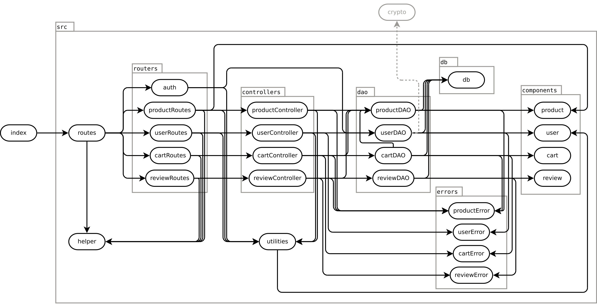
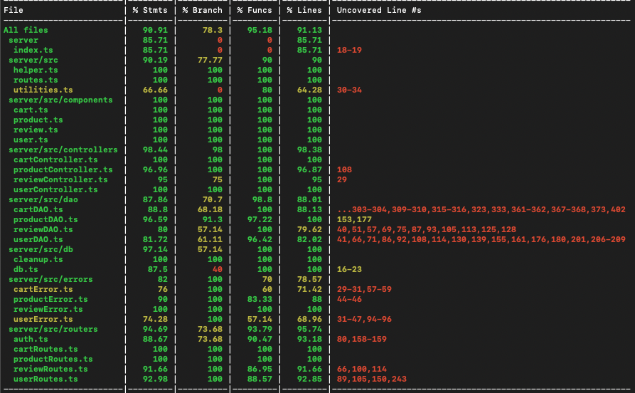

# Test Report

<The goal of this document is to explain how the application was tested, detailing how the test cases were defined and what they cover>

# Contents

- [Test Report](#test-report)
- [Contents](#contents)
- [Dependency graph](#dependency-graph)
- [Integration approach](#integration-approach)
    - [Step 1: Test di unità](#step-1-test-di-unità)
    - [Step 2: Test di integrazione principali](#step-2-test-di-integrazione-principali)
    - [Step 3: Test di integrazione secondari](#step-3-test-di-integrazione-secondari)
    - [Step 4: Test di Sistema e di API](#step-4-test-di-sistema-e-di-api)
- [Tests](#tests)
- [Coverage](#coverage)
  - [Coverage of FR](#coverage-of-fr)
  - [Functional Requirements Coverage](#functional-requirements-coverage)
  - [Coverage white box](#coverage-white-box)

# Dependency graph

# Integration approach

L'approccio principale utilizzato per il testing del software ezelectronics è stato basato su una tecnica bottom-up. 
Questa scelta ha permesso di testare modularmente a partire dai livelli più bassi il codice sviluppato, e rintracciare in modo sequenziale e efficace eventuali errori.
Per questo motivo abbiamo testato prima i moduli indipendenti per poi procedere verso quelli dipendenti fino a testare il sistema nel suo complesso.  
I test di unità sono stati effettuati sui singoli moduli per verificarne la corretta funzionalità.  
I test di integrazione sono stati svolti tramite chiamate sequenziali alle route delle unità da integrare, testando a cascata i vari test cases e scenari legati ai seguenti moduli funzionali:  

 - routes -> controllers -> dao.

La sequenza di integrazione dei test è stata sviluppata secondo la seguente logica di elaborazione:

### Step 1: Test di unità

- Test di unità degli utenti (Unit A): Test delle funzionalità dei singoli moduli di creazione, autenticazione, visualizzazione, e cancellazione degli utenti

- Test di unità dei prodotti (Unit B): Test delle funzionalità dei singoli moduli di creazione, visializzazione, aggiornamento, vendita e cancellazione dei prodotti

- Test di unità dei carrelli (Unit C): Test delle funzionalità dei singoli moduli di creazione, visualizzazione, aggiornamento, checkout e cancellazione dei carrelli

- Test di unità delle recensioni (Unit D): Test delle funzionalità dei singoli moduli di creazione, visualizzazione e cancellazione delle recensioni
    
### Step 2: Test di integrazione principali

- Test utenti e prodotti (Unit A + Unit B): Test di integrazione delle funzionalità utente e dei prodotti per creare, visualizzare, aggiornare, vendere e cancellare prodotti in funzione dei ruoli e dei permessi di ogni utente

- Test utenti e carrelli (Unit A + Unit C): Test di integrazione delle funzionalità utente e dei carrelli per visualizzare e cancellare i carrelli in funzione dei ruoli e dei permessi utente

### Step 3: Test di integrazione secondari

- Test Utenti, Prodotti e Carrelli (Unit A + Unit B + Unit C): Test di integrazione per verificare le funzionalità di inserimento, rimozione, cancellazione e checkout dei prodotti in un carrello da parte di un utente in relazione ai ruoli e permessi di ogni utente

- Test Utenti, Prodotti, Recensioni (Unit A + Unit B + Unit D): Test di integrazione per verificare le funzionalità di inserimento e cancellazione di recensioni riferite a prodotti in relazione ai ruoli e permessi di ogni utente

### Step 4: Test di Sistema e di API

- Test Utenti, Prodotti, Carrelli e Recensioni (All Units): Test del sistema complessivo con l'ausilio dell'interfaccia utente per verificare le funzionalità complessive di ogni unità in funzione di ruoli e permessi di ogni utente

# Tests

|                  Test case name                  |              Object(s) tested              | Test level  |                                         Technique used                                          |
|:------------------------------------------------:|:------------------------------------------:|:-----------:|:-----------------------------------------------------------------------------------------------:|
|         POST /users - Create a new User          |     userRoutes,userDao,userController      | Integration |         BB/ eq partitioning (per i test con bad parameters), WB/ statement coverage[^1]         |
|            GET /users - Get all Users            |     userRoutes,userDao,userController      | Integration |                                     Focus on the dependency                                     |
|  GET /users/roles/:role - Get all Users by Role  |     userRoutes,userDao,userController      | Integration |                                     Focus on the dependency                                     |
| GET /users/:username - Get an User by Username˙  |     userRoutes,userDao,userController      | Integration |                                     Focus on the dependency                                     |
|     DELETE /users/:username - Delete an User     |     userRoutes,userDao,userController      | Integration |                                     Focus on the dependency                                     |
|   DELETE /users - Delete every non-Admin User    |     userRoutes,userDao,userController      | Integration |                                     Focus on the dependency                                     |
| PATCH /users/:username - Update User information |     userRoutes,userDao,userController      | Integration |          BB/ eq partitioning (per i  test con bad parameters), Focus on the dependency          |
|              POST /sessions - Login              |                    auth                    |    Unit     |          WB/ statement coverage, BB/ eq partitioning (per i  test con bad parameters)           |
|        DELETE /sessions/current - Logout         |                    auth                    |    Unit     |                                     WB/ statement coverage                                      |
|     GET /sessions/current - Current Session      |                    auth                    |    Unit     |                                     WB/ statement coverage                                      |
|                  POST /products                  | productRoutes,productDao,productController | Integration | BB/ eq partitioning (per i  test con bad parameters), Focus on the dependency    ,BB/ boundary  |
|              PATCH /products/:model              | productRoutes,productDao,productController | Integration | BB/ eq partitioning (per i test con bad parameters), Focus on the dependency     ,BB/ boundary  |
|           PATCH /products/:model/sell            | productRoutes,productDao,productController | Integration | BB/ eq partitioning (per i  test con bad parameters), Focus on the dependency     ,BB/ boundary |
|                   GET /product                   | productRoutes,productDao,productController | Integration |          BB/ eq partitioning (per i test con bad parameters), Focus on the dependency           |
|             POST /products/available             | productRoutes,productDao,productController | Integration |          BB/ eq partitioning (per i test con bad parameters), Focus on the dependency           |
|             DELETE /products/:model              | productRoutes,productDao,productController | Integration |                                     Focus on the dependency                                     |
|                 DELETE /products                 | productRoutes,productDao,productController | Integration |                                     Focus on the dependency                                     |
|               POST /reviews/:model               |  reviewRoutes,reviewDao,reviewController   | Integration |                              BB/ boundary, Focus on the dependency                              |
|               GET /reviews/:model                |  reviewRoutes,reviewDao,reviewController   | Integration |                           Focus on the dependency,BB/ eq partitioning                           |
|              DELETE /reviews/:model              |  reviewRoutes,reviewDao,reviewController   | Integration |                                     Focus on the dependency                                     |
|                 DELETE /reviews                  |  reviewRoutes,reviewDao,reviewController   | Integration |                                     Focus on the dependency                                     |
|                    GET /carts                    |     cartRoutes,cartDao,cartController      | Integration |                                     Focus on the dependency                                     |
|                   POST /carts                    |     cartRoutes,cartDao,cartController      | Integration |                                     Focus on the dependency                                     |
|                   PATCH /carts                   |     cartRoutes,cartDao,cartController      | Integration |                                     Focus on the dependency                                     |
|                GET /carts/history                |     cartRoutes,cartDao,cartController      | Integration |                                     Focus on the dependency                                     |
|          DELETE /carts/products/:model           |     cartRoutes,cartDao,cartController      | Integration |                                     Focus on the dependency                                     |
|              DELETE /carts/current               |     cartRoutes,cartDao,cartController      | Integration |                                     Focus on the dependency                                     |
|                  DELETE /carts                   |     cartRoutes,cartDao,cartController      | Integration |                                     Focus on the dependency                                     |
|                  GET /carts/all                  |     cartRoutes,cartDao,cartController      | Integration |                                     Focus on the dependency                                     |
|            test routes create product            |               productRoutes                |    Unit     |                                     WB/ statement coverage                                      |
|            test routes change product            |               productRoutes                |    Unit     |                           WB/ statement coverage,BB/ eq partitioning                            |
|             test routes sell product             |               productRoutes                |    Unit     |                           WB/ statement coverage,BB/ eq partitioning                            |
|           test routes get all products           |               productRoutes                |    Unit     |                           WB/ statement coverage,BB/ eq partitioning                            |
|      test routes get all available products      |               productRoutes                |    Unit     |                           WB/ statement coverage,BB/ eq partitioning                            |
|         test routes delete all products          |               productRoutes                |    Unit     |                                     WB/ statement coverage                                      |
|           test routes delete a product           |               productRoutes                |    Unit     |                                     WB/ statement coverage                                      |
|         POST /users - Create a new User          |                 userRoutes                 |    Unit     |                           WB/ statement coverage,BB/ eq partitioning                            |
|            GET /users - Get all Users            |                 userRoutes                 |    Unit     |                                     WB/ statement coverage                                      |
|  GET /users/roles/:role - Get all Users by Role  |                 userRoutes                 |    Unit     |                           WB/ statement coverage,BB/ eq partitioning                            |
|  GET /users/:username - Get an User by Username  |                 userRoutes                 |    Unit     |                           WB/ statement coverage,BB/ eq partitioning                            |
|     DELETE /users/:username - Delete an User     |                 userRoutes                 |    Unit     |                           WB/ statement coverage,BB/ eq partitioning                            |
|   DELETE /users - Delete every non-Admin User    |                 userRoutes                 |    Unit     |                                     WB/ statement coverage                                      |
| PATCH /users/:username - Update User information |                 userRoutes                 |    Unit     |                           WB/ statement coverage,BB/ eq partitioning                            |
|              POST /sessions - Login              |                    auth                    |    Unit     |                                     WB/ statement coverage                                      |
|        DELETE /sessions/current - Logout         |                    auth                    |    Unit     |                                     WB/ statement coverage                                      |
|     GET /sessions/current - Current Session      |                    auth                    |    Unit     |                                     WB/ statement coverage                                      |
|                    GET /carts                    |                 cartRoutes                 |    Unit     |                                     WB/ statement coverage                                      |
|                   POST /carts                    |                 cartRoutes                 |    Unit     |                           WB/ statement coverage,BB/ eq partitioning                            |
|                   PATCH /carts                   |                 cartRoutes                 |    Unit     |                                     WB/ statement coverage                                      |
|                   GET /history                   |                 cartRoutes                 |    Unit     |                                     WB/ statement coverage                                      ||                                                  |                                   |             |                |
|             DELETE /products/:model              |                 cartRoutes                 |    Unit     |                                     WB/ statement coverage                                      |
|                 DELETE /current                  |                 cartRoutes                 |    Unit     |                                     WB/ statement coverage                                      |
|                     DELETE /                     |                 cartRoutes                 |    Unit     |                                     WB/ statement coverage                                      |
|                     GET /all                     |                 cartRoutes                 |    Unit     |                                     WB/ statement coverage                                      |
|                getUserCurrentCart                |                  cartDao                   |    Unit     |                                      WB/ decision coverage                                      ||                                                  |                                   |             |                |
|             Add product to user cart             |                  cartDao                   |    Unit     |                                      WB/ decision coverage                                      |
|           check Product exists In cart           |                  cartDao                   |    Unit     |                                      WB/ decision coverage                                      |
|                 getCurrentIdCart                 |                  cartDao                   |    Unit     |                                      WB/ decision coverage                                      |
|                   create Cart                    |                  cartDao                   |    Unit     |                                      WB/ decision coverage                                      |
|            getQuantityOfProductInCart            |                  cartDao                   |    Unit     |                                      WB/ decision coverage                                      |
|         Update Quantity Product In Cart          |                  cartDao                   |    Unit     |                                      WB/ decision coverage                                      |
|               Update Total In Cart               |                  cartDao                   |    Unit     |                                      WB/ decision coverage                                      |
|                  getCartHistory                  |                  cartDao                   |    Unit     |                                      WB/ decision coverage                                      |
|             remove product from cart             |                  cartDao                   |    Unit     |                                      WB/ decision coverage                                      |
|                  deleteAllCarts                  |                  cartDao                   |    Unit     |                                      WB/ decision coverage                                      |
|                    getAllCart                    |                  cartDao                   |    Unit     |                                      WB/ decision coverage                                      |
|                    getCartId                     |                  cartDao                   |    Unit     |                                      WB/ decision coverage                                      |
|               checkProductQuantity               |                  cartDao                   |    Unit     |                                      WB/ decision coverage                                      |
|                    run query                     |                  cartDao                   |    Unit     |                                      WB/ decision coverage                                      |
|                    get query                     |                  cartDao                   |    Unit     |                                      WB/ decision coverage                                      |
|                   fillProducts                   |                  cartDao                   |    Unit     |                                      WB/ decision coverage                                      |
|                    clearCart                     |                  cartDao                   |    Unit     |                                      WB/ decision coverage                                      |
|             add review to a product              |                reviewRoutes                |    Unit     |                                     WB/ statement coverage                                      |
|                Retrive a product                 |                reviewRoutes                |    Unit     |                                     WB/ statement coverage                                      |
|            delete a review of product            |                reviewRoutes                |    Unit     |                                     WB/ statement coverage                                      |
|         delete all reviews of a product          |                reviewRoutes                |    Unit     |                                     WB/ statement coverage                                      |
|                 delete a product                 |                reviewRoutes                |    Unit     |                                     WB/ statement coverage                                      |
|                     getCart                      |               cartController               |    Unit     |                                     WB/ statement coverage                                      |
|                    AddToCart                     |               cartController               |    Unit     |                                     WB/ statement coverage                                      |
|                  checkout cart                   |               cartController               |    Unit     |                                     WB/ statement coverage                                      |
|                 Get cart history                 |               cartController               |    Unit     |                                     WB/ statement coverage                                      |
|             Remove Product From Cart             |               cartController               |    Unit     |                                      WB/ decision coverage                                      |
|                    clear Cart                    |               cartController               |    Unit     |                                     WB/ statement coverage                                      |
|                  get all carts                   |               cartController               |    Unit     |                                     WB/ statement coverage                                      |
|                 delete all carts                 |               cartController               |    Unit     |                                     WB/ statement coverage                                      |
|                   Create User                    |               userController               |    Unit     |                                     WB/ statement coverage                                      |
|                  Get all users                   |               userController               |    Unit     |                                     WB/ statement coverage                                      |
|                Get users by Role                 |               userController               |    Unit     |                                     WB/ statement coverage                                      |
|              Get users by Username               |               userController               |    Unit     |                                     WB/ statement coverage                                      |
|             Delete User by Username              |               userController               |    Unit     |                                      WB/ decision coverage                                      |
|            Delete all non-admin Users            |               userController               |    Unit     |                                     WB/ statement coverage                                      |
|             Update user information              |               userController               |    Unit     |                                      WB/ decision coverage                                      |
|                 Register Product                 |             productController              |    Unit     |                                     WB/ statement coverage                                      |
|             Change Product Quantity              |             productController              |    Unit     |                           WB/ statement coverage,BB/ eq partitioning                            |
|                   Sell Product                   |             productController              |    Unit     |                           WB/ statement coverage,BB/ eq partitioning                            |
|                   get Products                   |             productController              |    Unit     |                           WB/ statement coverage,BB/ eq partitioning                            |
|              get Avaliable Products              |             productController              |    Unit     |                           WB/ statement coverage,BB/ eq partitioning                            |
|                DeleteAllProducts                 |             productController              |    Unit     |                           WB/ statement coverage,BB/ eq partitioning                            |
|                  create Product                  |                 productDao                 |    Unit     |                                     WB/ statement coverage                                      |
|               get Product by model               |                 productDao                 |    Unit     |                                     WB/ statement coverage                                      |
|             get Product by category              |                 productDao                 |    Unit     |                                     WB/ statement coverage                                      |
|                 get All Product                  |                 productDao                 |    Unit     |                                     WB/ statement coverage                                      |
|            check model exists Product            |                 productDao                 |    Unit     |                                     WB/ statement coverage                                      |
|         update product quantity Product          |                 productDao                 |    Unit     |                                     WB/ statement coverage                                      |
|         delete product by model Product          |                 productDao                 |    Unit     |                                     WB/ statement coverage                                      |
|           delete all products Product            |                 productDao                 |    Unit     |                                     WB/ statement coverage                                      |
|          Check if User is authenticated          |                  userDao                   |    Unit     |                                     WB/ statement coverage                                      |
|                   Create User                    |                  userDao                   |    Unit     |                                     WB/ statement coverage                                      |
|                    Get Users                     |                  userDao                   |    Unit     |                                     WB/ statement coverage                                      |
|                Get Users by Role                 |                  userDao                   |    Unit     |                                     WB/ statement coverage                                      |
|              Get Users by Username               |                  userDao                   |    Unit     |                                     WB/ statement coverage                                      |
|                   Delete User                    |                  userDao                   |    Unit     |                                     WB/ statement coverage                                      |
|                    Delete All                    |                  userDao                   |    Unit     |                                     WB/ statement coverage                                      |
|                 Update User info                 |                  userDao                   |    Unit     |                                     WB/ statement coverage                                      |
|          function: addReviewController           |              reviewController              |    Unit     |                                     WB/ statement coverage                                      |
|           function: getProductReviews            |              reviewController              |    Unit     |                                     WB/ statement coverage                                      |
|              function: deleteReview              |              reviewController              |    Unit     |                                     WB/ statement coverage                                      |
|         function: deleteReviewsOfProduct         |              reviewController              |    Unit     |                                     WB/ statement coverage                                      |
|            function: deleteAllReviews            |              reviewController              |    Unit     |                                     WB/ statement coverage                                      |
|                  Insert Review                   |                 reviewDao                  |    Unit     |                                     WB/ statement coverage                                      |
|                  get-All-Review                  |                 reviewDao                  |    Unit     |                                     WB/ statement coverage                                      |
|                  delete Review                   |                 reviewDao                  |    Unit     |                                     WB/ statement coverage                                      |
|             delete Review of product             |                 reviewDao                  |    Unit     |                                     WB/ statement coverage                                      |
|                delete all reviews                |                 reviewDao                  |    Unit     |                                     WB/ statement coverage                                      |

# Coverage

## Coverage of FR

<Report in the following table the coverage of functional requirements and scenarios(from official requirements) >

## Functional Requirements Coverage

| Functional Requirement or scenario                        | Test(s)                                                                                                                                                                                                                                                                                                                                                                                                                                                                                                                                                                                                                                                                                                                                                                                                                                                                                                                                                                                                                                                                                                                                                                                                                             |
| --------------------------------------------------------- | ----------------------------------------------------------------------------------------------------------------------------------------------------------------------------------------------------------------------------------------------------------------------------------------------------------------------------------------------------------------------------------------------------------------------------------------------------------------------------------------------------------------------------------------------------------------------------------------------------------------------------------------------------------------------------------------------------------------------------------------------------------------------------------------------------------------------------------------------------------------------------------------------------------------------------------------------------------------------------------------------------------------------------------------------------------------------------------------------------------------------------------------------------------------------------------------------------------------------------------- |
| **FR1.1**                                                 | **AuthIntegration:** `describe("POST /sessions - Login"),  - test("As Customer")`  -`test("As Manager")`  -`test("As Admin")`  - `test("As a non-existing User")`,  - `test("With wrong password")`   **AuthRoutes**: `describe("POST /sessions - Login")`  - `test("Successfully")`  -`test("Unsuccessfully")`                                                                                                                                                                                                                                                                                                                                                                                                                                                                                                                                                                                                                                                                                                                                                                                                                                                                                     |
| **FR1.2**                                                 | **AuthIntegration:** `describe("DELETE /sessions/current - Logout")`  - `test("As logged in User")`  -`test("As not logged in User")`  **AuthRoutes:** `describe("DELETE /sessions/current - Logout")`  - `test("As logged in User")`  -`test("As not logged in User")`                                                                                                                                                                                                                                                                                                                                                                                                                                                                                                                                                                                                                                                                                                                                                                                                                                                                                                                                         |
| **FR1.3**                                                 | **AuthIntegration:** `describe("GET /sessions/current - Current Session")`  - test("As logged in User"),  -test("As not logged in User")  **AuthRoutes:** `describe("GET /sessions/current - Current Session")`  - `test("As logged in User")`  -`test("As not logged in User")`                                                                                                                                                                                                                                                                                                                                                                                                                                                                                                                                                                                                                                                                                                                                                                                                                                                                                                                                |
| **FR2.1 Show the list of all users**                      | **UserRoutes:** `describe("GET /users - Get all Users")"`  - `test("As Admin")`,  -`test("As not Admin")`,                                                                                                                                                                                                                                                                                                                                                                                                                                                                                                                                                                                                                                                                                                                                                                                                                                                                                                                                                                                                                                                                                                              |
|                                                           | **UserController:** `describe("Get all users")`  - ` test("Empty list")`,  -`test("As Customer")`,  -`test("As Manager")`   ,   -`test("As not authenticated")`                                                                                                                                                                                                                                                                                                                                                                                                                                                                                                                                                                                                                                                                                                                                                                                                                                                                                                                                                                                                                                             |
|                                                           | **UserDao:** `describe("Get Users")`  - `test("Empty list")`,  -` test("Populated list")`,  -`test("It should return a 400 Date error code")`                                                                                                                                                                                                                                                                                                                                                                                                                                                                                                                                                                                                                                                                                                                                                                                                                                                                                                                                                                                                                                                                       |
|                                                           | **UserIntegration:** ` describe("GET /users - Get all Users")`  - `test("As Admin")`,  -`test("As Customer")`,  -`test("As Manager")`   ,   -`test("As not authenticated")`                                                                                                                                                                                                                                                                                                                                                                                                                                                                                                                                                                                                                                                                                                                                                                                                                                                                                                                                                                                                                                 |
| **FR2.2 Show the list of all users with a specific role** | **UserRoutes:** ` describe("GET /users/roles/:role - Get all Users by Role")` - `test("As Admin")` - `test("As not Admin")` -`test("Bad role")` **                                                                                                                                                                                                                                                                                                                                                                                                                                                                                                                                                                                                                                                                                                                                                                                                                                                                                                                                                                                                                                                                   |
|                                                           | **UserController:** `describe("Get users by Role")` - `test("It should return customers")` - `test("Integration: It should return a 200 success code and add a product")`                                                                                                                                                                                                                                                                                                                                                                                                                                                                                                                                                                                                                                                                                                                                                                                                                                                                                                                                                                                                                                               |
|                                                           | **UserDao:** `describe("Get Users by Role")` - `test("Empty list")` - `test("Populated list")`                                                                                                                                                                                                                                                                                                                                                                                                                                                                                                                                                                                                                                                                                                                                                                                                                                                                                                                                                                                                                                                                                                                          |
|                                                           | **UserIntegration:** `describe("GET /users/roles/:role - Get all Users by Role")` - `test("As Admin - Customer Role")` - `test("As Customer")`   - `test("As Manager")`  - ` test("As not authenticated")`  - `test("As Admin - invalid Role")`                                                                                                                                                                                                                                                                                                                                                                                                                                                                                                                                                                                                                                                                                                                                                                                                                                                                                                                                                                |
| **FR2.3 Show the information of a single user**           | **UserRoutes:** `describe("GET /users/:username - Get an User by Username")` - ` test("As logged in User")` - `test("As not logged in User")`   - `test("Non-existing User")`  - `test("Not same User nor Admin")`                                                                                                                                                                                                                                                                                                                                                                                                                                                                                                                                                                                                                                                                                                                                                                                                                                                                                                                                                                                                |
|                                                           | **UserController:** `describe("Get users by Username")` - `describe("Get users by Username")` - `test("User is not self nor Admin")`  - `test("User not found"`                                                                                                                                                                                                                                                                                                                                                                                                                                                                                                                                                                                                                                                                                                                                                                                                                                                                                                                                                                                                                                                      |
|                                                           | **UserDao:** `describe("Get Users by Username")` - `test("Not found")`                                                                                                                                                                                                                                                                                                                                                                                                                                                                                                                                                                                                                                                                                                                                                                                                                                                                                                                                                                                                                                                                                                                                                        |
|                                                           | **UserIntegration:** `describe("GET /users/:username - Get an User by Username"` - `test("As logged in User")` - `test("As not logged in User")`    - ` test("Non-existing User")`   - ` test("Not same User nor Admin")`                                                                                                                                                                                                                                                                                                                                                                                                                                                                                                                                                                                                                                                                                                                                                                                                                                                                                                                                                                                         |
| **FR2.4 Update the information of a single user**         | **UserRoutes:** ` describe("PATCH /users/:username - Update User information")` - `test("As logged in User")` - `test("As not logged in User"`                  - ` test("Not same User nor Admin")`  - ` test("To-be-updated User is Admin")`    - ` test("With bad date")`        - ` test("With no date")`    - ` test("Bad parameters")`                                                                                                                                                                                                                                                                                                                                                                                                                                                                                                                                                                                                                                                                                                                                                                                                                                                             |
|                                                           | **UserController:** `describe("Update user information",)` - `test("User is self")` - ` test("User is not self")`           - `  test("User is Admin updating Customer info")`       - ` test("User is Admin updating Manager info")`       - ` test("User is Admin updating Admin info"`       - ` test("User is Admin updating non-existing User info")`                                                                                                                                                                                                                                                                                                                                                                                                                                                                                                                                                                                                                                                                                                                                                                                                                                                  |
|                                                           | **UserDao:** `describe("Update User info")` - `test("User found")` - `test("User not found")`                                                                                                                                                                                                                                                                                                                                                                                                                                                                                                                                                                                                                                                                                                                                                                                                                                                                                                                                                                                                                                                                                                                           |
|                                                           | **UserIntegration:** `describe("PATCH /users/:username - Update User information")` - `test("As logged in User")` - `test("As Admin for different User")`     - `test("As Admin for self")`     - `test("As not logged in User")`                - `test("Not same User nor Admin")`           - `test("To-be-updated User is Admin")`   - `test("With bad date")`   - `test("With no date")`   - `test("Bad parameters")`                                                                                                                                                                                                                                                                                                                                                                                                                                                                                                                                                                                                                                                                                                                                                                         |
| **FR2.5 Delete a single _non Admin_ user**                | **UserRoutes:** `describe("DELETE /users/:username - Delete an User")` - `test("As logged in User")` - `test("As not logged in User")`            - `test("Non-existing User")`  - `test("Not same User nor Admin")`   - `test("To-be-deleted User is Admin")`                                                                                                                                                                                                                                                                                                                                                                                                                                                                                                                                                                                                                                                                                                                                                                                                                                                                                                                                                 |
|                                                           | **UserController:** `describe("Delete User by Username")` - `test("User is self")` - ` test("User is not Admin")`    - ` test("User is Admin deleting Customer")`      - `test("User is Admin deleting Manager")`   - ` test("User is Admin deleting Admin")`  - `test("User is Admin deleting non-existing User")`                                                                                                                                                                                                                                                                                                                                                                                                                                                                                                                                                                                                                                                                                                                                                                                                                                                                                         |
|                                                           | **UserDao:** `describe("Delete User")` - `test("Found")` - `test("Not found")`                                                                                                                                                                                                                                                                                                                                                                                                                                                                                                                                                                                                                                                                                                                                                                                                                                                                                                                                                                                                                                                                                                                                          |
|                                                           | **UserIntegration:** -`describe("DELETE /users/:username - Delete an User")` - `test("As Customer")` - ` test("As Manager")`   - ` test("As Admin")`  - ` test("As not logged in User")`   - ` test("Non-existing User")`  - ` test("Not same User nor Admin")`  - `  test("To-be-deleted User is Admin")`                                                                                                                                                                                                                                                                                                                                                                                                                                                                                                                                                                                                                                                                                                                                                                                                                                                                                               |
| **FR2.6 Delete all _non Admin_ users**                    | **UserRoutes:** `describe("DELETE /users - Delete every non-Admin User")` - `test("As Admin")` - `test("As not Admin")`                                                                                                                                                                                                                                                                                                                                                                                                                                                                                                                                                                                                                                                                                                                                                                                                                                                                                                                                                                                                                                                                                                 |
|                                                           | **UserController:** `describe("Delete all non-admin Users")` - `test("Successfully")`                                                                                                                                                                                                                                                                                                                                                                                                                                                                                                                                                                                                                                                                                                                                                                                                                                                                                                                                                                                                                                                                                                                                      |
|                                                           | **UserDao:** `describe("Delete All")` - `test("Successfully")`                                                                                                                                                                                                                                                                                                                                                                                                                                                                                                                                                                                                                                                                                                                                                                                                                                                                                                                                                                                                                                                                                                                                                             |
|                                                           | **UserIntegration:** `describe("DELETE /users - Delete every non-Admin User")` - `test("As Admin")` - `test("As Customer")`  - ` test("As Manager")`   - ` test("As non authenticated User"")  `                                                                                                                                                                                                                                                                                                                                                                                                                                                                                                                                                                                                                                                                                                                                                                                                                                                                                                                                                                                                                     |
| **FR3.1**                                                 | **ProductRoutes:** `describe("test routes create product")`  - `test("It should return a 200 success code")`,  -`test("It should return a 409 error code")`,  -`test("It should return a 400 Date error code")`                                                                                                                                                                                                                                                                                                                                                                                                                                                                                                                                                                                                                                                                                                                                                                                                                                                                                                                                                                                                         |
|                                                           | **ProductDAO:** `describe("create Product")`  - `test("should create a product")`,  -`test("should return product already exists")`,  -`test("should return product generic error")`,  -`test("should return product generic error from update history")`                                                                                                                                                                                                                                                                                                                                                                                                                                                                                                                                                                                                                                                                                                                                                                                                                                                                                                                                                           |
|                                                           | **ProductController:** `describe("Register Product")`  - `test("Register a Product")`,  -`test("Duplicate Product")`,  -`test("Product with no date")`                                                                                                                                                                                                                                                                                                                                                                                                                                                                                                                                                                                                                                                                                                                                                                                                                                                                                                                                                                                                                                                                  |
|                                                           | **ProductIntegration:** `describe("POST /products")`  - `test("should return 200 success and create new product")`,  -`test("should return 409 error duplicate product")`,  -`test("should return 400 error invalid date after current date")`,  -`test("should return 422 error invalid date format")`,  -`test("should return 422 error sellingPrice <=0")`,  -`test("should return 422 error Category not in 'Smartphone',  -'Laptop',  -'Appliance'")`,  -`test("should return 422 error quantity<=0")`,  -`test("should return 422 error model not a string")`,  -`test("should return 401 error not authorized")`                                                                                                                                                                                                                                                                                                                                                                                                                                                                                                                                                                 |
| **FR3.2**                                                 | **ProductRoutes:** `describe("test routes change product")`  - `test("It should return a 200 success code")`,  -`test("It should return a 200 without date success code")`,  -`test("It should return a Date Error 400 code")`,  -`test("It should return a Date format error 422")`,  -`test("It should return a Controller Error")`                                                                                                                                                                                                                                                                                                                                                                                                                                                                                                                                                                                                                                                                                                                                                                                                                                                                           |
|                                                           | **ProductDAO:** `describe("update product quantity Product")`  - `test("should update product")`,  -`test("should return generic error")`,  -`test("should return generic error from update history")`                                                                                                                                                                                                                                                                                                                                                                                                                                                                                                                                                                                                                                                                                                                                                                                                                                                                                                                                                                                                                  |
|                                                           | **ProductController:** `describe("Change Product Quantity")`  - `test("With no date")`,  -`test("With valid date")`,  -`test("With invalid date")`,  -`test("With invalid Product")`                                                                                                                                                                                                                                                                                                                                                                                                                                                                                                                                                                                                                                                                                                                                                                                                                                                                                                                                                                                                                                |
|                                                           | **ProductIntegration:** `describe("PATCH /products/:model")`  - `test("should return 200 success and increase product quantity")`,  -`test("should return 404 error product not found")`,  -`test("should return 422 error quantity <=0")`,  -`test("should return 422 error changeDate format error")`,  -`test("should return 400 error changeDate before arrival date")`,  -`test("should return 409 error changeDate after current date")`,  -`test("should return 401 error not authorized")`                                                                                                                                                                                                                                                                                                                                                                                                                                                                                                                                                                                                                                                                                                      |
| **FR3.3**                                                 | **ProductRoutes:** `describe("test routes sell product")`  - `test("It should return a 200 success code")`,  -`test("It should return a 200 without date success code")`,  -`test("It should return a Date Error 400 code")`,  -`test("It should return a Date format error 422")`,  -`test("It should return a Controller Error")`                                                                                                                                                                                                                                                                                                                                                                                                                                                                                                                                                                                                                                                                                                                                                                                                                                                                             |
|                                                           | **ProductController:** `describe("Sell Product")`  - `test("With no date")`,  -`test("With valid date")`,  -`test("With invalid date")`,  -`test("With product quantity = 0")`,  -`test("With product quantity < sell quantity")`,  -`test("With invalid Product")`                                                                                                                                                                                                                                                                                                                                                                                                                                                                                                                                                                                                                                                                                                                                                                                                                                                                                                                                         |
|                                                           | **ProductIntegration:** `describe("PATCH /products/:model/sell")`  - `test("should return 200 success and decrease product quantity")`,  -`test("should return 404 error product not found")`,  -`test("should return 422 error quantity <=0")`,  -`test("should return 409 error quantity of product = 0")`,  -`test("should return 409 error quantity of product < quantity sold")`,  -`test("should return 422 error changeDate format error")`,  -`test("should return 400 error changeDate before arrival date")`,  -`test("should return 409 error changeDate after current date")`,  -`test("should return 401 error not authorized")`                                                                                                                                                                                                                                                                                                                                                                                                                                                                                                                                                   |
| **FR3.4**                                                 | **ProductRoutes:** `describe("test routes get all products")`  - `test("It should return a 200 success code without grouping")`,  -`test("It should return a 200 success code with grouping=model and model")`,  -`test("It should return a 200 success code with grouping=category and category")`,  -`test("It should return a 422 success code with grouping=category and both category and model specified")`,  -`test("It should return a Controller Error")`                                                                                                                                                                                                                                                                                                                                                                                                                                                                                                                                                                                                                                                                                                                                              |
|                                                           | **ProductDAO:** `describe("get All Product")`  - `test("should return all products")`,  -`test("should return available products")`,  -`test("should return generic error")`                                                                                                                                                                                                                                                                                                                                                                                                                                                                                                                                                                                                                                                                                                                                                                                                                                                                                                                                                                                                                                            |
|                                                           | **ProductController:** `describe("get Products")`  - `test("grouping no specified")`,  -`test("grouping specified with model")`,  -`test("grouping specified with category")`                                                                                                                                                                                                                                                                                                                                                                                                                                                                                                                                                                                                                                                                                                                                                                                                                                                                                                                                                                                                                                           |
|                                                           | **ProductIntegration:** `describe("GET /products")`  - `test("should return 200 success and return all products")`,  -`test("should return 200 success and return products with model 'model'")`,  -`test("should return 200 success and return all products with category Laptop")`,  -`test("should return 422 error grouping null & category defined")`,  -`test("should return 422 error grouping null & model defined")`,  -`test("should return 422 error grouping defined & model null")`,  -`test("should return 422 error grouping defined & category null")`,  -`test("should return 422 error grouping=model & model null & category defined")`,  -`test("should return 422 error grouping=category & category null & model defined")`,  -`test("should return 404 error grouping=model & wrong model")`,  -`test("should return 422 error grouping=category & wrong model")`,  -`test("should return 422 error grouping=category & both category and model specified")`,  -`test("should return 422 error grouping=model & both category and model specified")`,  -`test("should return 401 error not authenticated")`                                          |
| **FR3.4.1**                                               | **ProductRoutes:** `describe("test routes get all available products")`  - `test("It should return a 200 success code without grouping")`,  -`test("It should return a 200 success code with grouping=model and model")`,  -`test("It should return a 200 success code with grouping=category and category")`,  -`test("It should return a 422 success code with grouping=category and both category and model specified")`,  -`test("It should return a Controller Error")`                                                                                                                                                                                                                                                                                                                                                                                                                                                                                                                                                                                                                                                                                                                                    |
|                                                           | **ProductDAO:** `describe("get Product by category")`  - `test("should return products by category")`,  -`test("should return products by available category")`,  -`test("should return generic error")`                                                                                                                                                                                                                                                                                                                                                                                                                                                                                                                                                                                                                                                                                                                                                                                                                                                                                                                                                                                                                |
|                                                           | **ProductController:** `describe("get Available Products")`  - `test("grouping no specified")`,  -`test("grouping specified with model")`,  -`test("grouping specified with category")`                                                                                                                                                                                                                                                                                                                                                                                                                                                                                                                                                                                                                                                                                                                                                                                                                                                                                                                                                                                                                                 |
|                                                           | **ProductIntegration:** `describe("POST /products/available")`  - `test("should return 200 success and return all available products")`,  -`test("should return 200 success and return available products with model 'model'")`,  -`test("should return 200 success and return all available products with category Laptop")`,  -`test("should return 422 error grouping null & category defined")`,  -`test("should return 422 error grouping null & model defined")`,  -`test("should return 422 error grouping defined & model null")`,  -`test("should return 422 error grouping defined & category null")`,  -`test("should return 422 error grouping=model & model null & category defined")`,  -`test("should return 422 error grouping=category & category null & model defined")`,  -`test("should return 404 error grouping=model & wrong model")`,  -`test("should return 422 error grouping=category & wrong model")`,  -`test("should return 422 error grouping=category & both category and model specified")`,  -`test("should return 422 error grouping=model & both category and model specified")`,  -`test("should return 401 error not authenticated")` |
| **FR3.5**                                                 | **ProductDAO:** `describe("check model exists Product")`  - `test("should check existence")`                                                                                                                                                                                                                                                                                                                                                                                                                                                                                                                                                                                                                                                                                                                                                                                                                                                                                                                                                                                                                                                                                                                                    |
| **FR3.6**                                                 | **ProductRoutes:** `describe("test routes delete all products")`  - `test("It should return a 200 success delete")`,  -`test("It should return a Controller error delete")`                                                                                                                                                                                                                                                                                                                                                                                                                                                                                                                                                                                                                                                                                                                                                                                                                                                                                                                                                                                                                                                 |
|                                                           | **ProductDAO:** `describe("delete all products Product")`  - `test("should delete a product")`                                                                                                                                                                                                                                                                                                                                                                                                                                                                                                                                                                                                                                                                                                                                                                                                                                                                                                                                                                                                                                                                                                                                  |
|                                                           | **ProductController:** `describe("DeleteAllProducts")`  - `test("should delete all products")`                                                                                                                                                                                                                                                                                                                                                                                                                                                                                                                                                                                                                                                                                                                                                                                                                                                                                                                                                                                                                                                                                                                                  |
|                                                           | **ProductIntegration:** `describe("DELETE /products")`  - `test("should return 200 success and delete all products")`,  -`test("should return 401 error not authorized")`,  -`test("should return 401 error not authenticated")`                                                                                                                                                                                                                                                                                                                                                                                                                                                                                                                                                                                                                                                                                                                                                                                                                                                                                                                                                                                        |
| **FR3.7**                                                 | **ProductRoutes:** `describe("test routes delete a product")`  - `test("It should return a 200 success delete")`,  -`test("It should return a Controller error delete")`                                                                                                                                                                                                                                                                                                                                                                                                                                                                                                                                                                                                                                                                                                                                                                                                                                                                                                                                                                                                                                                    |
|                                                           | **ProductDAO:** `describe("delete product by model Product")`  - `test("should delete a product")`,  -`test("should return generic error")`                                                                                                                                                                                                                                                                                                                                                                                                                                                                                                                                                                                                                                                                                                                                                                                                                                                                                                                                                                                                                                                                                 |
|                                                           | **ProductController:** `describe("DeleteAllProducts")`  - `test("should delete a products")`                                                                                                                                                                                                                                                                                                                                                                                                                                                                                                                                                                                                                                                                                                                                                                                                                                                                                                                                                                                                                                                                                                                                    |
|                                                           | **ProductIntegration:** `describe("DELETE /products/:model")`  - `test("should return 200 success and delete a product")`,  -`test("should return 404 error product not found")`,  -`test("should return 401 error not authorized")`                                                                                                                                                                                                                                                                                                                                                                                                                                                                                                                                                                                                                                                                                                                                                                                                                                                                                                                                                                                    |
| **FR4.1**                                                 | **ReviewRoutes:** `describe("add review to a product")` - `test("function: add a review")`                                                                                                                                                                                                                                                                                                                                                                                                                                                                                                                                                                                                                                                                                                                                                                                                                                                                                                                                                                                                                                                                                                                                |
| **FR4.1**                                                 | **ReviewController:** `describe("addReview")`  - `test("Case: Product exists, review Added correctly")`  - `test("Case: Product not exists, review not added")`  - `test("Case: Product exists, review not added correctly")`  - `test("Case: Product not exists, review not added correctly")`                                                                                                                                                                                                                                                                                                                                                                                                                                                                                                                                                                                                                                                                                                                                                                                                                                                                                                                 |
| **FR4.1**                                                 | **ReviewDAO:** `describe("Insert Review")`  - `test("insertReview")`  - `test("insertReviewJustAdded")`                                                                                                                                                                                                                                                                                                                                                                                                                                                                                                                                                                                                                                                                                                                                                                                                                                                                                                                                                                                                                                                                                                                 |
| **FR4.1**                                                 | **IntegrationReview:** `describe("POST /reviews/:model")`  - `test("should return 200 success and create new review")`  - `test("should return 404 error for non-existent product")`  - `test("should return 409 error for existing review by the same customer")`  - `test("should return 422 score is > 5")`                                                                                                                                                                                                                                                                                                                                                                                                                                                                                                                                                                                                                                                                                                                                                                                                                                                                                                  |
| **FR4.2**                                                 | **ReviewRoutes:** `describe("Retrieve a product")` - `test("retrieve all reviews of a product")`                                                                                                                                                                                                                                                                                                                                                                                                                                                                                                                                                                                                                                                                                                                                                                                                                                                                                                                                                                                                                                                                                                                          |
| **FR4.2**                                                 | **ReviewController:** `describe("getProductReviews")`  - `test("Case: allReviewRetrieved")`                                                                                                                                                                                                                                                                                                                                                                                                                                                                                                                                                                                                                                                                                                                                                                                                                                                                                                                                                                                                                                                                                                                                 |
| **FR4.2**                                                 | **ReviewDAO:** `describe("get-All-Review")`  - `test("product-found")`                                                                                                                                                                                                                                                                                                                                                                                                                                                                                                                                                                                                                                                                                                                                                                                                                                                                                                                                                                                                                                                                                                                                                      |
| **FR4.2**                                                 | **IntegrationReview:** `describe("GET /reviews/:model")`  - `test("should return 200 success and retrieve reviews for a product")` - `test("should return 200 but it does not find products")`  - `test("should return 401 error if not authenticated")` - `test("should return 422 because model not exists")`                                                                                                                                                                                                                                                                                                                                                                                                                                                                                                                                                                                                                                                                                                                                                                                                                                                                                                 |
| **FR4.3**                                                 | **ReviewRoutes:** `describe("delete a review of product")` - `test("delete a review of a product")`                                                                                                                                                                                                                                                                                                                                                                                                                                                                                                                                                                                                                                                                                                                                                                                                                                                                                                                                                                                                                                                                                                                       |
| **FR4.3**                                                 | **ReviewController:** `describe("deleteReview")`  - `test("Case: the product exists, the user has the review")`  - `test("Case: the product not exists, the user has the review")`  - `test("Case: the product exists, the user hasn't the review")`  - `test("Case: the product not exists, the user hasn't the review")`                                                                                                                                                                                                                                                                                                                                                                                                                                                                                                                                                                                                                                                                                                                                                                                                                                                                                      |
| **FR4.3**                                                 | **ReviewDAO:** `describe("deleteReview")`  - `test("delete Review")`                                                                                                                                                                                                                                                                                                                                                                                                                                                                                                                                                                                                                                                                                                                                                                                                                                                                                                                                                                                                                                                                                                                                                        |
| **FR4.3**                                                 | **IntegrationReview:** `describe(""DELETE /reviews/:model")`  - `test("should return 200 success and delete a review")`  - `test("should return 404 error for review not found")`                                                                                                                                                                                                                                                                                                                                                                                                                                                                                                                                                                                                                                                                                                                                                                                                                                                                                                                                                                                                                                       |
| **FR4.4**                                                 | **ReviewRoutes:** `describe("delete all reviews of a product")` - `test("delete all reviews of a product")`                                                                                                                                                                                                                                                                                                                                                                                                                                                                                                                                                                                                                                                                                                                                                                                                                                                                                                                                                                                                                                                                                                               |
| **FR4.4**                                                 | **ReviewController:** `describe("deleteReviewsOfProduct")`  - `test("Case: the product exists")`  - `test("Case: the product not exists")`                                                                                                                                                                                                                                                                                                                                                                                                                                                                                                                                                                                                                                                                                                                                                                                                                                                                                                                                                                                                                                                                              |
| **FR4.4**                                                 | **ReviewDAO:** `describe("delete Review of product")`  - `test("delete Review of product")`                                                                                                                                                                                                                                                                                                                                                                                                                                                                                                                                                                                                                                                                                                                                                                                                                                                                                                                                                                                                                                                                                                                                 |
| **FR4.4**                                                 | **IntegrationReview:** `describe("DELETE /reviews/:model")`  - `test("should return 200 success and delete a review")`  - `test("should return 404 error for review not found")`   - `test("should return 401 Unauthorized (manager)")`  - `test("should return 401 Unauthorized (admin)")`                                                                                                                                                                                                                                                                                                                                                                                                                                                                                                                                                                                                                                                                                                                                                                                                                                                                                                                     |
| **FR4.5**                                                 | **ReviewRoutes:** `describe("delete all reviews")` - `test("delete all reviews")`                                                                                                                                                                                                                                                                                                                                                                                                                                                                                                                                                                                                                                                                                                                                                                                                                                                                                                                                                                                                                                                                                                                                         |
| **FR4.5**                                                 | **ReviewController:** `describe("deleteAllReviews")`  - `test("deleteAllReviews")`                                                                                                                                                                                                                                                                                                                                                                                                                                                                                                                                                                                                                                                                                                                                                                                                                                                                                                                                                                                                                                                                                                                                          |
| **FR4.5**                                                 | **ReviewDAO:** `describe("delete all reviews")`  - `test("delete all reviews")`                                                                                                                                                                                                                                                                                                                                                                                                                                                                                                                                                                                                                                                                                                                                                                                                                                                                                                                                                                                                                                                                                                                                             |
| **FR4.5**                                                 | **IntegrationReview:** `describe("DELETE /reviews")`  - `test("should return 200 success and delete all reviews of all products (admin)")`  - `test("should return 200 success and delete all reviews of all products (manager)")`  - `test("should return 401 Unauthorized (customer)")`                                                                                                                                                                                                                                                                                                                                                                                                                                                                                                                                                                                                                                                                                                                                                                                                                                                                                                                           |
| **FR5.1**                                                 | **CartRoutes:** `describe("GET /carts")` - `test("should return the cart with status 200")` - `test("Integration: It should return a 200 success code and retrive the all product of the cart")`                                                                                                                                                                                                                                                                                                                                                                                                                                                                                                                                                                                                                                                                                                                                                                                                                                                                                                                                                                                                                        |
|                                                           | **CartController:** `describe("getCart")` - `test("getProduct success")` - `test("getProduct error")`                                                                                                                                                                                                                                                                                                                                                                                                                                                                                                                                                                                                                                                                                                                                                                                                                                                                                                                                                                                                                                                                                                                   |
|                                                           | **CartDAO:** `describe("getUserCurrentCart")` - `test("user does not have a cart")` - `test("user have a cart")` - `test("user have a cart with no products")` - `test("Database Error")`                                                                                                                                                                                                                                                                                                                                                                                                                                                                                                                                                                                                                                                                                                                                                                                                                                                                                                                                                                                                                            |
|                                                           | **ProductIntegration**   `describe("GET /carts")`  `test("It should return a 200 success code and retrive the all product of the cart" )` - `test("It should return a 200 success code and retrive the all product of the cart - Add one product to the cart" )` - `test("It should return a 200 success code and retrive the all product of the cart - Add more product and more quantity to the cart" )` - `test("It should return a 401 error code: admin" )` - `test("It should return a 401 error code: manager" )`                                                                                                                                                                                                                                                                                                                                                                                                                                                                                                                                                                                                                                                                                |
| **FR5.2**                                                 | **CartRoutes:** `describe("POST /carts")` - `test("should return the cart with status 200")` - `test("Integration: It should return a 200 success code and add a product", async () => )`                                                                                                                                                                                                                                                                                                                                                                                                                                                                                                                                                                                                                                                                                                                                                                                                                                                                                                                                                                                                                               |
|                                                           | **CartController:** `describe("AddToCart")` - `test("addToCart: Product not in database")` - `test("addToCart success")` - `test("addToCart create cart")` - `test("addToCart empty stock")`                                                                                                                                                                                                                                                                                                                                                                                                                                                                                                                                                                                                                                                                                                                                                                                                                                                                                                                                                                                                                      |
|                                                           | **CartDAO:** `describe("Add product to user cart")` - `test("add product success")` - `test("add product Error")`                                                                                                                                                                                                                                                                                                                                                                                                                                                                                                                                                                                                                                                                                                                                                                                                                                                                                                                                                                                                                                                                                                          |
|                                                           | **ProductIntegration**  `describe("POST /carts")`       `test("It should return a 200 success code and add a product" )` - `test("It should return a 404 success code and not insert the cart") ` - `test("It should return a 409 code and not insert the cart" )` - `test("It should return a 422 success code and not insert the cart" )` - `test("It should return a 422 success code and not insert the cart space" )` - `test("It should return a 401 error code: admin" )` - `test("It should return a 401 error code: manager" )`                                                                                                                                                                                                                                                                                                                                                                                                                                                                                                                                                                                                                                                            |
| **FR5.3**                                                 | **CartRoutes:** `describe("PATCH /carts")` - `test("should return the cart with status 200")` - `test("Integration: It should return a 200 success code and add pay the current cart", async () => )` `describe("checkout cart")` - `test("checkout success")` - `test("cart not found")` - `test("empty cart")` - `test("low product stock")` - `test("empty product stock")` - `test("get all Cart error")` `describe("Update Total In Cart")` - `test("quantity retrived")`                                                                                                                                                                                                                                                                                                                                                                                                                                                                                                                                                                                                                                                                                                                                                                                                                                                                                                                                                                                                                                                                                                                                                 |
|                                                           | **ProductIntegration**   `describe("PATCH /carts")`  `test("It should return a 200 success code and add pay the current cart" )` `test("It should return a 200 success code and add pay the current cart case: more product in the cart" )` `test("It should return a 404 error code" )` `test("It should return a 400 error code" )` `test("It should return a 409 error code" )` `test("It should return a 409 error code quantityRequest > quantityStored" )` `test("It should return a 401 error code: Admin" )` `test("It should return a 401 error code: Admin" )`                                                                                                                                                                                                                                                                                                                                                                                                                                                                                                                                                                                                                        |
| **FR5.4**                                                 | **CartRoutes:** `describe("GET /carts/history")` - `test("should return the cart with status 200")` - `test("Integration: It should return a 200 success code and retrive the history: case one cart paid", async () => )`                                                                                                                                                                                                                                                                                                                                                                                                                                                                                                                                                                                                                                                                                                                                                                                                                                                                                                                                                                                              |
|                                                           | **CartController:** `describe("Get cart history")` - `test("get Cart history success")` - `test("get Cart history error")`                                                                                                                                                                                                                                                                                                                                                                                                                                                                                                                                                                                                                                                                                                                                                                                                                                                                                                                                                                                                                                                                                              |
|                                                           | **CartDAO:** `describe("getCartHistory")` - `test("quantity retrived")`                                                                                                                                                                                                                                                                                                                                                                                                                                                                                                                                                                                                                                                                                                                                                                                                                                                                                                                                                                                                                                                                                                                                                       |
|                                                           | **ProductIntegration**   `describe("GET /carts/history")`  `test("It should return a 200 success code and retrive the history: case one cart paid" )` `test("It should return a 200 success code and retrive the history: case more than one cart paid" )` `test("It should return a 401 error code: admin" )` `test("It should return a 401 error code: manager" )`                                                                                                                                                                                                                                                                                                                                                                                                                                                                                                                                                                                                                                                                                                                                                                                                                                            |
| **FR5.5**                                                 | **CartRoutes:** `describe("DELETE /carts/products/:model")` - `test("should return the cart with status 200")` - `test("Integration: It should return a 200 success code and delete a product of the current cart: case one product in the cart", async () => )`                                                                                                                                                                                                                                                                                                                                                                                                                                                                                                                                                                                                                                                                                                                                                                                                                                                                                                                                                        |
|                                                           | **CartController:** `describe("Remove Product From Cart")` - `test("Remove product from cart success")` - `test("Remove product from cart error")` - `test("Remove product from cart error: ProductNotInCartError")` - `test("Remove product from cart error: EmptyCartError first condition")` - `test("Remove product from cart error: EmptyCartError second condition")` - `test("Remove product from cart error: ProductNotFoundError")`                                                                                                                                                                                                                                                                                                                                                                                                                                                                                                                                                                                                                                                                                                                                                                   |
|                                                           | **CartDAO:**                                                                                                                                                                                                                                                                                                                                                                                                                                                                                                                                                                                                                                                                                                                                                                                                                                                                                                                                                                                                                                                                                                                                                                                                                     |
|                                                           | **ProductIntegration**   `describe("GET /carts/history")`  `test("It should return a 200 success code and retrive the history: case one cart paid" )` `test("It should return a 200 success code and retrive the history: case more than one cart paid" )` `test("It should return a 401 error code: admin" )` `test("It should return a 401 error code: manager" )`                                                                                                                                                                                                                                                                                                                                                                                                                                                                                                                                                                                                                                                                                                                                                                                                                                            |
| **FR5.6**                                                 | **CartRoutes:** `describe("DELETE /carts/current")` - `test("should return the cart with status 200")` - `test("Integration: It should return a 404 error code", async () => )`                                                                                                                                                                                                                                                                                                                                                                                                                                                                                                                                                                                                                                                                                                                                                                                                                                                                                                                                                                                                                                         |
|                                                           | **CartController:** `describe("clear Cart")` - `test("clear Cart success")` - `test("clear cart Error")` `                                                                                                                                                                                                                                                                                                                                                                                                                                                                                                                                                                                                                                                                                                                                                                                                                                                                                                                                                                                                                                                                                                              |
|                                                           | **CartDAO:** `describe("clearCart")` - `test("clear success")` - `test("It should return a 404 error code if there is no unpaid cart for the user")`                                                                                                                                                                                                                                                                                                                                                                                                                                                                                                                                                                                                                                                                                                                                                                                                                                                                                                                                                                                                                                                                       |
|                                                           | **IntegrationCart:** `describe("DELETE /carts/current")` - `test("It should return a 404 error code")` - `test("It should return a 401 success code: Admin")` - `test("It should return a 401 success code: Manager")`                                                                                                                                                                                                                                                                                                                                                                                                                                                                                                                                                                                                                                                                                                                                                                                                                                                                                                                                                                                                  |
| **FR5.7**                                                 | **CartRoutes:** `describe("GET /carts/all")` - `test("should return the cart with status 200")` - `test("Integration: It should return a 200 success code and retrive all the carts", async () => )`                                                                                                                                                                                                                                                                                                                                                                                                                                                                                                                                                                                                                                                                                                                                                                                                                                                                                                                                                                                                                    |
|                                                           | **CartController:** `describe("getAllCart")` - `test("get all carts success")` - `test("get all carts error")`                                                                                                                                                                                                                                                                                                                                                                                                                                                                                                                                                                                                                                                                                                                                                                                                                                                                                                                                                                                                                                                                                                          |
|                                                           | **CartDAO:** `describe("getAllCart")` - `test("get all carts")`                                                                                                                                                                                                                                                                                                                                                                                                                                                                                                                                                                                                                                                                                                                                                                                                                                                                                                                                                                                                                                                                                                                                                               |
|                                                           | **IntegrationCart:** `describe("DELETE /carts")` - `test("It should return a 200 success code and retrive the history: case one cart paid")` - `test("It should return a 401 error code: customer")` - `test("It should return a 200 success code and retrive the history: case one cart paid")`  `describe("GET /carts/all")` - `test("It should return a 200 success code and retrive all the carts")` - `test("It should return a 401 error code: customer")` - `test("It should return a 200 success code")`                                                                                                                                                                                                                                                                                                                                                                                                                                                                                                                                                                                                                                                                                         |
| **FR5.8**                                                 | **CartRoutes:** `describe("DELETE /carts")` - `test("should return the cart with status 200")` - `test("Integration: It should return a 200 success code and retrive the history: case one cart paid", async () => )`  **CartController:** `describe("delete all carts")` - `test("delete all Carts success")` - `test("get all Cart error")`                                                                                                                                                                                                                                                                                                                                                                                                                                                                                                                                                                                                                                                                                                                                                                                                                                                            |
|                                                           | **CartController:** `describe("delete all carts")` - `test("delete all Carts success")` - `test("get all Cart error")`                                                                                                                                                                                                                                                                                                                                                                                                                                                                                                                                                                                                                                                                                                                                                                                                                                                                                                                                                                                                                                                                                                  |
|                                                           | **CartDAO:** `describe("deleteAllCarts")` - `test("delete success")` - `test("database error")`                                                                                                                                                                                                                                                                                                                                                                                                                                                                                                                                                                                                                                                                                                                                                                                                                                                                                                                                                                                                                                                                                                                            |
|                                                           | **IntegrationCart:** `describe("DELETE /carts")` - `test("It should return a 200 success code and clear all carts")` - `test("It should return a 401 error code: customer")`                                                                                                                                                                                                                                                                                                                                                                                                                                                                                                                                                                                                                                                                                                                                                                                                                                                                                                                                                                                                                                               |

## Coverage white box

Report here the screenshot of coverage values obtained with jest-- coverage

[^1] Si inseriscono più tecniche per indicare che all'interno del modulo describe sono stati utilizzati test differenti che usano le tecniche riportate
