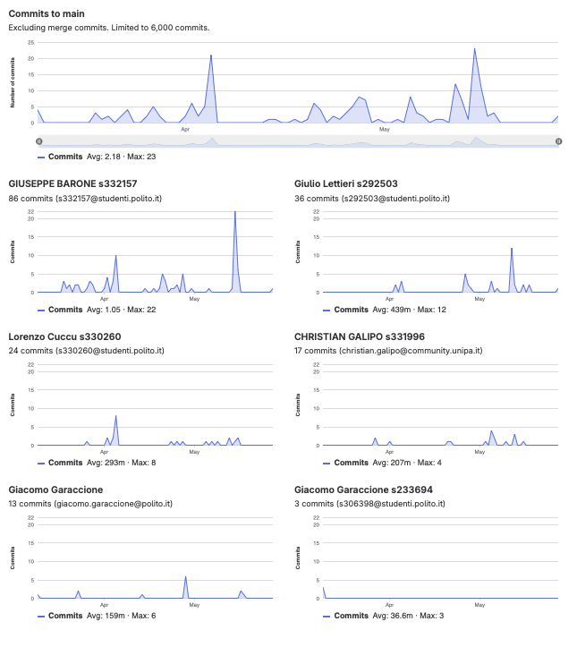

# Gruppo 14

## Valutazione deliverable V1

| gruppo | context diagram | business model | stakeholder | stories | interface | FR | NFR | use cases diagram | use cases | scenario | Glossary | DeploymentDiagram | functionality | estimation doc | precisione valori estimation | valutazione |
| --- | --- | --- | --- | --- | --- | --- | --- | --- | --- | --- | --- | --- | --- | --- | --- | --- |
| - | 1 | 0.5 | 0.5 | 1 | 1 | 3 | 3 | 1 | 5 | 5 | 5 | 2 | 1 | 2 | 2 | 33 |
| 14 | 95 | 100 | 95 | 85 | 95 | 100 | 90 | 95 | 100 | 100 | 90 | 100 | 100 | 90 | 66.82 | 95.5 |

## Valutazione deliverable V2

| gruppo | context diagram | business model | stakeholder | stories | interface | FR | NFR | ACCESS RIGHTS | use cases diagram | use cases | scenario | Glossary | DeploymentDiagram | functionality | estimation | precisione valori estimation | valutazione |
| --- | --- | --- | --- | --- | --- | --- | --- | --- | --- | --- | --- | --- | --- | --- | --- | --- | --- |
| - | 1 | 0.5 | 0.5 | 1 | 1 | 3 | 2 | 1 | 1 | 5 | 5 | 5 | 2 | 1 | 2 | 2 | 33 |
| 14 | 100 | 100 | 100 | 100 | 100 | 100 | 100 | 0 | 100 | 100 | 100 | 100 | 90 | 100 | 100 | 59.5 | 95.44 |

Le percentuali di v2 sono state riscalate in quanto la media pesata delle percentuali portava alcuni gruppi oltre al 100%.

## Valutazione codice e test (V2 + V3)

| Test Unit Totali | Test Unit Passati | Statement Coverage Unit | Branch Coverage Unit | Function Coverage Unit | Line Coverage Unit | Test Integration Totali | Test Integration Falliti | Statement Coverage Integration | Branch Coverage Integration | Function Coverage Integration | Line Coverage Integration | Correttezza V2 | Correttezza V3 | valutazione |
| --- | --- | --- | --- | --- | --- | --- | --- | --- | --- | --- | --- | --- | --- | --- |
| 1 | 0.5 | 2 | 2 | 1 | 1 | 1 | 0.5 | 2 | 2 | 1 | 1 | 16 | 2 | 33 |
| 75 | 100 | 100 | 75 | 100 | 100 | 100 | 100 | 100 | 75 | 100 | 100 | 97.4789915966387 | 100 | 94.99 |

 Unit e integration test prodotti dai gruppi sono stati eseguiti con la versione V2 del codice.

## Risultati Progetto

| Deliverable | Punteggio | Peso |
| --- | --- | --- |
| **Documenti V1** | 95.5% | 6 |
| **Documenti V2** | 94.16% | 2 |
| **Codice e Test** | 94.99% | 22 |
| **Timesheet** | 66.66% | 3 |
| **Valutazione** | 30.51 | 33 |
| **Valutazione** | 12.20 | 13.2 |

## Calcolo pesi progetto per singolo studente

| cognome | nome | email | gruppo | commit studente | commit totali | commit sul totale | coefficiente catme | coefficiente pesato | coefficiente progetto |
| --- | --- | --- | --- | --- | --- | --- | --- | --- | --- |
| BARONE | GIUSEPPE MARIA | s332157@studenti.polito.it | 14 | 86 | 163 | 0.53 | 1.05 | 0.95 | 1.00 |
| CUCCU | LORENZO | s330260@studenti.polito.it | 14 | 24 | 163 | 0.15 | 1.04 | 0.86 | 0.91 |
| GALIPO' | CHRISTIAN | s331996@studenti.polito.it | 14 | 17 | 163 | 0.10 | 0.78 | 0.64 | 0.68 |
| LETTIERI | GIULIO | s292503@studenti.polito.it | 14 | 36 | 163 | 0.22 | 1.05 | 0.88 | 0.94 |

 I pesi del progetto sono ottenuti per l'80% dal valore calcolato da CATME e per il 20% dalla percentuale dei commit del singolo studente sul totale dei commit effettuati dagli studenti dello stesso gruppo. Il risultato è stato poi riscalato in modo che il punteggio più alto del gruppo ottenesse 1.

## Studenti

| Nome | Matricola | Email | Bonus | Voto Primo Appello | Voto Progetto | Voto Finale |
| --- | --- | --- | --- | --- | --- | --- |
| GIULIO LETTIERI | 292503 | s292503@studenti.polito.it | 1 | 18.9 | 11.41 | 30 |
| LORENZO CUCCU | 330260 | s330260@studenti.polito.it | 1 | 17.9 | 11.12 | 30 |
| GIUSEPPE MARIA BARONE | 332157 | s332157@studenti.polito.it | 1 | 13.9 | 12.20 | 27 |
| CHRISTIAN GALIPO' | 331996 | s331996@studenti.polito.it | 1 | 14.4 | 8.32 | 24 |
